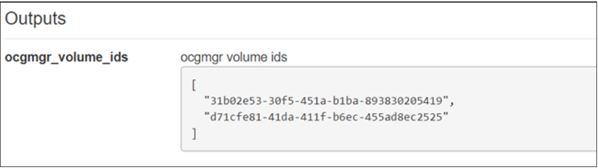

.. Licensed under a Creative Commons Attribution 4.0 International License.
.. http://creativecommons.org/licenses/by/4.0
.. Copyright 2017 AT&T Intellectual Property.  All rights reserved.

.. _ONAP Heat Heat Template Constructs:

ONAP Heat Heat Template Constructs
--------------------------------------

.. _Nested Heat Templates:

Nested Heat Templates
^^^^^^^^^^^^^^^^^^^^^

ONAP supports nested Heat templates per the OpenStack specifications.
Nested templates may be suitable for larger VNFs that contain many
repeated instances of the same VM type(s). A common usage pattern is to
create a nested template for each {vm-type} along with its supporting
resources. The VNF module may then reference these component templates
either statically by repeated definition or dynamically by using the
resource OS::Heat::ResourceGroup.

Nested Heat Template Requirements
~~~~~~~~~~~~~~~~~~~~~~~~~~~~~~~~~

ONAP supports nested Heat Orchestration Templates.

As stated in Requirements :need:`R-36582`, :need:`R-56721`, and
:need:`R-30395`, a Base Module, Incremental Module, and Cinder Volume
Module may use nested heat.

.. req::
    :id: R-00228
    :target: VNF
    :keyword: MAY
    :updated: casablanca

    A VNF's Heat Orchestration Template **MAY**
    reference the nested heat statically by repeated definition.

.. req::
    :id: R-01101
    :target: VNF
    :keyword: MAY
    :updated: casablanca

    A VNF's Heat Orchestration Template **MAY**
    reference the nested heat dynamically using the resource
    ``OS::Heat::ResourceGroup``.

A VNF's Heat Orchestration Template must
reference a Nested YAML file by name.
The use of ``resource_registry`` in the VNF's Heat Orchestration Templates
Environment File must not be used (as stated in R-67231).

As stated in requirement R-99646, a VNF's YAML files
(i.e, Heat Orchestration Template files and Nested files) **MUST**
have a unique name in the scope of the VNF.

.. req::
    :id: R-60011
    :keyword: MUST
    :updated: casablanca
    :validation_mode: static

    A VNF's Heat Orchestration Template **MUST** have no more than two
    levels of nesting.

Two levels of nesting is defined as follows:  A base module, incremental
module, or cinder volume module references a nested heat file either
statically or by using the resource ``OS::Heat::ResourceGroup``.
The referenced YAML heat file is the first level of nested heat.
If first level nested YAML file references a nested heat file, that file is
the second level of nested heat.

.. req::
    :id: R-17528
    :keyword: MUST
    :updated: casablanca
    :validation_mode: static

    A VNF's Heat Orchestration Template's first level Nested YAML file
    **MUST NOT** contain more than one ``OS::Nova::Server`` resource.
    A VNF's Heat Orchestration Template's second level Nested YAML file
    **MUST NOT** contain an ``OS::Nova::Server`` resource.

.. req::
    :id: R-708564
    :keyword: MUST NOT
    :introduced: casablanca
    :updated: dublin
    :validation_mode: static

    If a VNF's Heat Orchestration Template's resource invokes a nested
    YAML file, either statically or dynamically
    (via ``OS::Heat::ResuorceGroup``),
    the names of the parameters associated with the following resource
    properties **MUST NOT** change.

    * ``OS::Nova::Server`` property ``flavor``
    * ``OS::Nova::Server`` property ``image``
    * ``OS::Nova::Server`` property ``name``
    * ``OS::Nova::Server`` property metadata key value ``vnf_id``
    * ``OS::Nova::Server`` property metadata key value ``vf_module_id``
    * ``OS::Nova::Server`` property metadata key value ``vnf_name``
    * ``OS::Nova::Server`` property metadata key value ``vf_module_name``
    * ``OS::Nova::Server`` property metadata key value ``vm_role``
    * ``OS::Nova::Server`` property metadata key value ``vf_module_index``
    * ``OS::Nova::Server`` property metadata key value ``workload_context``
    * ``OS::Nova::Server`` property metadata key value ``environment_context``
    * ``OS::Nutron::Port`` property ``fixed_ips``, map property ``ip_address``
    * ``OS::Nutron::Port`` property ``fixed_ips``, map property ``subnet``
    * ``OS::Nutron::Port`` property ``allowed_address_pairs``, map property
      ``ip_address``
    * ``OS::Nutron::Port`` property ``network``
    * ``OS::ContrailV2::VirtualMachineInterface`` property
      ``virtual_network_refs``
    * ``OS::ContrailV2::VirtualMachineInterface`` property
      ``virtual_machine_interface_allowed_address_pairs``
    * ``OS::ContrailV2::InstanceIP`` property ``instance_ip_address``

Note that the parameters associated with properties not listed in R-708564
may change when past into a nested YAML file.  For example,
``OS::Nova::Server`` property ``availability_zone``.

Requirement R-708564 was introduced with Generic Resource API (GR-API).
GR-API creates the new VNFC Object.
SDN-C matches the ``{vm-type}`` in the ``OS::Nova::Server`` resource in the
nested YAML file to the corresponding nfc_naming_code.
If the ``{vm-type}`` name changes when the parameter names are passed into
the nested YAML file, SDN-C will not be able to match the
``{vm-type}`` to the nfc_naming_code, breaking the assignment logic
and ONAP assigns a default value (i.e., "DEFAULT").
Instantiation will succeed with the incorrect VNFC Object
(i.e, contains the DEFAULT value).  However, the default VNFC object will
cause issues for other ONAP applications/features.

.. req::
    :id: R-11041
    :keyword: MUST
    :updated: casablanca
    :validation_mode: static

    All parameters defined in a VNFs Nested YAML file
    **MUST**  be passed in as properties of the resource calling
    the nested yaml file.

.. req::
    :id: R-90022
    :keyword: MAY
    :updated: casablanca

    A VNF's Nested YAML file **MAY** be invoked more than once by
    a VNF's Heat Orchestration Template.

.. req::
    :id: R-04344
    :keyword: MAY
    :updated: casablanca

    A VNF's Nested YAML file **MAY** be invoked by more than one of
    a VNF's Heat Orchestration Templates (when the VNF is composed of two
    or more Heat Orchestration Templates).

Note that as
stated in requirement R-00011, a VNF's Heat Orchestration Template's
Nested YAML file's parameter's **SHOULD NOT** have a parameter
constraint defined.

If a VNF's Heat Orchestration Template's nested YAML file is required to
expose a resource property to the invoking Heat OrchestrationTemplate,
an ``outputs:`` statement must be used in the nested YAML file.
The invoking template references the property by using the intrinsic
function ``get_attr`` that targets the resource invoking the nested YAML
file and references the parameter defined in the ``outputs`` section.

Nested Heat Template Example: Static
~~~~~~~~~~~~~~~~~~~~~~~~~~~~~~~~~~~~

incremental.yaml

.. code-block:: yaml

  resources:
    dns_server_0:
      type: nested.yaml
      properties:
        dns_image_name: { get_param: dns_image_name }
        dns_flavor_name: { get_param: dns_flavor_name }
        availability_zone_0: { get_param: availability_zone_0 }
        DNS_shared_sec_grp_id: { get_param: DNS_shared_sec_grp_id }
        oam_protected_net_id: { get_param: oam_protected_net_id }
        dns_oam_ip_0: { get_param: dns_oam_ip_0 }
        dns_name_0: { get_param: dns_name_0 }
        vnf_name: { get_param: vnf_name }
        vnf_id: { get_param: vnf_id }
        vf_module_id: {get_param: vf_module_id}

nested.yaml

.. code-block:: yaml

  dns_0_oam_protected_port_0:
    type: OS::Neutron::Port
    properties:
      name:
        str_replace:
          template: VNF_NAME_dns_oam_port
          params:
            VNF_NAME: {get_param: vnf_name}
      network: { get_param: oam_protected_net_id }
      fixed_ips: [{ "ip_address": { get_param: dns_oam_ip_0 }}]
      security_groups: [{ get_param: DNS_shared_sec_grp_id }]
  dns_server_0:
    type: OS::Nova::Server
    properties:
      name: { get_param: dns_names }
      image: { get_param: dns_image_name }
      flavor: { get_param: dns_flavor_name }
      availability_zone: { get_param: availability_zone_0 }
      networks:
      - port: { get_resource: ns_0_oam_protected_port_0 }
      metadata:
        vnf_id: { get_param: vnf_id }
        vf_module_id: { get_param: vf_module_id }
        vnf_name {get_param: vnf_name }

Use of Heat ResourceGroup
~~~~~~~~~~~~~~~~~~~~~~~~~

The OS::Heat::ResourceGroup is a useful Heat element for creating
multiple instances of a given resource or collection of resources.
Typically, it is used with a nested Heat template to create, for
example, a set of identical OS::Nova::Server resources plus their
related OS::Neutron::Port resources via a single resource in a master
template.

OS::Heat::ResourceGroup may be used to simplify the structure of a Heat
template that creates multiple instances of the same VM type.

However, there are important caveats to be aware of:

OS::Heat::ResourceGroup does not deal with structured parameters
(comma-delimited-list and json) as one might typically expect. In
particular, when using a list-based parameter, where each list element
corresponds to one instance of the ResourceGroup, it is not possible to
use the intrinsic "loop variable" %index% in the OS::Heat::ResourceGroup
definition.

For instance, the following is **not** valid Heat for
OS::Heat::ResourceGroup:

.. code-block:: yaml

  type: OS::Heat::ResourceGroup
  properties:
      . . .
      resource_def:
        type: my_nested_vm_template.yaml
        properties:
          name: {get_param: [vm_name_list, "%index%"]}

Although this appears to use the nth entry of the vm_name_list list for
the nth element of the OS::Heat::ResourceGroup, it will in fact result
in a Heat exception. When parameters are provided as a list (one for
each element of a OS::Heat::ResourceGroup), you must pass the complete
parameter to the nested template along with the current index as
separate parameters.

Below is an example of an **acceptable** Heat Syntax for a
ResourceGroup:

.. code-block:: yaml

  type: OS::Heat::ResourceGroup
  properties:
    . . .
    resource_def:
      type: my_nested_vm_template.yaml
      properties:
        names: {get_param: vm_name_list}
        index: "%index%"

You can then reference within the nested template as:

{ get_param: [names, {get_param: index} ] }

OS::Heat::ResourceGroup Property count
++++++++++++++++++++++++++++++++++++++

.. req::
    :id: R-50011
    :target: VNF
    :keyword: MUST
    :validation_mode: static
    :updated: casablanca

    A VNF's Heat Orchestration Template's ``OS::Heat::ResourceGroup``
    property ``count`` **MUST** be enumerated in the VNF's
    Heat Orchestration Template's Environment File and **MUST** be
    assigned a value.

This is required for ONAP to build the TOSCA model for the VNF.

.. code-block:: yaml

  type: OS::Heat::ResourceGroup
  properties:
    count: { get_param: count }
    index_var: index
    resource_def:
      type: my_nested_vm_template.yaml
      properties:
        names: {get_param: vm_name_list}
        index: index

Availability Zone and ResourceGroups
++++++++++++++++++++++++++++++++++++

The resource OS::Heat::ResourceGroup and the property availability_zone
has been an "issue" with a few VNFs since ONAP only supports
availability_zone as a string parameter and not as a
comma_delimited_list. This makes it difficult to use a
OS::Heat::ResourceGroup to create Virtual Machines in more than one
availability zone.

There are numerous solutions to this issue. Below are two suggested
usage patterns.

**Option 1:** create a CDL in the OS::Heat::ResourceGroup. In the
resource type: OS::Heat::ResourceGroup, create a comma_delimited_list
availability_zones by using the intrinsic function list_join.

.. code-block:: yaml

  <resource name>:
    type: OS::Heat::ResourceGroup
    properties:
      count: { get_param: node_count }
      index_var: index
      resource_def:
        type: nested.yaml
        properties:
          index: index
          availability_zones: { list_join: [',', [ { get_param: availability_zone_0 }, { get_param: availability_zone_1 } ] ] }

In the nested heat

.. code-block:: yaml

  parameters:
    availability_zones:
      type: comma_delimited_list
      description:

  resources:
    servers:
      type: OS::Nova::Server
      properties:
        name: { get_param: [ dns_names, get_param: index ] }
        image: { get_param: dns_image_name }
        flavor: { get_param: dns_flavor_name }
        availability_zone: { get_param: [ availability_zones, get_param: index ] }

**Option 2:** Create a CDL by passing the availability zone parameter
into a nested heat template. An example is provided below.

base.yaml

.. code-block:: yaml

  availability_zone_list:
     type: az_list_generate.yaml
     properties:
       availability_zone_0: { get_param: availability_zone_0 }
       availability_zone_1: { get_param: availability_zone_1 }

    create_virtual_machines:
      type: OS::Heat::ResourceGroup
      properties:
        count: { get_param: count }
        index_var: $INDEX
        resource_def:
          type: nest_file.yaml
          properties:
            index: $INDEX
            availability_zone_0 : { get_attr: [availability_zone_list, general_zones ] }
            . . .

az_list_generate.yaml

.. code-block:: yaml

  parameters:
    availability_zone_0:
      type: string
      description: availability zone 0

    availability_zone_1:
      type: string
      description: availability zone 1

  outputs:

    general_zones:
      value: [
        { get_param: availability_zone_0 },
        { get_param: availability_zone_1 },
        { get_param: availability_zone_0 },
        { get_param: availability_zone_1 },
        { get_param: availability_zone_0 },
        { get_param: availability_zone_1 }
  ]

Nested Heat Template Example: OS::Heat::ResourceGroup
+++++++++++++++++++++++++++++++++++++++++++++++++++++

In this example, ocgapp_volume.yml creates volumes using a
OS::Heat::ResourceGroup that uses nested heat by calling
ocgapp_nested_volume.yml. ocgapp_volume.yml has an outputs: parameter
ocgapp_volume_ids which is declared a input parameter of type: json in
ocgapp_volume.yml.

This is an example of requirement :need:`R-07443`, where
a VNF's Heat Orchestration Templates' Cinder Volume Module Output
Parameter's name and type **MUST** match the input parameter name and type
in the corresponding Base Module or Incremental Module unless the Output
Parameter is of the type ``comma_delimited_list``, then the corresponding
input parameter **MUST** be declared as type ``json``.

ocgapp_volume.yml

.. code-block:: yaml

  heat_template_version: 2014-10-16

  description: Template for the volumes

  parameters:
    vnf_name:
      type: string
      label: OCG VNF Name
      description: OCG VNF Name
    ocgapp_volume_size_0:
      type: number
      label: Cinder volume 1 size
      description: the size of the Cinder volume
      constraints:
      - range: { min: 100, max: 400 }
    ocgapp_volume_type_0:
      type: string
      label: app vm 1 volume type
      description: the name of the target volume backend for the first OCG APP
    volume_count:
      type: number
      label: volume count
      description: number of volumes needed

  resources:
    ocgapp_volume_resource_group:
      type: OS::Heat::ResourceGroup
      properties:
        count: {get_param: volume_count}
        index_var: index
        resource_def:
          type: ocgapp_nested_volume.yml
          properties:
            index: index
            size: {get_param: ocgapp_volume_size_0}
            volume_type: {get_param: ocgapp_volume_type_0}
            vnf_name: {get_param: vnf_name}

  outputs:
    ocgapp_volume_ids:
    description: ocgapp volume ids
    value: {get_attr: [ocgapp_volume_resource_group, ocgapp_volume_id_0]}

ocgapp_nested_volume.yml

.. code-block:: yaml

 heat_template_version: 2014-10-16

 description: nested heat

 parameters:
   index:
     type: number
     label: Volume Index
     description: number of volumes to spin up
   size:
     type: number
     label: Volume Size
     description: size of the cinder volumes
   volume_type:
     type: string
     label: Volume Type
     description: type of cinder volumes
   vnf_name:
     type: string
     label: VNF Name
     description: vnf name

 resources:
   ocgapp_volume_0:
     type: OS::Cinder::Volume
     properties:
       size: {get_param: size}
       volume_type: {get_param: volume_type}
       name:
         str_replace:
           template: VF_NAME_STACK_NAME_INDEX
           params:
             VF_NAME: { get_param: vnf_name }
             STACK_NAME: { get_param: 'OS::stack_name' }
             INDEX: {get_param: index}

 outputs:
   ocgapp_volume_id_0:
   description: the ocgapp volume uuid
   value: {get_resource: ocgapp_volume_0}

Below is a screen shot of parameter ocgapp_volume_ids from the OpenStack
Horizon GUI showing the output.

The heat template below is a partial heat template,

ocgapp.yml

.. code-block:: yaml

  heat_template_version: 2014-10-16

  #file version 1.0
  description: OCG Apps template

  parameters:
    ocgapp_volume_ids:
      type: json
      description: Unique IDs for volumes

  resources:
    ocgapp_server_0:
      type: OS::Nova::Server
      properties:
    . . . .
    ocgapp_server_1:
      type: OS::Nova::Server
      properties:
    . . . .
    ocgapp_volume_attachment_0:
      type: OS::Cinder::VolumeAttachment
      properties:
        volume_id: {get_param: [ocgapp_volume_ids, 0]}
        instance_uuid: {get_resource: ocgapp_server_0}
    ocgapp_volume_attachment_1:
      type: OS::Cinder::VolumeAttachment
      properties:
        volume_id: {get_param: [ocgapp_volume_ids, 1]}
        instance_uuid: {get_resource: ocgapp_server_1}

External References
^^^^^^^^^^^^^^^^^^^

Heat templates *must not* reference any HTTP-based resource
definitions, any HTTP-based nested configurations, or any HTTP-based
environment files.

-  During orchestration, ONAP *must not* retrieve any such resources
   from external/untrusted/unknown sources.

-  VNF images must not contain external references in user-data or other
   configuration/operational scripts that are specified via Heat or
   encoded into the VNF image itself.

*Note: HTTP-based references are acceptable if the HTTP-based reference
is accessing information utilizing the VM private/internal network.*

Note that Namespaces in XML (defined at
http://www.w3.org/TR/2009/REC-xml-names-20091208/) are allowed if the
Heat Orchestration Template is describing and storing software
configuration information. An XML namespace is identified by a URI
reference. A Uniform Resource Identifier (URI) is a string of characters
which identifies an Internet Resource. The most common URI is the
Uniform Resource Locator (URL) which identifies an Internet domain
address. Another, not so common type of URI is the Universal Resource
Name (URN). The namespace URI is not used by XML the parser to look up
information. The purpose of using an URI is to give the namespace a
unique name.

Heat Files Support (get_file)
^^^^^^^^^^^^^^^^^^^^^^^^^^^^^

A VNF's Heat Orchestration Template may contain the inclusion of text files
containing scripts or configuration files.  The ``get_file`` intrinsic
function returns the content of a file into a Heat Orchestration Template.

The support for the ``get_file`` intrinsic function in ONAP is subject to the
following limitations:

.. req::
    :id: R-76718
    :target: VNF
    :keyword: MUST
    :validation_mode: static
    :updated: casablanca

    If a VNF's Heat Orchestration Template uses the intrinsic function
    ``get_file``, the ``get_file`` target **MUST** be referenced in
    the Heat Orchestration Template by file name.

The ``get_file`` target files are on-boarded to SDC in the same zip file
that contains the VNF's complete Heat Orchestration Template.
See requirement R-511776.

.. req::
    :id: R-41888
    :target: VNF
    :keyword: MUST NOT
    :validation_mode: static
    :updated: casablanca

    A VNF's Heat Orchestration Template intrinsic function
    ``get_file`` **MUST NOT** utilize URL-based file retrieval.

.. req::
    :id: R-05050
    :target: VNF
    :keyword: MAY
    :updated: casablanca

    A VNF's Heat Orchestration Templates intrinsic function
    ``get_file`` <content key> **MAY** be used:

        * more than once in a VNF's Heat Orchestration Template
        * in two or more of a VNF's Heat Orchestration Templates
        * in a VNF's Heat Orchestration Templates nested YAML file

Key Pairs
^^^^^^^^^

When Nova Servers are created via Heat templates, they may be passed a
"keypair" which provides an ssh key to the 'root' login on the newly
created VM. This is often done so that an initial root key/password does
not need to be hard-coded into the image.

Key pairs are unusual in OpenStack, because they are the one resource
that is owned by an OpenStack User as opposed to being owned by an
OpenStack Tenant. As a result, they are usable only by the User that
created the keypair. This causes a problem when a Heat template attempts
to reference a keypair by name, because it assumes that the keypair was
previously created by a specific ONAP user ID.

When a keypair is assigned to a server, the SSH public-key is
provisioned on the VMs at instantiation time. They keypair itself is not
referenced further by the VM (i.e. if the keypair is updated with a new
public key, it would only apply to subsequent VMs created with that
keypair).

Due to this behavior, the recommended usage of keypairs is in a more
generic manner which does not require the pre-requisite creation of a
keypair. The Heat should be structured in such a way as to:

 -  Pass a public key as a parameter value instead of a keypair name

 -  Create a new keypair within the VNF Heat templates (in the base module)
    based on an existing public key for use within that VNF

By following this approach, the end result is the same as pre-creating
the keypair using the public key – i.e., that public key will be
provisioned in the new VM. However, this recommended approach also makes
sure that a known public key is supplied (instead of having OpenStack
generate a public/private pair to be saved and tracked outside of ONAP).
It also removes any access/ownership issues over the created keypair.

The public keys may be enumerated as a VNF Orchestration Constant in the
environment file (since it is public, it is not a secret key), or passed
at run-time as instance-specific parameters. ONAP will never
automatically assign a public/private key pair.

*Example (create keypair with an existing ssh public-key for {vm-type}
of lb (for load balancer)):*

.. code-block:: yaml

  parameters:
    vnf_name:
      type: string
    lb_ssh_public_key:
      type: string

  resources:
    lb_keypair_0:
      type: OS::Nova::Keypair
      properties:
        name:
          str_replace:
            template: VNF_NAME_key_pair
            params:
              VNF_NAME: { get_param: vnf_name }
        public_key: {get_param: lb_ssh_public_key}
        save_private_key: false

Security Groups
^^^^^^^^^^^^^^^

OpenStack allows a tenant to create Security groups and define rules
within the security groups.

Security groups, with their rules, may either be created in the Heat
Orchestration Template or they can be pre-created in OpenStack and
referenced within the Heat template via parameter(s). There can be a
different approach for security groups assigned to ports on internal
(intra-VNF) networks or external networks (inter-VNF). Furthermore,
there can be a common security group across all VMs for a specific
network or it can vary by VM (i.e., {vm-type}) and network type (i.e.,
{network-role}).

Anti-Affinity and Affinity Rules
^^^^^^^^^^^^^^^^^^^^^^^^^^^^^^^^

Anti-affinity or affinity rules are supported using normal OpenStack
OS::Nova::ServerGroup resources. Separate ServerGroups are typically
created for each VM type to prevent them from residing on the same host,
but they can be applied to multiple VM types to extend the
affinity/anti-affinity across related VM types as well.

*Example:*

In this example, the {network-role} has been defined as oam to represent
an oam network and the {vm-type} have been defined as lb for load
balancer and db for database.

.. code-block:: yaml

  resources:
    db_server_group:
      type: OS::Nova::ServerGroup
      properties:
        name:
          str_replace:
            params:
              $vnf_name: {get_param: vnf_name}
            template: $vnf_name-server_group1
        policies:
        - anti-affinity
    lb_server_group:
      type: OS::Nova::ServerGroup
      properties:
        name:
          str_replace:
            params:
              $vnf_name: {get_param: vnf_name}
            template: $vnf_name-server_group2
        policies:
        - affinity
    db_server_0:
      type: OS::Nova::Server
      properties:
        ...
        scheduler_hints:
        group: {get_resource: db_server_group}
    db_server_1:
      type: OS::Nova::Server
      properties:
        ...
        scheduler_hints:
        group: {get_resource: db_server_group}
    lb_server_0:
      type: OS::Nova::Server
      properties:
        ...
        scheduler_hints:
        group: {get_resource: lb_server_group}

Resource Data Synchronization
^^^^^^^^^^^^^^^^^^^^^^^^^^^^^

For cases where synchronization is required in the orchestration of Heat
resources, two approaches are recommended:

-  Standard Heat depends_on property for resources

   -  Assures that one resource completes before the dependent resource
      is orchestrated.

   -  Definition of completeness to OpenStack may not be sufficient
      (e.g., a VM is considered complete by OpenStack when it is ready
      to be booted, not when the application is up and running).

-  Use of Heat Notifications

   -  Create OS::Heat::WaitCondition and OS::Heat::WaitConditionHandle
      resources.

   -  Pre-requisite resources issue *wc_notify* commands in user_data.

   -  Dependent resource define depends_on in the
      OS::Heat::WaitCondition resource.

*Example: "depends_on" case*

In this example, the {network-role} has been defined as oam to represent
an oam network and the {vm-type} has been defined as oam to represent an
oam server.

.. code-block:: yaml

  resources:
    oam_server_01:
      type: OS::Nova::Server
      properties:
        name: {get_param: [oam_names, 0]}
        image: {get_param: oam_image_name}
        flavor: {get_param: oam_flavor_name}
        availability_zone: {get_param: availability_zone_0}
        networks:
        - port: {get_resource: oam01_port_0}
        - port: {get_resource: oam01_port_1}
        user_data:
        scheduler_hints: {group: {get_resource: oam_servergroup}}
        user_data_format: RAW
    oam_01_port_0:
      type: OS::Neutron::Port
      properties:
        network: {get_resource: oam_net_name}
        fixed_ips: [{"ip_address": {get_param: [oam_oam_net_ips, 1]}}]
        security_groups: [{get_resource: oam_security_group}]
    oam_01_port_1:
      type: OS::Neutron::Port
      properties:
        network: {get_param: oam_net_name}
        fixed_ips: [{"ip_address": {get_param: [oam_oam_net_ips, 2]}}]
        security_groups: [{get_resource: oam_security_group}]
    oam_volume_attachment_0:
      type: OS::Cinder::VolumeAttachment
      depends_on: oam_server_01
      properties:
        volume_id: {get_param: oam_vol_1}
        mountpoint: /dev/vdb
        instance_uuid: {get_resource: oam_server_01}
