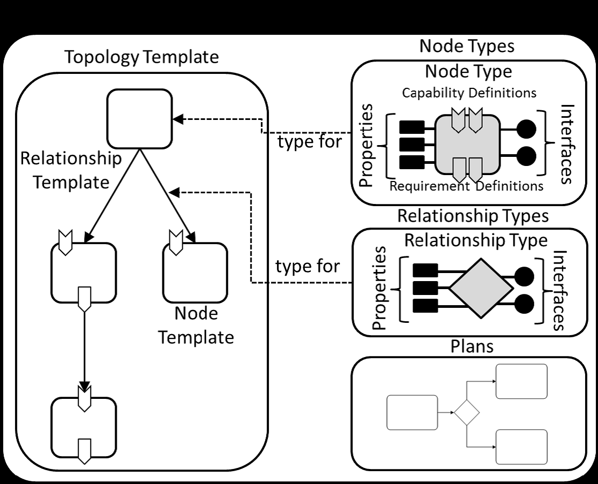
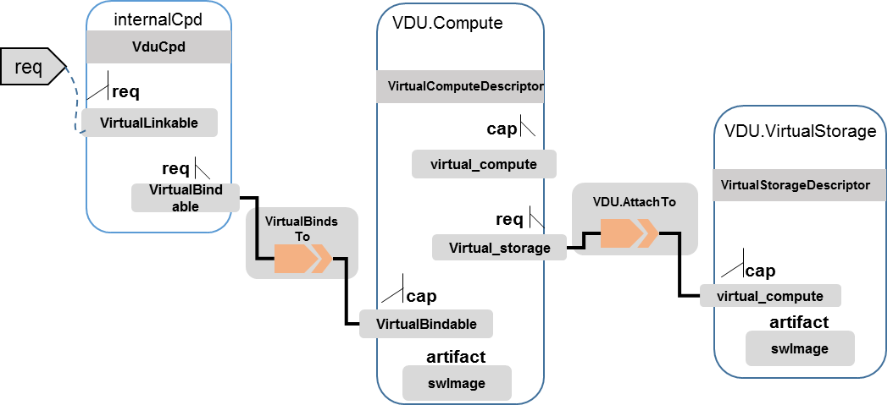

.. Modifications Copyright © 2017-2018 AT&T Intellectual Property.

.. Licensed under the Creative Commons License, Attribution 4.0 Intl.
   (the "License"); you may not use this documentation except in compliance
   with the License. You may obtain a copy of the License at

.. https://creativecommons.org/licenses/by/4.0/

.. Unless required by applicable law or agreed to in writing, software
   distributed under the License is distributed on an "AS IS" BASIS,
   WITHOUT WARRANTIES OR CONDITIONS OF ANY KIND, either express or implied.
   See the License for the specific language governing permissions and
   limitations under the License.

ONAP TOSCA VNFD or PNFD Requirements
------------------------------------

Introduction
^^^^^^^^^^^^

The following sub-clauses describe the numbered requirements for VNF
Descriptor (VNFD) and PNF Descriptor (PNFD) or in other words the VNF/PNF
Service Template based on the most updated draft of ETSI NFV-SOL001 standard
for VNF/PNF Descriptor. The ETSI standard specifies a NFV specific data
model using TOSCA/YAML data model constructs specified in TOSCA Simple
Profile in YAML v.1.2.

The requirements for TOSCA/CSAR based VNF/PNF package are described as well
and they are based on ETSI NFV-SOL004 standard.

References
^^^^^^^^^^^^^^^^^^

  1. ETSI GS NFV-SOL001 v.2.5.1
  2. TOSCA SIMPLE Profile in YAML v.1.2
  3. ETSI GS NFV-SOL004 v.2.6.1 + NFV CR NFVSOL(18)000746r3.

Intended Audience
^^^^^^^^^^^^^^^^^^

This document is intended for developers of VNF TOSCA templates that
will be orchestrated by ONAP. The document is also applicable for
creating RFP’s with the list of required TOSCA/YAML features
supported by VNF provider.

Scope
^^^^^^^^^^^^^^^^

ONAP implementations of Network Cloud supports TOSCA Templates, also
referred to as TOSCA in this document.

ONAP requires the TOSCA Templates to follow a specific format. This
document provides the mandatory, recommended, and optional requirements
associated with this format.

Overview
^^^^^^^^^^^^^^^^

The document includes three charters to help the VNF or PNF providers to
use the VNF or PNF model design tools and understand the VNF or PNF package
structure and VNF or PNF TOSCA templates.

In the ONAP, VNF or PNF Package and VNFD or PNFD template can be designed by
manually or via model designer tools. VNF or PNF model designer tools can
provide the GUI and CLI tools for the VNF or PNF provider to develop the
VNF or PNF Package and VNFD or PNFD template.

The VNF or PNF package structure is align to the NFV TOSCA protocol,
and supports CSAR

The VNFD or PNFD and VNF or PNF package are all align to the NFV TOSCA
protocol, which supports multiple TOSCA template yaml files, and also
supports self-defined node or other extensions.

VNF or PNF CSAR Package
^^^^^^^^^^^^^^^^^^^^^^

CSAR Overview
~~~~~~~~~~~~~~~~

TOSCA YAML CSAR file is an archive file using the ZIP file format whose
structure complies with the TOSCA Simple Profile YAML v1.2 Specification.
The CSAR file may have one of the two following structures:

  - CSAR containing a TOSCA-Metadata directory, which includes the TOSCA.meta
    metadata file providing an entry information for processing a CSAR file.

  - CSAR containing a single yaml (.yml or .yaml) file at the root of the
    archive. The yaml file is a TOSCA definition template that contains a
    metadata section with template_name and template_version metadata. This
    file is the CSAR Entry-Definitions file.

VNF Package Structure and Format
~~~~~~~~~~~~~~~~~~~~~~~~~~~~~~~~~~

.. req::
    :id: R-51347
    :target: VNF or PNF
    :keyword: MUST
    :introduced: casablanca
    :updated: dublin

    The VNF or PNF CSAR package **MUST** be arranged as a CSAR archive as
    specified in TOSCA Simple Profile in YAML 1.2.

.. req::
    :id: R-87234
    :target: VNF or PNF
    :keyword: MUST
    :introduced: casablanca
    :updated: dublin

    The VNF or PNF package provided by a VNF or PNF vendor **MUST** be with
    TOSCA-Metadata directory (CSAR Option 1) as specified in
    ETSI GS NFV-SOL004.

    **Note:** SDC supports only the CSAR Option 1 in Dublin. The Option 2
    will be considered in future ONAP releases.

.. req::
    :id: R-506221
    :target: VNF or PNF CSAR PACKAGE
    :keyword: MUST
    :introduced: dublin

    The VNF or PNF TOSCA CSAR file **MUST** be a zip file with .csar extension.

VNF Package Contents
~~~~~~~~~~~~~~~~~~~~~~~~~~~~~~

.. req::
    :id: R-10087
    :target: VNF or PNF CSAR PACKAGE
    :keyword: MUST
    :introduced: casablanca
    :updated: dublin

    The VNF or PNF CSAR package **MUST** include all artifacts required by
    ETSI GS NFV-SOL004 including Manifest file, VNFD or PNFD (or Main
    TOSCA/YAML based Service Template) and other optional artifacts. 

.. req::
    :id: R-01123
    :target: VNF or PNF
    :keyword: MUST
    :introduced: casablanca
    :updated: dublin

    The VNF or PNF package Manifest file **MUST** contain: VNF or PNF package
    meta-data, a list of all artifacts (both internal and external) entry's
    including their respected URI's, an algorithm to calculate a digest and
    a digest result calculated on the content of each artifacts, as specified
    in ETSI GS NFV-SOL004.

.. req::
    :id: R-21322
    :target: VNF
    :keyword: MUST
    :introduced: casablanca

    The VNF provider **MUST** provide their testing scripts to support
    testing as specified in ETSI NFV-SOL004 - Testing directory in CSAR

.. req::
    :id: R-26885
    :target: VNF
    :keyword: MUST
    :introduced: casablanca

    The VNF provider **MUST** provide the binaries and images needed to
    instantiate the VNF (VNF and VNFC images) either as:

      - Local artifact in CSAR: ROOT\\Artifacts\\ **VNF_Image.bin**

      - externally referred (by URI) artifact in Manifest file (also may be
        referred by VNF Descriptor)

    Note: Currently, ONAP doesn't have the capability of Image management,
    we upload the image into VIM/VNFM manually.

.. req::
    :id: R-40820
    :target: VNF
    :keyword: MUST
    :introduced: casablanca

    The VNF provider **MUST** enumerate all of the open source licenses
    their VNF(s) incorporate. CSAR License directory as per ETSI SOL004.

    for example ROOT\\Licenses\\ **License_term.txt**

.. req::
    :id: R-293901
    :target: VNF or PNF CSAR PACKAGE
    :keyword: MUST
    :introduced: dublin

    The VNF or PNF CSAR PACKAGE with TOSCA-Metadata **MUST** include following
    additional keywords pointing to TOSCA files:
    
      - ETSI-Entry-Manifest

      - ETSI-Entry-Change-Log

    Note: For a CSAR containing a TOSCA-Metadata directory, which includes
    the TOSCA.meta metadata file. The TOSCA.meta metadata file includes block_0
    with the Entry-Definitions keyword pointing to a TOSCA definitions YAML
    file used as entry for parsing the contents of the overall CSAR archive.

.. req::
    :id: R-146092
    :target: VNF or PNF TOSCA PACKAGE
    :keyword: MUST
    :introduced: dublin

    The VNF or PNF TOSCA CSAR package Manifest file **MUST** contain: non-mano
    artifact set with following ONAP public tag

      - onap_ves_events: contains VES registration files

      - onap_pm_dictionary: contains the PM dictionary files

      - onap_yang_modules: contains Yang module files for configurations

      - onap_ansible_playbooks: contains any ansible_playbooks

      - onap_others: contains any other non_MANO artifacts, e.g. informational
        documents

.. req::
    :id: R-221914
    :target: VNF or PNF
    :keyword: MUST
    :introduced: dublin

    The VNF or PNF package **MUST** contain a a human-readable change log text
    file. The Change Log file keeps a history describing any changes in the VNF
    or PNF package. The Change Log file is kept up to date continuously from
    the creation of the CSAR package.

.. req::
    :id: R-57019
    :target: PNF CSAR PACKAGE
    :keyword: MUST
    :introduced: dublin

    The PNF TOSCA CSAR PACKAGE Manifest file **MUST** start with the PNF
    package metadata in the form of a name-value pairs. Each pair shall appear
    on a different line. The name is specified as following:

      - pnfd_provider

      - pnfd_name

      - pnfd_release_date_time

      - pnfd_archive_version

.. req::
    :id: R-795126
    :target: VNF CSAR PACKAGE
    :keyword: MUST
    :introduced: dublin

    The VNF TOSCA CSAR package Manifest file **MUST** start with the VNF
    package metadata in the form of a name-value pairs. Each pair shall appear
    on a different line. The name is specified as following:

      - vnf_provider_id

      - vnf_product_name

      - vnf_release_date_time

      - vnf_package_version

VNF or PNF Package Authenticity and Integrity
~~~~~~~~~~~~~~~~~~~~~~~~~~~~~~~~~~~~~~~~~~~~~

VNF or PNF CSAR package shall support a method for authenticity and integrity
assurance. According to ETSI SOL004 the onboarding package shall be secured.
ETSI SOL004 provides two options:

Option 1 - One Digest for each components of the VNF or PNF package. The table
of hashes is included in the manifest file, which is signed with the VNF or PNF
provider private key. A signing certificate including the provider’s public key
shall be included in the package.

Option 2 - The complete CSAR file shall be digitally signed with the provider
private key. The provider delivers one zip file consisting of the CSAR file, a
signature file and a certificate file that includes the VNF provider public
key.

*Dublin release note*

    - VNFSDK pre-onboarding validation procedure:

      - Option 1: specified in ETSI SOL004 is supported.

      - Option 2: Will be supported in the future releases.

    - SDC onboarding procedure:

      - Option 1: specified in ETSI SOL004 is supported.

      - Option 2: Will be supported in the future releases.

.. req::
    :id: R-787965
    :target: VNF or PNF CSAR PACKAGE
    :keyword: MUST
    :introduced: dublin

    If the VNF or PNF CSAR Package utilizes Option 2 for package security, then
    the complete CSAR file **MUST** be digitally signed with the VNF or PNF
    provider private key. The VNF or PNF provider delivers one zip file
    consisting of the CSAR file, a signature file and a certificate file that
    includes the VNF or PNF provider public key. The certificate may also be
    included in the signature container, if the signature format allows that.
    The VNF or PNF provider creates a zip file consisting of the CSAR file with
    .csar extension, signature and certificate files. The signature and
    certificate files must be siblings of the CSAR file with extensions .cms
    and .cert respectively.

.. req::
    :id: R-130206
    :target: VNF or PNF CSAR PACKAGE
    :keyword: MUST
    :introduced: dublin

    If the VNF or PNF CSAR Package utilizes Option 2 for package security, then
    the complete CSAR file **MUST** contain a Digest (a.k.a. hash) for each of
    the components of the VNF or PNF package. The table of hashes is included
    in the package manifest file, which is signed with the VNF or PNF provider
    private key. In addition, the VNF or PNF provider MUST include a signing
    certificate that includes the VNF or PNF provider public key, following a
    TOSCA pre-defined naming convention and located either at the root of the
    archive or in a predefined location specified by the TOSCA.meta file with
    the corresponding entry named "ETSI-Entry-Certificate".

VNF Package ONAP Extensions
~~~~~~~~~~~~~~~~~~~~~~~~~~~~~~

1. TOACA data type extension tosca.datatypes.nfv.injectFile is used for vCPE
   use case.
2. ONAP extensions for VNF package that is currently proposed for Dublin
   release is VES extension described below.

TOSCA Introduction
^^^^^^^^^^^^^^^^^^^

TOSCA defines a Meta model for defining IT services. This Meta model
defines both the structure of a service as well as how to manage it. A
Topology Template (also referred to as the topology model of a service)
defines the structure of a service. Plans define the process models that
are used to create and terminate a service as well as to manage a
service during its whole lifetime.

A Topology Template consists of a set of Node Templates and Relationship
Templates that together define the topology model of a service as a (not
necessarily connected) directed graph. A node in this graph is
represented by a *Node Template*. A Node Template specifies the
occurrence of a Node Type as a component of a service. A *Node Type*
defines the properties of such a component (via *Node Type Properties*)
and the operations (via *Interfaces*) available to manipulate the
component. Node Types are defined separately for reuse purposes and a
Node Template references a Node Type and adds usage constraints, such as
how many times the component can occur.

|image1|

Figure 1: Structural Elements of Service Template and their Relations

TOSCA Modeling Principles & Data Model
^^^^^^^^^^^^^^^^^^^^^^^^^^^^^^^^^^^^^^^^

This section describing TOSCA modeling principles and data model for
NFV, which shall be based on [TOSCA-1.0] and [TOSCA-Simple-Profile-YAML
V1.0], or new type based on ETSI NFV requirements, etc.

TOSCA VNF Descriptor
^^^^^^^^^^^^^^^^^^^^^^^^^

General
~~~~~~~~~~

.. req::
    :id: R-35854
    :target: VNF
    :keyword: MUST
    :introduced: casablanca

    The VNF Descriptor (VNFD) provided by VNF vendor **MUST** comply with
    TOSCA/YAML based Service template for VNF descriptor specified in
    ETSI NFV-SOL001.

    **Note**: As the ETSI NFV-SOL001 is work in progress the below tables
    summarizes the TOSCA definitions agreed to be part of current version
    of NFV profile and that VNFD MUST comply with in ONAP Release 2+
    Requirements.

.. req::
    :id: R-65486
    :target: VNF
    :keyword: MUST
    :introduced: casablanca

    The VNFD **MUST** comply with ETSI GS NFV-SOL001 document endorsing
    the above mentioned NFV Profile and maintaining the gaps with the
    requirements specified in ETSI GS NFV-IFA011 standard.

.. req::
    :id: R-17852
    :target: VNF
    :keyword: MAY
    :introduced: casablanca

    The VNFD **MAY** include TOSCA/YAML definitions that are not part of
    NFV Profile. If provided, these definitions MUST comply with TOSCA
    Simple Profile in YAML v.1.2.

.. req::
    :id: R-46527
    :target: VNF
    :keyword: MUST
    :introduced: casablanca

    A VNFD is a deployment template which describes a VNF in terms of
    deployment and operational behavior requirements. It contains
    virtualized resources (nodes) requirements as well as connectivity
    and interfaces requirements and **MUST** comply with info elements
    specified in ETSI GS NFV-IFA 011. The main parts of the VNFD are
    the following:

      - VNF topology: it is modeled in a cloud agnostic way using virtualized
        containers and their connectivity. Virtual Deployment Units (VDU)
        describe the capabilities of the virtualized containers, such as
        virtual CPU, RAM, disks; their connectivity is modeled with VDU
        Connection Point Descriptors (VduCpd), Virtual Link Descriptors
        (VnfVld) and VNF External Connection Point Descriptors
        (VnfExternalCpd);

      - VNF deployment aspects: they are described in one or more
        deployment flavours, including configurable parameters, instantiation
        levels, placement constraints (affinity / antiaffinity), minimum and
        maximum VDU instance numbers. Horizontal scaling is modeled with
        scaling aspects and the respective scaling levels in the deployment
        flavours;

    **Note**: The deployment aspects (deployment flavour etc.) are postponed
    for future ONAP releases.

      - VNF lifecycle management (LCM) operations: describes the LCM operations
        supported per deployment flavour, and their input parameters;
        Note, thatthe actual LCM implementation resides in a different layer,
        namely referring to additional template artifacts.

.. req::
    :id: R-15837
    :target: VNF
    :keyword: MUST
    :introduced: casablanca

    The following table defines the major TOSCA  Types specified in
    ETSI NFV-SOL001 standard draft. The VNFD provided by a VNF vendor
    **MUST** comply with the below definitions:

.. csv-table:: **TOSCA Definition**
   :file: TOSCA_descriptor.csv
   :header-rows: 1
   :align: center
   :widths: auto

Data Types
~~~~~~~~~~~~

.. req::
    :id: R-54356
    :target: VNF
    :keyword: MUST
    :introduced: casablanca

    The below table includes the data types used by NFV node and is based
    on TOSCA/YAML constructs specified in draft GS NFV-SOL 001. The node
    data definitions/attributes used in VNFD **MUST** comply with the below
    table.

.. csv-table:: **NFV Data Types**
   :file: NFV_data_type.csv
   :header-rows: 1
   :align: center
   :widths: auto

.. req::
    :id: R-54876
    :target: VNF
    :keyword: MUST
    :introduced: casablanca

    The below table describes the data types used for LCM configuration
    and is based on TOSCA constructs specified in draft GS NFV-SOL 001.
    The LCM configuration data elements used in VNFD **MUST** comply
    with the below table.

.. csv-table:: **LCM Configuration**
   :file: LCM_config.csv
   :header-rows: 1
   :align: center
   :widths: auto

Artifact Types
~~~~~~~~~~~~~~~~~~~~~~~~

No artifact type is currently supported in ONAP.

Capability Types
~~~~~~~~~~~~~~~~~~~~~~~~

.. req::
    :id: R-67895
    :target: VNF
    :keyword: MUST
    :introduced: casablanca

    The VNFD provided by VNF vendor may use the below described TOSCA
    capabilities. An on-boarding entity (ONAP SDC) **MUST** support them.

      **tosca.capabilities.nfv.VirtualBindable**

        A node type that includes the VirtualBindable capability indicates
        that it can be pointed by **tosca.relationships.nfv.VirtualBindsTo**
        relationship type.

      **tosca.capabilities.nfv.VirtualLinkable**

        A node type that includes the VirtualLinkable capability indicates
        that it can be pointed by **tosca.relationships.nfv.VirtualLinksTo**
        relationship.

      **tosca.capabilities.nfv.ExtVirtualLinkable**

        A node type that includes the ExtVirtualLinkable capability
        indicates that it can be pointed by
        **tosca.relationships.nfv.VirtualLinksTo** relationship.

      **Note**: This capability type is used in Casablanca how it does
      not exist in the last SOL001 draft

      **tosca.capabilities.nfv.VirtualCompute** and
      **tosca.capabilities.nfv.VirtualStorage** includes flavours of VDU

Relationship Types
~~~~~~~~~~~~~~~~~~~~~~~~

.. req::
    :id: R-95321
    :target: VNF
    :keyword: MUST
    :introduced: casablanca

    The VNFD provided by VNF vendor may use the below described TOSCA
    relationships. An on-boarding entity (ONAP SDC) **MUST** support them.

      **tosca.relationships.nfv.VirtualBindsTo**

        This relationship type represents an association relationship between
        VDU and CP node types.

      **tosca.relationships.nfv.VirtualLinksTo**

        This relationship type represents an association relationship between
        the VduCpd's and VirtualLinkDesc node types.

Interface Types
~~~~~~~~~~~~~~~~~~~~~~~~

.. req::
    :id: R-32155
    :target: VNF
    :keyword: MUST
    :introduced: casablanca

    The VNFD provided by VNF vendor may use the below described TOSCA
    interface types. An on-boarding entity (ONAP SDC) **MUST** support them.

      **tosca.interfaces.nfv.vnf.lifecycle.Nfv** supports LCM operations

+--------------------------------------------------------------------+
| +--------------------------------------------------------------+   |
| | tosca\_definitions\_version: tosca\_simple\_yaml\_1\_0       |   |
| |                                                              |   |
| | description: VNFD TOSCA file demo                            |   |
| |                                                              |   |
| | imports:                                                     |   |
| |                                                              |   |
| | - TOSCA\_definition\_nfv\_1\_0.yaml                          |   |
| |                                                              |   |
| | - TOSCA\_definition\_nfv\_ext\_1\_0.yaml                     |   |
| |                                                              |   |
| | | **node\_types:                                             |   |
| |   tosca.nodes.nfv.VNF.vOpenNAT:                              |   |
| |   derived\_from:** tosca.nodes.nfv.VNF                       |   |
| | | **requirements:                                            |   |
| |   **- **sriov\_plane:                                        |   |
| |   capability:** tosca.capabilities.nfv.VirtualLinkable       |   |
| | | **node:** tosca.nodes.nfv.VnfVirtualLinkDesc               |   |
| | | **relationship:** tosca.relationships.nfv.VirtualLinksTo   |   |
| +--------------------------------------------------------------+   |
+====================================================================+
+--------------------------------------------------------------------+

TOSCA PNF Descriptor
^^^^^^^^^^^^^^^^^^^^^^^^^

General
~~~~~~~~~~

.. req::
    :id: R-24632
    :target: PNF
    :keyword: MUST
    :introduced: dublin

    The PNF Descriptor (PNFD) provided by PNF vendor **MUST** comply with
    TOSCA/YAML based Service template for PNF descriptor specified in ETSI
    NFV-SOL001.

.. req::
    :id: R-998862
    :target: PNF
    :keyword: MUST
    :introduced: dublin

    The PNFD provided by a PNF vendor **MUST** comply with the following TOSCA
    Types as specified in ETSI NFV-SOL001 standard:

      - tosca.nodes.nfv.PNF

      - tosca.nodes.nfv.PnfExtCp

Data Types
~~~~~~~~~~~~~~

.. req::
    :id: R-484843
    :target: PNF
    :keyword: MUST
    :introduced: dublin

    The PNFD provided by a PNF vendor **MUST** comply with the following Data
    Types as specified in ETSI NFV-SOL001 standard:

      - tosca.datatypes.nfv.CpProtocolData

      - tosca.datatypes.nfv.AddressData

      - tosca.datatypes.nfv.L2AddressData

      - tosca.datatypes.nfv.L3AddressData

      - tosca.datatypes.nfv.LocationInfo

      - tosca.datatypes.nfv.CivicAddressElement

Artifact Types
~~~~~~~~~~~~~~~~~~~~~~~~

No artifact type is currently supported in ONAP.

Capability Types
~~~~~~~~~~~~~~~~~~~~~~~~

.. req::
    :id: R-177937
    :target: PNF
    :keyword: MUST
    :introduced: dublin

    The PNFD provided by a PNF vendor **MUST** comply with the following
    Capabilities Types as specified in ETSI NFV-SOL001 standard:

      - tosca.datatypes.nfv.VirtualLinkable

Requirements Types
~~~~~~~~~~~~~~~~~~~~~~~~

Relationship Types
~~~~~~~~~~~~~~~~~~~~~~~~

.. req::
    :id: R-64064
    :target: PNF
    :keyword: MUST
    :introduced: dublin

    The PNFD provided by a PNF vendor **MUST** comply with the following
    Relationship Types as specified in ETSI NFV-SOL001 standard:
    
      - tosca.datatypes.nfv.VirtualLinksTo

Interface Types
~~~~~~~~~~~~~~~~~~~~~~~~

No interface type is currently supported in ONAP.

Node Types
~~~~~~~~~~~~~~

.. req::
    :id: R-535009
    :target: PNF
    :keyword: MUST
    :introduced: dublin

    The PNFD provided by a PNF vendor **MUST** comply with the following Node
    Types as specified in ETSI NFV-SOL001 standard:

      - tosca.nodes.nfv.PNF

      - tosca.nodes.nfv.PnfExtCp

      - tosca.nodes.nfv.Cp

Group Types
~~~~~~~~~~~~~~

No group type is currently supported in ONAP.

Policy Types
~~~~~~~~~~~~~~

.. req::
    :id: R-596064
    :target: PNF
    :keyword: MUST
    :introduced: dublin

    The PNFD provided by a PNF vendor **MUST** comply with the following Policy
    Types as specified in ETSI NFV-SOL001 standard:

      - tosca.datatypes.nfv.SecurityGroupRule

HPA Requirements
^^^^^^^^^^^^^^^^^^

1. SR-IOV Passthrought

Definitions of SRIOV\_Port are necessary if VDU supports SR-IOV. Here is
an example.

.. code-block:: yaml

  node\_templates:

  vdu\_vNat:

  SRIOV\_Port:

  attributes:

  tosca\_name: SRIOV\_Port

  properties:

  virtual\_network\_interface\_requirements:

  - name: sriov

  support\_mandatory: false

  description: sriov

  requirement:

  SRIOV: true

  role: root

  description: sriov port

  layer\_protocol: ipv4

  requirements:

  - virtual\_binding:

  capability: virtual\_binding

  node: vdu\_vNat

  relationship:

  type: tosca.relationships.nfv.VirtualBindsTo

  - virtual\_link:

  node: tosca.nodes.Root

  type: tosca.nodes.nfv.VduCpd

  substitution\_mappings:

  requirements:

  sriov\_plane:

  - SRIOV\_Port

  - virtual\_link

  node\_type: tosca.nodes.nfv.VNF.vOpenNAT

2. Hugepages

Definitions of mem\_page\_size as one property shall be added to
Properties and set the value to large if one VDU node supports
huagepages. Here is an example.

.. code-block:: yaml

  node\_templates:

  vdu\_vNat:

  Hugepages:

  attributes:

  tosca\_name: Huge\_pages\_demo

  properties:

  mem\_page\_size:large

3. NUMA (CPU/Mem)

Likewise, we shall add definitions of numa to
requested\_additional\_capabilities if we wand VUD nodes to support
NUMA. Here is an example.

.. code-block:: yaml

  topology\_template:

  node\_templates:

  vdu\_vNat:

  capabilities:

  virtual\_compute:

  properties:

  virtual\_memory:

  numa\_enabled: true

  virtual\_mem\_size: 2 GB

  requested\_additional\_capabilities:

  numa:

  support\_mandatory: true

  requested\_additional\_capability\_name: numa

  target\_performance\_parameters:

  hw:numa\_nodes: "2"

  hw:numa\_cpus.0: "0,1"

  hw:numa\_mem.0: "1024"

  hw:numa\_cpus.1: "2,3,4,5"

  hw:numa\_mem.1: "1024"

4. Hyper-Theading

Definitions of Hyper-Theading are necessary as one of
requested\_additional\_capabilities of one VUD node if that node
supports Hyper-Theading. Here is an example.

.. code-block:: yaml

  topology\_template:

  node\_templates:

  vdu\_vNat:

  capabilities:

  virtual\_compute:

  properties:

  virtual\_memory:

  numa\_enabled: true

  virtual\_mem\_size: 2 GB

  requested\_additional\_capabilities:

  hyper\_threading:

  support\_mandatory: true

  requested\_additional\_capability\_name: hyper\_threading

  target\_performance\_parameters:

  hw:cpu\_sockets : "2"

  hw:cpu\_threads : "2"

  hw:cpu\_cores : "2"

  hw:cpu\_threads\_policy: "isolate"

5. OVS+DPDK

Definitions of ovs\_dpdk are necessary as one of
requested\_additional\_capabilities of one VUD node if that node
supports dpdk. Here is an example.

.. code-block:: yaml

  topology\_template:

  node\_templates:

  vdu\_vNat:

  capabilities:

  virtual\_compute:

  properties:

  virtual\_memory:

  numa\_enabled: true

  virtual\_mem\_size: 2 GB

  requested\_additional\_capabilities:

  ovs\_dpdk:

  support\_mandatory: true

  requested\_additional\_capability\_name: ovs\_dpdk

  target\_performance\_parameters:

  sw:ovs\_dpdk: "true"

NFV TOSCA Type Definition
^^^^^^^^^^^^^^^^^^^^^^^^^^^^

tosca.capabilites.nfv.VirtualCompute
~~~~~~~~~~~~~~~~~~~~~~~~~~~~~~~~~~~~~~

This capability is used with the properties specified in ETSI SOL001 draft.

tosca.nodes.nfv.VDU.Compute
~~~~~~~~~~~~~~~~~~~~~~~~~~~~

The NFV Virtualization Deployment Unit (VDU) compute node type
represents a VDU entity which it describes the deployment and
operational behavior of a VNF component (VNFC), as defined by **[ETSI
NFV IFA011].**

+-----------------------+-------------------------------+
| Shorthand Name        | VDU.Compute                   |
+=======================+===============================+
| Type Qualified Name   | tosca:VDU.Compute             |
+-----------------------+-------------------------------+
| Type URI              | tosca.nodes.nfv.VDU.Compute   |
+-----------------------+-------------------------------+
| derived\_from         | tosca.nodes.Compute           |
+-----------------------+-------------------------------+

Attributes
++++++++++++

None

Capabilities
++++++++++++++

+------------+--------------------+------------+------------------------------+
| Name       | Type               | Constraints| Description                  |
+============+====================+============+==============================+
| virtual\   | tosca.\            |            | Describes virtual compute    |
| _compute   | capabilities.nfv.\ |            | resources capabilities.      |
|            | VirtualCompute     |            |                              |
+------------+--------------------+------------+------------------------------+
| monitoring\| tosca.\            | None       | Monitoring parameter, which  |
| _parameter | capabilities.nfv.\ |            | can be tracked for a VNFC    |
|            | Metric             |            | based on this VDU            |
|            |                    |            |                              |
|            |                    |            | Examples include:            |
|            |                    |            | memory-consumption,          |
|            |                    |            | CPU-utilisation,             |
|            |                    |            | bandwidth-consumption, VNFC  |
|            |                    |            | downtime, etc.               |
+------------+--------------------+------------+------------------------------+
| Virtual\   | tosca.\            |            | Defines ability of           |
| _binding   | capabilities.nfv.\ |            | VirtualBindable              |
|            | VirtualBindable    |            |                              |
|            |                    |            |                              |
|            | editor note: need  |            |                              |
|            | to create a        |            |                              |
|            | capability type    |            |                              |
+------------+--------------------+------------+------------------------------+

Definition
++++++++++++

.. code-block:: yaml

  tosca.nodes.nfv.VDU.Compute:

  derived\_from: tosca.nodes.Compute

  properties:

  name:

  type: string

  required: true

  description:

  type: string

  required: true

  boot\_order:

  type: list # explicit index (boot index) not necessary, contrary to IFA011

  entry\_schema:

  type: string

  required: false

  nfvi\_constraints:

  type: list

  entry\_schema:

  type: string

  required: false

  configurable\_properties:

  type: map

  entry\_schema:

  type: tosca.datatypes.nfv.VnfcConfigurableProperties

  required: true

  attributes:

  private\_address:

  status: deprecated

  public\_address:

  status: deprecated

  networks:

  status: deprecated

  ports:

  status: deprecated

  capabilities:

  virtual\_compute:

  type: tosca.capabilities.nfv.VirtualCompute

  virtual\_binding:

  type: tosca.capabilities.nfv.VirtualBindable

  #monitoring\_parameter:

  # modeled as ad hoc (named) capabilities in VDU node template

  # for example:

  #capabilities:

  # cpu\_load: tosca.capabilities.nfv.Metric

  # memory\_usage: tosca.capabilities.nfv.Metric

  host: #Editor note: FFS. How this capabilities should be used in NFV Profile|

  type: *tosca.capabilities.Container*

  valid\_source\_types:
  [*tosca.nodes.SoftwareComponent*]

  occurrences: [0,UNBOUNDED]

  endpoint:

  occurrences: [0,0]

  os:

  occurrences: [0,0]

  scalable:
  #Editor note: FFS. How this capabilities should be used in NFV Profile

  type: *tosca.capabilities.Scalable*

  binding:

  occurrences: [0,UNBOUND]

  requirements:

  - virtual\_storage:

  capability: tosca.capabilities.nfv.VirtualStorage

  relationship: tosca.relationships.nfv.VDU.AttachedTo

  node: tosca.nodes.nfv.VDU.VirtualStorage

  occurences: [ 0, UNBOUNDED ]

  - local\_storage: #For NFV Profile, this requirement is deprecated.

  occurrences: [0,0]

  artifacts:

  - sw\_image:

  file:

  type: tosca.artifacts.nfv.SwImage

Artifact
++++++++++

Note: currently not supported.

+--------+---------+----------------+------------+------------------------+
| Name   | Required| Type           | Constraints| Description            |
+========+=========+================+============+========================+
| SwImage| Yes     | tosca.\        |            | Describes the software |
|        |         | artifacts.nfv.\|            | image which is directly|
|        |         | SwImage        |            | realizing this virtual |
|        |         |                |            | storage                |
+--------+---------+----------------+------------+------------------------+

|image2|

tosca.nodes.nfv.VDU.VirtualStorage
~~~~~~~~~~~~~~~~~~~~~~~~~~~~~~~~~~~~~~

The NFV VirtualStorage node type represents a virtual storage entity
which it describes the deployment and operational behavior of a virtual
storage resources, as defined by **[ETSI NFV IFA011].**

**[editor note]** open issue: should NFV profile use the current storage
model as described in YAML 1.1. Pending on Shitao proposal (see
NFVIFA(17)000110 discussion paper)

**[editor note]** new relationship type as suggested in Matt
presentation. Slide 8. With specific rules of "valid\_target\_type"

+---------------------------+--------------------------------------+
| **Shorthand Name**        | VirtualStorage                       |
+===========================+======================================+
| **Type Qualified Name**   | tosca: VirtualStorage                |
+---------------------------+--------------------------------------+
| **Type URI**              | tosca.nodes.nfv.VDU.VirtualStorage   |
+---------------------------+--------------------------------------+
| **derived\_from**         | tosca.nodes.Root                     |
+---------------------------+--------------------------------------+

tosca.artifacts.nfv.SwImage
~~~~~~~~~~~~~~~~~~~~~~~~~~~~~

+---------------------------+------------------------------------+
| **Shorthand Name**        | SwImage                            |
+===========================+====================================+
| **Type Qualified Name**   | tosca:SwImage                      |
+---------------------------+------------------------------------+
| **Type URI**              | tosca.artifacts.nfv.SwImage        |
+---------------------------+------------------------------------+
| **derived\_from**         | tosca.artifacts.Deployment.Image   |
+---------------------------+------------------------------------+

Properties
++++++++++++

+-----------------+---------+----------+------------+-------------------------+
| Name            | Required| Type     | Constraints| Description             |
+=================+=========+==========+============+=========================+
| name            | yes     | string   |            | Name of this software   |
|                 |         |          |            | image                   |
+-----------------+---------+----------+------------+-------------------------+
| version         | yes     | string   |            | Version of this software|
|                 |         |          |            | image                   |
+-----------------+---------+----------+------------+-------------------------+
| checksum        | yes     | string   |            | Checksum of the software|
|                 |         |          |            | image file              |
+-----------------+---------+----------+------------+-------------------------+
| container\      | yes     | string   |            | The container format    |
| _format         |         |          |            | describes the container |
|                 |         |          |            | file format in which    |
|                 |         |          |            | software image is       |
|                 |         |          |            | provided.               |
+-----------------+---------+----------+------------+-------------------------+
| disk\_format    | yes     | string   |            | The disk format of a    |
|                 |         |          |            | software image is the   |
|                 |         |          |            | format of the underlying|
|                 |         |          |            | disk image              |
+-----------------+---------+----------+------------+-------------------------+
| min\_disk       | yes     | scalar-\ |            | The minimal disk size   |
|                 |         | unit.size|            | requirement for this    |
|                 |         |          |            | software image.         |
+-----------------+---------+----------+------------+-------------------------+
| min\_ram        | no      | scalar-\ |            | The minimal RAM         |
|                 |         | unit.size|            | requirement for this    |
|                 |         |          |            | software image.         |
+-----------------+---------+----------+------------+-------------------------+
| Size            | yes     | scalar-\ |            | The size of this        |
|                 |         | unit.size|            | software image          |
+-----------------+---------+----------+------------+-------------------------+
| sw\_image       | yes     | string   |            | A reference to the      |
|                 |         |          |            | actual software image   |
|                 |         |          |            | within VNF Package, or  |
|                 |         |          |            | url.                    |
+-----------------+---------+----------+------------+-------------------------+
| operating\      | no      | string   |            | Identifies the operating|
| _system         |         |          |            | system used in the      |
|                 |         |          |            | software image.         |
+-----------------+---------+----------+------------+-------------------------+
| supported\      | no      | list     |            | Identifies the          |
| _virtualization\|         |          |            | virtualization          |
| _enviroment     |         |          |            | environments (e.g.      |
|                 |         |          |            | hypervisor) compatible  |
|                 |         |          |            | with this software image|
+-----------------+---------+----------+------------+-------------------------+

Definition
+++++++++++

.. code-block:: yaml

  tosca.artifacts.nfv.SwImage:

    derived\_from: tosca.artifacts.Deployment.Image

    properties or metadata:

      #id:

        # node name

      name:

        type: string

  required: true

      version:

        type: string

  required: true

      checksum:

        type: string

  required: true

      container\_format:

        type: string

  required: true

      disk\_format:

        type: string

  required: true

      min\_disk:

        type: scalar-unit.size # Number

  required: true

      min\_ram:

        type: scalar-unit.size # Number

  required: false

      size:

        type: scalar-unit.size # Number

  required: true

      sw\_image:

        type: string

  required: true

      operating\_system:

        type: string

  required: false

      supported\_virtualisation\_environments:

        type: list

        entry\_schema:

          type: string

  required: false

