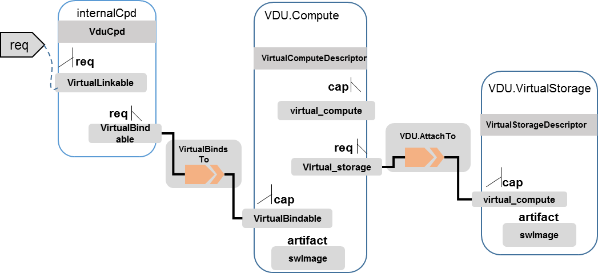

.. Modifications Copyright © 2017-2018 AT&T Intellectual Property.

.. Licensed under the Creative Commons License, Attribution 4.0 Intl.
   (the "License"); you may not use this documentation except in compliance
   with the License. You may obtain a copy of the License at

.. https://creativecommons.org/licenses/by/4.0/

.. Unless required by applicable law or agreed to in writing, software
   distributed under the License is distributed on an "AS IS" BASIS,
   WITHOUT WARRANTIES OR CONDITIONS OF ANY KIND, either express or implied.
   See the License for the specific language governing permissions and
   limitations under the License.

NFV TOSCA Type Definition
-------------------------

tosca.capabilites.nfv.VirtualCompute
^^^^^^^^^^^^^^^^^^^^^^^^^^^^^^^^^^^^

This capability is used with the properties specified in ETSI SOL001 draft.

tosca.nodes.nfv.VDU.Compute
^^^^^^^^^^^^^^^^^^^^^^^^^^^

The NFV Virtualization Deployment Unit (VDU) compute node type
represents a VDU entity which it describes the deployment and
operational behavior of a VNF component (VNFC), as defined by **[ETSI
NFV IFA011].**

+-----------------------+-------------------------------+
| Shorthand Name        | VDU.Compute                   |
+=======================+===============================+
| Type Qualified Name   | tosca:VDU.Compute             |
+-----------------------+-------------------------------+
| Type URI              | tosca.nodes.nfv.VDU.Compute   |
+-----------------------+-------------------------------+
| derived_from          | tosca.nodes.Compute           |
+-----------------------+-------------------------------+

Attributes
~~~~~~~~~~

None

Capabilities
~~~~~~~~~~~~

+------------+--------------------+------------+------------------------------+
| Name       | Type               | Constraints| Description                  |
+============+====================+============+==============================+
| virtual\   | tosca.\            |            | Describes virtual compute    |
| _compute   | capabilities.nfv.\ |            | resources capabilities.      |
|            | VirtualCompute     |            |                              |
+------------+--------------------+------------+------------------------------+
| monitoring\| tosca.\            | None       | Monitoring parameter, which  |
| _parameter | capabilities.nfv.\ |            | can be tracked for a VNFC    |
|            | Metric             |            | based on this VDU            |
|            |                    |            |                              |
|            |                    |            | Examples include:            |
|            |                    |            | memory-consumption,          |
|            |                    |            | CPU-utilisation,             |
|            |                    |            | bandwidth-consumption, VNFC  |
|            |                    |            | downtime, etc.               |
+------------+--------------------+------------+------------------------------+
| Virtual\   | tosca.\            |            | Defines ability of           |
| _binding   | capabilities.nfv.\ |            | VirtualBindable              |
|            | VirtualBindable    |            |                              |
|            |                    |            |                              |
|            | editor note: need  |            |                              |
|            | to create a        |            |                              |
|            | capability type    |            |                              |
+------------+--------------------+------------+------------------------------+

Definition
~~~~~~~~~~

.. code-block:: yaml

  tosca.nodes.nfv.VDU.Compute:

  derived_from: tosca.nodes.Compute

  properties:

  name:

  type: string

  required: true

  description:

  type: string

  required: true

  boot_order:

  type: list # explicit index (boot index) not necessary, contrary to IFA011

  entry_schema:

  type: string

  required: false

  nfvi_constraints:

  type: list

  entry_schema:

  type: string

  required: false

  configurable_properties:

  type: map

  entry_schema:

  type: tosca.datatypes.nfv.VnfcConfigurableProperties

  required: true

  attributes:

  private_address:

  status: deprecated

  public_address:

  status: deprecated

  networks:

  status: deprecated

  ports:

  status: deprecated

  capabilities:

  virtual_compute:

  type: tosca.capabilities.nfv.VirtualCompute

  virtual_binding:

  type: tosca.capabilities.nfv.VirtualBindable

  #monitoring_parameter:

  # modeled as ad hoc (named) capabilities in VDU node template

  # for example:

  #capabilities:

  # cpu_load: tosca.capabilities.nfv.Metric

  # memory_usage: tosca.capabilities.nfv.Metric

  host: #Editor note: FFS. How this capabilities should be used in NFV Profile|

  type: *tosca.capabilities.Container*

  valid_source_types:
  [*tosca.nodes.SoftwareComponent*]

  occurrences: [0,UNBOUNDED]

  endpoint:

  occurrences: [0,0]

  os:

  occurrences: [0,0]

  scalable:
  #Editor note: FFS. How this capabilities should be used in NFV Profile

  type: *tosca.capabilities.Scalable*

  binding:

  occurrences: [0,UNBOUND]

  requirements:

  - virtual_storage:

  capability: tosca.capabilities.nfv.VirtualStorage

  relationship: tosca.relationships.nfv.VDU.AttachedTo

  node: tosca.nodes.nfv.VDU.VirtualStorage

  occurences: [ 0, UNBOUNDED ]

  - local_storage: #For NFV Profile, this requirement is deprecated.

  occurrences: [0,0]

  artifacts:

  - sw_image:

  file:

  type: tosca.artifacts.nfv.SwImage

Artifact
~~~~~~~~~~

Note: currently not supported.

+--------+---------+----------------+------------+------------------------+
| Name   | Required| Type           | Constraints| Description            |
+========+=========+================+============+========================+
| SwImage| Yes     | tosca.\        |            | Describes the software |
|        |         | artifacts.nfv.\|            | image which is directly|
|        |         | SwImage        |            | realizing this virtual |
|        |         |                |            | storage                |
+--------+---------+----------------+------------+------------------------+

|image2|

tosca.nodes.nfv.VDU.VirtualStorage
^^^^^^^^^^^^^^^^^^^^^^^^^^^^^^^^^^

The NFV VirtualStorage node type represents a virtual storage entity
which it describes the deployment and operational behavior of a virtual
storage resources, as defined by **[ETSI NFV IFA011].**

**[editor note]** open issue: should NFV profile use the current storage
model as described in YAML 1.1. Pending on Shitao proposal (see
NFVIFA(17)000110 discussion paper)

**[editor note]** new relationship type as suggested in Matt
presentation. Slide 8. With specific rules of "valid_target_type"

+---------------------------+--------------------------------------+
| **Shorthand Name**        | VirtualStorage                       |
+===========================+======================================+
| **Type Qualified Name**   | tosca: VirtualStorage                |
+---------------------------+--------------------------------------+
| **Type URI**              | tosca.nodes.nfv.VDU.VirtualStorage   |
+---------------------------+--------------------------------------+
| **derived_from**          | tosca.nodes.Root                     |
+---------------------------+--------------------------------------+

tosca.artifacts.nfv.SwImage
^^^^^^^^^^^^^^^^^^^^^^^^^^^

+---------------------------+------------------------------------+
| **Shorthand Name**        | SwImage                            |
+===========================+====================================+
| **Type Qualified Name**   | tosca:SwImage                      |
+---------------------------+------------------------------------+
| **Type URI**              | tosca.artifacts.nfv.SwImage        |
+---------------------------+------------------------------------+
| **derived_from**          | tosca.artifacts.Deployment.Image   |
+---------------------------+------------------------------------+

Properties
~~~~~~~~~~

+-----------------+---------+----------+------------+-------------------------+
| Name            | Required| Type     | Constraints| Description             |
+=================+=========+==========+============+=========================+
| name            | yes     | string   |            | Name of this software   |
|                 |         |          |            | image                   |
+-----------------+---------+----------+------------+-------------------------+
| version         | yes     | string   |            | Version of this software|
|                 |         |          |            | image                   |
+-----------------+---------+----------+------------+-------------------------+
| checksum        | yes     | string   |            | Checksum of the software|
|                 |         |          |            | image file              |
+-----------------+---------+----------+------------+-------------------------+
| container\      | yes     | string   |            | The container format    |
| _format         |         |          |            | describes the container |
|                 |         |          |            | file format in which    |
|                 |         |          |            | software image is       |
|                 |         |          |            | provided.               |
+-----------------+---------+----------+------------+-------------------------+
| disk\_format    | yes     | string   |            | The disk format of a    |
|                 |         |          |            | software image is the   |
|                 |         |          |            | format of the underlying|
|                 |         |          |            | disk image              |
+-----------------+---------+----------+------------+-------------------------+
| min\_disk       | yes     | scalar-\ |            | The minimal disk size   |
|                 |         | unit.size|            | requirement for this    |
|                 |         |          |            | software image.         |
+-----------------+---------+----------+------------+-------------------------+
| min\_ram        | no      | scalar-\ |            | The minimal RAM         |
|                 |         | unit.size|            | requirement for this    |
|                 |         |          |            | software image.         |
+-----------------+---------+----------+------------+-------------------------+
| Size            | yes     | scalar-\ |            | The size of this        |
|                 |         | unit.size|            | software image          |
+-----------------+---------+----------+------------+-------------------------+
| sw\_image       | yes     | string   |            | A reference to the      |
|                 |         |          |            | actual software image   |
|                 |         |          |            | within VNF Package, or  |
|                 |         |          |            | url.                    |
+-----------------+---------+----------+------------+-------------------------+
| operating\      | no      | string   |            | Identifies the operating|
| _system         |         |          |            | system used in the      |
|                 |         |          |            | software image.         |
+-----------------+---------+----------+------------+-------------------------+
| supported\      | no      | list     |            | Identifies the          |
| _virtualization\|         |          |            | virtualization          |
| _enviroment     |         |          |            | environments (e.g.      |
|                 |         |          |            | hypervisor) compatible  |
|                 |         |          |            | with this software image|
+-----------------+---------+----------+------------+-------------------------+

Definition
~~~~~~~~~~

.. code-block:: yaml

  tosca.artifacts.nfv.SwImage:

    derived_from: tosca.artifacts.Deployment.Image

    properties or metadata:

      #id:

        # node name

      name:

        type: string

  required: true

      version:

        type: string

  required: true

      checksum:

        type: string

  required: true

      container_format:

        type: string

  required: true

      disk_format:

        type: string

  required: true

      min_disk:

        type: scalar-unit.size # Number

  required: true

      min_ram:

        type: scalar-unit.size # Number

  required: false

      size:

        type: scalar-unit.size # Number

  required: true

      sw_image:

        type: string

  required: true

      operating_system:

        type: string

  required: false

      supported_virtualisation_environments:

        type: list

        entry_schema:

          type: string

  required: false

