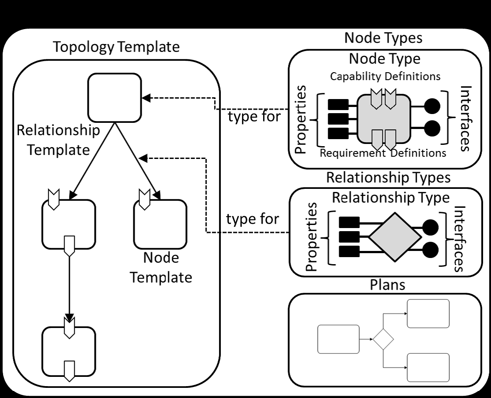

.. Modifications Copyright © 2017-2018 AT&T Intellectual Property.

.. Licensed under the Creative Commons License, Attribution 4.0 Intl.
   (the "License"); you may not use this documentation except in compliance
   with the License. You may obtain a copy of the License at

.. https://creativecommons.org/licenses/by/4.0/

.. Unless required by applicable law or agreed to in writing, software
   distributed under the License is distributed on an "AS IS" BASIS,
   WITHOUT WARRANTIES OR CONDITIONS OF ANY KIND, either express or implied.
   See the License for the specific language governing permissions and
   limitations under the License.

Introduction
------------

The following sub-clauses describe the numbered requirements for VNF
Descriptor (VNFD) and PNF Descriptor (PNFD) or in other words the VNF/PNF
Service Template based on the most updated draft of ETSI NFV-SOL001 standard
for VNF/PNF Descriptor. The ETSI standard specifies a NFV specific data
model using TOSCA/YAML data model constructs specified in TOSCA Simple
Profile in YAML v.1.2.

The requirements for TOSCA/CSAR based VNF/PNF package are described as well
and they are based on ETSI NFV-SOL004 standard.

References
^^^^^^^^^^

  1. ETSI GS NFV-SOL001 v.2.5.1
  2. TOSCA SIMPLE Profile in YAML v.1.2
  3. ETSI GS NFV-SOL004 v.2.6.1 + NFV CR NFVSOL(18)000746r3.

Intended Audience
^^^^^^^^^^^^^^^^^

This document is intended for developers of VNF TOSCA templates that
will be orchestrated by ONAP. The document is also applicable for
creating RFP’s with the list of required TOSCA/YAML features
supported by VNF provider.

Scope
^^^^^

ONAP implementations of Network Cloud supports TOSCA Templates, also
referred to as TOSCA in this document.

ONAP requires the TOSCA Templates to follow a specific format. This
document provides the mandatory, recommended, and optional requirements
associated with this format.

Overview
^^^^^^^^

The document includes three charters to help the VNF or PNF providers to
use the VNF or PNF model design tools and understand the VNF or PNF package
structure and VNF or PNF TOSCA templates.

In the ONAP, VNF or PNF Package and VNFD or PNFD template can be designed by
manually or via model designer tools. VNF or PNF model designer tools can
provide the GUI and CLI tools for the VNF or PNF provider to develop the
VNF or PNF Package and VNFD or PNFD template.

The VNF or PNF package structure is align to the NFV TOSCA protocol,
and supports CSAR

The VNFD or PNFD and VNF or PNF package are all align to the NFV TOSCA
protocol, which supports multiple TOSCA template yaml files, and also
supports self-defined node or other extensions.

TOSCA Introduction
^^^^^^^^^^^^^^^^^^

TOSCA defines a Meta model for defining IT services. This Meta model
defines both the structure of a service as well as how to manage it. A
Topology Template (also referred to as the topology model of a service)
defines the structure of a service. Plans define the process models that
are used to create and terminate a service as well as to manage a
service during its whole lifetime.

A Topology Template consists of a set of Node Templates and Relationship
Templates that together define the topology model of a service as a (not
necessarily connected) directed graph. A node in this graph is
represented by a *Node Template*. A Node Template specifies the
occurrence of a Node Type as a component of a service. A *Node Type*
defines the properties of such a component (via *Node Type Properties*)
and the operations (via *Interfaces*) available to manipulate the
component. Node Types are defined separately for reuse purposes and a
Node Template references a Node Type and adds usage constraints, such as
how many times the component can occur.

|image1|

Figure 1: Structural Elements of Service Template and their Relations

TOSCA Modeling Principles & Data Model
^^^^^^^^^^^^^^^^^^^^^^^^^^^^^^^^^^^^^^

This section describing TOSCA modeling principles and data model for
NFV, which shall be based on [TOSCA-1.0] and [TOSCA-Simple-Profile-YAML
V1.0], or new type based on ETSI NFV requirements, etc.

