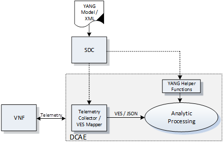

:tocdepth: 2
**7. ONAP Management Requirements**
=====================================

a. Service Design
==================

This section, Service Design, has been left intentionally blank. It is out-of-scope for the VNF Requirements project for the Amsterdam release and no numbered requirements are expected. Content may be added in future updates of this document.

b. VNF On-boarding and package management
==========================================

**Design Definition**

The ONAP Design Time Framework provides the ability to design NFV
resources including VNFs, Services, and products. The VNF provider must
provide VNF packages that include a rich set of recipes, management and
functional interfaces, policies, configuration parameters, and
infrastructure requirements that can be utilized by the ONAP Design
module to onboard and catalog these resources. Initially this
information may be provided in documents, but in the near future a
method will be developed to automate as much of the transfer of data as
possible to satisfy its long term requirements.

The current VNF Package Requirement is based on a subset of the
Requirements contained in the ETSI Document: ETSI GS NFV-MAN 001 v1.1.1
and GS NFV IFA011 V0.3.0 (2015-10) - Network Functions Virtualization
(NFV), Management and Orchestration, VNF Packaging Specification.

**Resource Description**

* R-77707 The VNF provide **MUST** include a Manifest File that contains a list of all the components in the VNF package.
* R-66070 The VNF Package **MUST** include VNF Identification Data to uniquely identify the resource for a given VNF provider. The identification data must include: an identifier for the VNF, the name of the VNF as was given by the VNF provider, VNF description, VNF provider, and version.
* R-69565 The VNF Package **MUST** include documentation describing VNF Management APIs. The document must include information and tools for:

 - ONAP to deploy and configure (initially and ongoing) the VNF application(s) (e.g., NETCONF APIs). Includes description of configurable parameters for the VNF and whether the parameters can be configured after VNF instantiation.
 - ONAP to monitor the health of the VNF (conditions that require healing and/or scaling responses). Includes a description of:

  - Parameters that can be monitored for the VNF and event records (status, fault, flow, session, call, control plane, etc.) generated by the VNF after instantiation.
  - Runtime lifecycle events and related actions (e.g., control responses, tests) which can be performed for the VNF.

* R-84366 The VNF Package **MUST** include documentation describing VNF Functional APIs that are utilized to build network and application services. This document describes the externally exposed functional inputs and outputs for the VNF, including interface format and protocols supported.
* R-36280 The VNF provider **MUST** provide documentation describing VNF Functional Capabilities that are utilized to operationalize the VNF and compose complex services.
* R-98617 The VNF provider **MUST** provide information regarding any dependency (e.g., affinity, anti-affinity) with other VNFs and resources.

**Resource Configuration**

* R-89571 The VNF **MUST** support and provide artifacts for configuration management using at least one of the following technologies:

 - Netconf/YANG
 - Chef
 - Ansible

 Note: The requirements for Netconf/YANG, Chef, and Ansible protocols are provided separately and must be supported only if the corresponding protocol option is provided by the VNF providor.

 **Configuration Management via Netconf/YANG**

 * R-30278 The VNF provider **MUST** provide a Resource/Device YANG model as a foundation for creating the YANG model for configuration. This will include VNF attributes/parameters and valid values/attributes configurable by policy.

 **Configuration Management via Chef**

 * R-13390 The VNF provider **MUST** provide cookbooks to be loaded on the appropriate Chef Server.
 * R-18525 The VNF provider **MUST** provide a JSON file for each supported action for the VNF.  The JSON file must contain key value pairs with all relevant values populated with sample data that illustrates its usage. The fields and their description are defined in Appendix A.

 Note: Chef support in ONAP is not currently available and planned for 4Q 2017.

 **Configuration Management via Ansible**

 * R-75608 The VNF provider **MUST** provide playbooks to be loaded on the appropriate Ansible Server.
 * R-16777 The VNF provider **MUST** provide a JSON file for each supported action for the VNF.  The JSON file must contain key value pairs with all relevant values populated with sample data that illustrates its usage. The fields and their description are defined in Appendix B.

* R-46567 The VNF Package **MUST** include configuration scripts for boot sequence and configuration.
* R-16065 The VNF provider **MUST** provide configurable parameters (if unable to conform to YANG model) including VNF attributes/parameters and valid values, dynamic attributes and cross parameter dependencies (e.g., customer provisioning data).

**Resource Control Loop**

* R-22888 The VNF provider **MUST** provide documentation for the VNF Policy Description to manage the VNF runtime lifecycle. The document must include a description of how the policies (conditions and actions) are implemented in the VNF.
* R-01556 The VNF Package **MUST** include documentation describing the fault, performance, capacity events/alarms and other event records that are made available by the VNF. The document must include:

 - A unique identification string for the specific VNF, a description of the problem that caused the error, and steps or procedures to perform Root Cause Analysis and resolve the issue.
 - All events, severity level (e.g., informational, warning, error) and descriptions including causes/fixes if applicable for the event.
 - All events (fault, measurement for VNF Scaling, Syslogs, State Change and Mobile Flow), that need to be collected at each VM, VNFC (defined in *VNF Guidelines for Network Cloud and ONAP*) and for the overall VNF.

* R-27711 The VNF provider **MUST** provide an XML file that contains a list of VNF error codes, descriptions of the error, and possible causes/corrective action.
* R-01478 The VNF Package **MUST** include documentation describing all parameters that are available to monitor the VNF after instantiation (includes all counters, OIDs, PM data, KPIs, etc.) that must be collected for reporting purposes. The documentation must include a list of:

 - Monitoring parameters/counters exposed for virtual resource management and VNF application management.
 - KPIs and metrics that need to be collected at each VM for capacity planning and performance management purposes.
 - The monitoring parameters must include latencies, success rates, retry rates, load and quality (e.g., DPM) for the key transactions/functions supported by the VNF and those that must be exercised by the VNF in order to perform its function.
 - For each KPI, provide lower and upper limits.
 - When relevant, provide a threshold crossing alert point for each KPI and describe the significance of the threshold crossing.
 - For each KPI, identify the suggested actions that need to be performed when a threshold crossing alert event is recorded.
 - Describe any requirements for the monitoring component of tools for Network Cloud automation and management to provide these records to components of the VNF.
 - When applicable, provide calculators needed to convert raw data into appropriate reporting artifacts.

* R-56815 The VNF Package **MUST** include documentation describing supported VNF scaling capabilities and capacity limits (e.g., number of users, bandwidth, throughput, concurrent calls).
* R-48596 The VNF Package **MUST** include documentation describing the characteristics for the VNF reliability and high availability.
* R-74763 The VNF provider **MUST** provide an artifact per VNF that contains all of the VNF Event Records supported. The artifact should include reference to the specific release of the VNF Event Stream Common Event Data Model document it is based on. (e.g., `VES Event Listener <https://github.com/att/evel-test-collector/tree/master/docs/att_interface_definition>`__)

**Compute, Network, and Storage Requirements**

* R-35851 The VNF Package **MUST** include VNF topology that describes basic network and application connectivity internal and external to the VNF including Link type, KPIs, Bandwidth, latency, jitter, QoS (if applicable) for each interface.
* R-97102 The VNF Package **MUST** include VM requirements via a Heat template that provides the necessary data for:

 - VM specifications for all VNF components - for hypervisor, CPU, memory, storage.
 - Network connections, interface connections, internal and external to VNF.
 - High availability redundancy model.
 - Scaling/growth VM specifications.

 Note: Must comply with the *Heat requirements in 5.b*.

* R-26881 The VNF provider **MUST** provide the binaries and images needed to instantiate the VNF (VNF and VNFC images).
* R-96634 The VNF provider **MUST** describe scaling capabilities to manage scaling characteristics of the VNF.

**Testing**

* R-43958 The VNF Package **MUST** include documentation describing the tests that were conducted by the VNF providor and the test results.
* R-04298 The VNF provider **MUST** provide their testing scripts to support testing.
* R-58775 The VNF provider **MUST** provide software components that can be packaged with/near the VNF, if needed, to simulate any functions or systems that connect to the VNF system under test. This component is necessary only if the existing testing environment does not have the necessary simulators.

**Licensing Requirements**

* R-85653 The VNF **MUST** provide metrics (e.g., number of sessions, number of subscribers, number of seats, etc.) to ONAP for tracking every license.
* R-44125 The VNF provider **MUST** agree to the process that can be met by Service Provider reporting infrastructure. The Contract shall define the reporting process and the available reporting tools.
* R-40827 The VNF provider **MUST** enumerate all of the open source licenses their VNF(s) incorporate.
* R-97293 The VNF provider **MUST NOT** require audits of Service Provider’s business.
* R-44569 The VNF provider **MUST NOT** require additional infrastructure such as a VNF provider license server for VNF provider functions and metrics.
* R-13613 The VNF **MUST** provide clear measurements for licensing purposes to allow automated scale up/down by the management system.
* R-27511 The VNF provider **MUST** provide the ability to scale up a VNF provider supplied product during growth and scale down a VNF provider supplied product during decline without “real-time” restrictions based upon VNF provider permissions.
* R-85991 The VNF provider **MUST** provide a universal license key per VNF to be used as needed by services (i.e., not tied to a VM instance) as the recommended solution. The VNF provider may provide pools of Unique VNF License Keys, where there is a unique key for each VNF instance as an alternate solution. Licensing issues should be resolved without interrupting in-service VNFs.
* R-47849 The VNF provider **MUST** support the metadata about licenses (and their applicable entitlements) as defined in this document for VNF software, and any license keys required to authorize use of the VNF software.  This metadata will be used to facilitate onboarding the VNF into the ONAP environment and automating processes for putting the licenses into use and managing the full lifecycle of the licenses. The details of this license model are described in Appendix C. Note: License metadata support in ONAP is not currently available and planned for 1Q 2018.

c. Configuration Management
===========================

ONAP interacts directly with VNFs through its Network and Application
Adapters to perform configuration activities within NFV environment.
These activities include service and resource
configuration/reconfiguration, automated scaling of resources, service
and resource removal to support runtime lifecycle management of VNFs and
services. The Adapters employ a model driven approach along with
standardized APIs provided by the VNF developers to configure resources
and manage their runtime lifecycle.

Additional details can be found in the `ONAP Application Controller (APPC) API Guide <http://onap.readthedocs.io/en/latest/submodules/appc.git/docs/APPC%20API%20Guide/APPC%20API%20Guide.html>`_, `ONAP VF-C project <http://onap.readthedocs.io/en/latest/submodules/vfc/nfvo/lcm.git/docs/index.html>`_ and the `ONAP SDNC project <http://onap.readthedocs.io/en/latest/submodules/sdnc/northbound.git/docs/index.html>`_.

NETCONF Standards and Capabilities
----------------------------------

ONAP Controllers and their Adapters utilize device YANG model and
NETCONF APIs to make the required changes in the VNF state and
configuration. The VNF providers must provide the Device YANG model and
NETCONF server supporting NETCONF APIs to comply with target ONAP and
industry standards.

**VNF Configuration via NETCONF Requirements**

**Configuration Management**

* R-88026 The VNF **MUST** include a NETCONF server enabling runtime configuration and lifecycle management capabilities.
* R-95950 The VNF **MUST** provide a NETCONF interface fully defined by supplied YANG models for the embedded NETCONF server.

**NETCONF Server Requirements**

* R-73468 The VNF **MUST** allow the NETCONF server connection parameters to be configurable during virtual machine instantiation through Heat templates where SSH keys, usernames, passwords, SSH service and SSH port numbers are Heat template parameters.
* R-90007 The VNF **MUST** implement the protocol operation: **close-session()**- Gracefully close the current session.
* R-70496 The VNF **MUST** implement the protocol operation: **commit(confirmed, confirm-timeout)** - Commit candidate configuration datastore to the running configuration.
* R-18733 The VNF **MUST** implement the protocol operation: **discard-changes()** - Revert the candidate configuration datastore to the running configuration.
* R-44281 The VNF **MUST** implement the protocol operation: **edit-config(target, default-operation, test-option, error-option, config)** - Edit the target configuration datastore by merging, replacing, creating, or deleting new config elements.
* R-60106 The VNF **MUST** implement the protocol operation: **get(filter)** - Retrieve (a filtered subset of) the running configuration and device state information. This should include the list of VNF supported schemas.
* R-29488 The VNF **MUST** implement the protocol operation: **get-config(source, filter)** - Retrieve a (filtered subset of a) configuration from the configuration datastore source.
* R-11235 The VNF **MUST** implement the protocol operation: **kill-session(session)** - Force the termination of **session**.
* R-02597 The VNF **MUST** implement the protocol operation: **lock(target)** - Lock the configuration datastore target.
* R-96554 The VNF **MUST** implement the protocol operation: **unlock(target)** - Unlock the configuration datastore target.
* R-29324 The VNF **SHOULD** implement the protocol operation: **copy-config(target, source) -** Copy the content of the configuration datastore source to the configuration datastore target.
* R-88031 The VNF **SHOULD** implement the protocol operation: **delete-config(target) -** Delete the named configuration datastore target.
* R-97529 The VNF **SHOULD** implement the protocol operation: **get-schema(identifier, version, format) -** Retrieve the YANG schema.
* R-62468 The VNF **MUST** allow all configuration data shall to be edited through a NETCONF <edit-config> operation. Proprietary NETCONF RPCs that make configuration changes are not sufficient.
* R-01382 The VNF **MUST** allow the entire configuration of the VNF to be retrieved via NETCONF's <get-config> and <edit-config>, independently of whether it was configured via NETCONF or other mechanisms.
* R-28756 The VNF **MUST** support **:partial-lock** and **:partial-unlock** capabilities, defined in RFC 5717. This allows multiple independent clients to each write to a different part of the <running> configuration at the same time.
* R-83873 The VNF **MUST** support **:rollback-on-error** value for the <error-option> parameter to the <edit-config> operation. If any error occurs during the requested edit operation, then the target database (usually the running configuration) will be left unaffected. This provides an 'all-or-nothing' edit mode for a single <edit-config> request.
* R-68990 The VNF **MUST** support the **:startup** capability. It will allow the running configuration to be copied to this special database. It can also be locked and unlocked.
* R-68200 The VNF **MUST** support the **:url** value to specify protocol operation source and target parameters. The capability URI for this feature will indicate which schemes (e.g., file, https, sftp) that the server supports within a particular URL value. The 'file' scheme allows for editable local configuration databases. The other schemes allow for remote storage of configuration databases.
* R-20353 The VNF **MUST** implement at least one of the capabilities **:candidate** or **:writable-running**. If both **:candidate** and **:writable-running** are provided then two locks should be supported.
* R-11499 The VNF **MUST** fully support the XPath 1.0 specification for filtered retrieval of configuration and other database contents. The 'type' attribute within the <filter> parameter for <get> and <get-config> operations may be set to 'xpath'. The 'select' attribute (which contains the XPath expression) will also be supported by the server. A server may support partial XPath retrieval filtering, but it cannot advertise the **:xpath** capability unless the entire XPath 1.0 specification is supported.
* R-83790 The VNF **MUST** implement the **:validate** capability
* R-49145 The VNF **MUST** implement **:confirmed-commit** If **:candidate** is supported.
* R-58358 The VNF **MUST** implement the **:with-defaults** capability [RFC6243].
* R-59610 The VNF **MUST** implement the data model discovery and download as defined in [RFC6022].
* R-87662 The VNF **SHOULD** implement the NETCONF Event Notifications [RFC5277].
* R-93443 The VNF **MUST** define all data models in YANG [RFC6020], and the mapping to NETCONF shall follow the rules defined in this RFC.
* R-26115 The VNF **MUST** follow the data model upgrade rules defined in [RFC6020] section 10. All deviations from section 10 rules shall be handled by a built-in automatic upgrade mechanism.
* R-10716 The VNF **MUST** support parallel and simultaneous configuration of separate objects within itself.
* R-29495 The VNF **MUST** support locking if a common object is being manipulated by two simultaneous NETCONF configuration operations on the same VNF within the context of the same writable running data store (e.g., if an interface parameter is being configured then it should be locked out for configuration by a simultaneous configuration operation on that same interface parameter).
* R-53015 The VNF **MUST** apply locking based on the sequence of NETCONF operations, with the first configuration operation locking out all others until completed.
* R-02616 The VNF **MUST** permit locking at the finest granularity if a VNF needs to lock an object for configuration to avoid blocking simultaneous configuration operations on unrelated objects (e.g., BGP configuration should not be locked out if an interface is being configured or entire Interface configuration should not be locked out if a non-overlapping parameter on the interface is being configured).
* R-41829 The VNF **MUST** be able to specify the granularity of the lock via a restricted or full XPath expression.
* R-66793 The VNF **MUST** guarantee the VNF configuration integrity for all simultaneous configuration operations (e.g., if a change is attempted to the BUM filter rate from multiple interfaces on the same EVC, then they need to be sequenced in the VNF without locking either configuration method out).
* R-54190 The VNF **MUST** release locks to prevent permanent lock-outs when/if a session applying the lock is terminated (e.g., SSH session is terminated).
* R-03465 The VNF **MUST** release locks to prevent permanent lock-outs when the corresponding <partial-unlock> operation succeeds.
* R-63935 The VNF **MUST** release locks to prevent permanent lock-outs when a user configured timer has expired forcing the NETCONF SSH Session termination (i.e., product must expose a configuration knob for a user setting of a lock expiration timer)
* R-10173 The VNF **MUST** allow another NETCONF session to be able to initiate the release of the lock by killing the session owning the lock, using the <kill-session> operation to guard against hung NETCONF sessions.
* R-88899 The VNF **MUST** support simultaneous <commit> operations within the context of this locking requirements framework.
* R-07545 The VNF **MUST** support all operations, administration and management (OAM) functions available from the supplier for VNFs using the supplied YANG code and associated NETCONF servers.
* R-60656 The VNF **MUST** support sub tree filtering.
* R-80898 The VNF **MUST** support heartbeat via a <get> with null filter.
* R-06617 The VNF **MUST** support get-schema (ietf-netconf-monitoring) to pull YANG model over session.
* R-25238 The VNF PACKAGE **MUST** validated YANG code using the open source pyang [1]_ program using the following commands:

.. code-block:: python

 $ pyang --verbose --strict <YANG-file-name(s)>
 $ echo $!

* R-63953 The VNF **MUST** have the echo command return a zero value otherwise the validation has failed
* R-26508 The VNF **MUST** support NETCONF server that can be mounted on OpenDaylight (client) and perform the following operations:

- Modify, update, change, rollback configurations using each configuration data element.
- Query each state (non-configuration) data element.
- Execute each YANG RPC.
- Receive data through each notification statement.

The following requirements provides the Yang models that suppliers must
conform, and those where applicable, that suppliers need to use.

* R-28545 The VNF **MUST** conform its YANG model to RFC 6060, “YANG - A Data Modeling Language for the Network Configuration Protocol (NETCONF)”
* R-29967 The VNF **MUST** conform its YANG model to RFC 6022, “YANG module for NETCONF monitoring”.
* R-22700 The VNF **MUST** conform its YANG model to RFC 6470, “NETCONF Base Notifications”.
* R-10353 The VNF **MUST** conform its YANG model to RFC 6244, “An Architecture for Network Management Using NETCONF and YANG”.
* R-53317 The VNF **MUST** conform its YANG model to RFC 6087, “Guidelines for Authors and Reviewers of YANG Data Model Documents”.
* R-33955 The VNF **SHOULD** conform its YANG model to \*\*RFC 6991, “Common YANG Data Types”.
* R-22946 The VNF **SHOULD** conform its YANG model to RFC 6536, “NETCONF Access Control Model”.
* R-10129 The VNF **SHOULD** conform its YANG model to RFC 7223, “A YANG Data Model for Interface Management”.
* R-12271 The VNF **SHOULD** conform its YANG model to RFC 7223, “IANA Interface Type YANG Module”.
* R-49036 The VNF **SHOULD** conform its YANG model to RFC 7277, “A YANG Data Model for IP Management”.
* R-87564 The VNF **SHOULD** conform its YANG model to RFC 7317, “A YANG Data Model for System Management”.
* R-24269 The VNF **SHOULD** conform its YANG model to RFC 7407, “A YANG Data Model for SNMP Configuration”.

The NETCONF server interface shall fully conform to the following
NETCONF RFCs.

* R-33946 The VNF **MUST** conform to the NETCONF RFC 4741, “NETCONF Configuration Protocol”.
* R-04158 The VNF **MUST** conform to the NETCONF RFC 4742, “Using the NETCONF Configuration Protocol over Secure Shell (SSH)”.
* R-13800 The VNF **MUST** conform to the NETCONF RFC 5277, “NETCONF Event Notification”.
* R-01334 The VNF **MUST** conform to the NETCONF RFC 5717, “Partial Lock Remote Procedure Call”.
* R-08134 The VNF **MUST** conform to the NETCONF RFC 6241, “NETCONF Configuration Protocol”.
* R-78282 The VNF **MUST** conform to the NETCONF RFC 6242, “Using the Network Configuration Protocol over Secure Shell”.

VNF REST APIs
-------------

Healthcheck is a command for which no NETCONF support exists. Therefore, this must be supported using a RESTful interface (defined in this section) or 
with a Chef cookbook/Ansible playbook (defined in sections `Chef Standards and Capabilities`_ and `Ansible Standards and Capabilities`_).

HealthCheck Definition: The VNF level HealthCheck is a check over the entire scope of the VNF. 
The VNF must be 100% healthy, ready to take requests and provide services, with all VNF required 
capabilities ready to provide services and with all active and standby resources fully ready with 
no open MINOR, MAJOR or CRITICAL alarms.  NOTE: A switch may need to be turned on, but the VNF 
should be ready to take service requests or be already processing service requests successfully.

The VNF must provide a REST formatted GET RPCs to support Healthcheck queries via the GET method 
over HTTP(s).

The port number, url, and other authentication information is provided
by the VNF provider.

**REST APIs**

* R-31809 The VNF **MUST** support the HealthCheck RPC. The HealthCheck RPC executes a VNF Provider-defined VNF Healthcheck over the scope of the entire VNF (e.g., if there are multiple VNFCs, then run a health check, as appropriate, for all VNFCs). It returns a 200 OK if the test completes. A JSON object is returned indicating state (healthy, unhealthy), scope identifier, time-stamp and one or more blocks containing info and fault information. If the VNF is unable to run the HealthCheck, return a standard http error code and message.

Examples:

.. code-block:: java

 200
 {
   "identifier": "scope represented",
   "state": "healthy",
   "time": "01-01-1000:0000"
 }

 200
 {
   "identifier": "scope represented",
   "state": "unhealthy",
    {[
   "info": "System threshold exceeded details",
   "fault":
     {
       "cpuOverall": 0.80,
       "cpuThreshold": 0.45
     }
     ]},
   "time": "01-01-1000:0000"
 }

Chef Standards and Capabilities
-------------------------------

ONAP will support configuration of VNFs via Chef subject to the
requirements and guidelines defined in this section.

The Chef configuration management mechanism follows a client-server
model. It requires the presence of a Chef-Client on the VNF that will be
directly managed by a Chef Server. The Chef-client will register with
the appropriate Chef Server and are managed via ‘cookbooks’ and
configuration attributes loaded on the Chef Server which contain all
necessary information to execute the appropriate actions on the VNF via
the Chef-client.

ONAP will utilize the open source Chef Server, invoke the documented
Chef REST APIs to manage the VNF and requires the use of open source
Chef-Client and Push Jobs Client on the VNF
(https://downloads.chef.io/).

**VNF Configuration via Chef Requirements**

**Chef Client Requirements**

* R-79224 The VNF **MUST** have the chef-client be preloaded with validator keys and configuration to register with the designated Chef Server as part of the installation process.
* R-72184 The VNF **MUST** have routable FQDNs for all the endpoints (VMs) of a VNF that contain chef-clients which are used to register with the Chef Server.  As part of invoking VNF actions, ONAP will trigger push jobs against FQDNs of endpoints for a VNF, if required.
* R-47068 The VNF **MAY** expose a single endpoint that is responsible for all functionality.
* R-67114 The VNF **MUST** be installed with:

 -  Chef-Client >= 12.0
 -  Chef push jobs client >= 2.0

**Chef Roles/Requirements**

* R-27310 The VNF Package **MUST** include all relevant Chef artifacts (roles/cookbooks/recipes) required to execute VNF actions requested by ONAP for loading on appropriate Chef Server.
* R-26567 The VNF Package **MUST** include a run list of roles/cookbooks/recipes, for each supported VNF action, that will perform the desired VNF action in its entirety as specified by ONAP (see Section 8.c, ONAP Controller APIs and Behavior, for list of VNF actions and requirements), when triggered by a chef-client run list in JSON file.
* R-98911 The VNF **MUST NOT** use any instance specific parameters for the VNF in roles/cookbooks/recipes invoked for a VNF action.
* R-37929 The VNF **MUST** accept all necessary instance specific data from the environment or node object attributes for the VNF in roles/cookbooks/recipes invoked for a VNF action.
* R-62170 The VNF **MUST** over-ride any default values for configurable parameters that can be set by ONAP in the roles, cookbooks and recipes.
* R-78116 The VNF **MUST** update status on the Chef Server appropriately (e.g., via a fail or raise an exception) if the chef-client run encounters any critical errors/failures when executing a VNF action.
* R-44013 The VNF **MUST** populate an attribute, defined as node[‘PushJobOutput’] with the desired output on all nodes in the push job that execute chef-client run if the VNF action requires the output of a chef-client run be made available (e.g., get running configuration).
* R-30654 The VNF Package **MUST** have appropriate cookbooks that are designed to automatically ‘rollback’ to the original state in case of any errors for actions that change state of the VNF (e.g., configure).
* R-65755 The VNF **SHOULD** support callback URLs to return information to ONAP upon completion of the chef-client run for any chef-client run associated with a VNF action.

-  As part of the push job, ONAP will provide two parameters in the environment of the push job JSON object:
    -  ‘RequestId’ a unique Id to be used to identify the request,
    -  ‘CallbackUrl’, the URL to post response back.

-  If the CallbackUrl field is empty or missing in the push job, then the chef-client run need not post the results back via callback.

* R-15885 The VNF **MUST** Upon completion of the chef-client run, POST back on the callback URL, a JSON object as described in Table A2 if the chef-client run list includes a cookbook/recipe that is callback capable. Failure to POST on the Callback Url should not be considered a critical error. That is, if the chef-client successfully completes the VNF action, it should reflect this status on the Chef Server regardless of whether the Callback succeeded or not.

ONAP Chef API Usage
~~~~~~~~~~~~~~~~~~~

This section outlines the workflow that ONAP invokes when it receives an
action request against a Chef managed VNF.

1. When ONAP receives a request for an action for a Chef Managed VNF, it
   retrieves the corresponding template (based on **action** and
   **VNF)** from its database and sets necessary values in the
   “Environment”, “Node” and “NodeList” keys (if present) from either
   the payload of the received action or internal data.

2. If “Environment” key is present in the updated template, it posts the
   corresponding JSON dictionary to the appropriate Environment object
   REST endpoint on the Chef Server thus updating the Environment
   attributes on the Chef Server.

3. Next, it creates a Node Object from the “Node” JSON dictionary for
   all elements listed in the NodeList (using the FQDN to construct the
   endpoint) by replicating it  [2]_. As part of this process, it will
   set the name field in each Node Object to the corresponding FQDN.
   These node objects are then posted on the Chef Server to
   corresponding Node Object REST endpoints to update the corresponding
   node attributes.

4. If PushJobFlag is set to “True” in the template, ONAP requests a push
   job against all the nodes in the NodeList to trigger
   chef-client\ **.** It will not invoke any other command via the push
   job. ONAP will include a callback URL in the push job request and a
   unique Request Id. An example push job posted by ONAP is listed
   below:

.. code-block:: java

   {
     "command": "chef-client",
     "run\_timeout": 300,
     "nodes”: [“node1.vnf\_a.onap.com”, “node2.vnf\_a.onap.com”],
       "env": {
                “RequestId”:”8279-abcd-aksdj-19231”,
                “CallbackUrl”:”<callback>”
              },
   }

5. If CallbackCapable field in the template is not present or set to
   “False” ONAP will poll the Chef Server to check completion status of
   the push job.

6. If “GetOutputFlag” is set to “True” in the template and
   CallbackCapable is not set to “True”, ONAP will retrieve any output
   from each node where the push job has finished by accessing the Node
   Object attribute node[‘PushJobOutput’].

Ansible Standards and Capabilities
----------------------------------

ONAP will support configuration of VNFs via Ansible subject to the
requirements and guidelines defined in this section.

Ansible allows agentless management of VNFs/VMs/VNFCs via execution of ‘playbooks’ 
over ssh. The ‘playbooks’ are a structured set of tasks which contain all the necessary 
data and execution capabilities to take the necessary action on one or more target VMs 
(and/or VNFCs) of the VNF. ONAP will utilize the framework of an Ansible Server that 
will host and run playbooks to manage VNFs that support Ansible.

**VNF Configuration via Ansible Requirements**

**Ansible Client Requirements**

* R-32217 The VNF **MUST** have routable FQDNs that are reachable via the Ansible Server for the endpoints (VMs) of a VNF on which playbooks will be executed. ONAP will initiate requests to the Ansible Server for invocation of playbooks against these end points [3]_.
* R-54373 The VNF **MUST** have Python >= 2.7 on the endpoint VM(s) of a VNF on which an Ansible playbook will be executed.
* R-35401 The VNF **MUST** support SSH and allow SSH access to the Ansible server for the endpoint VM(s) and comply with the  Network Cloud Service Provider guidelines for authentication and access.
* R-NNNNN The VNF **SHOULD** load the SSH key onto VNF VM(s) as part of instantiation. This will allow the Ansible Server to authenticate to perform post-instantiation configuration without manual intervention and without requiring specific VNF login IDs and passwords.

 CAUTION: For VNFs configured using Ansible, to eliminate the need for manual steps, post-instantiation and pre-configuration, to upload of SSH keys, SSH keys loaded during (heat) instantiation shall be preserved and not removed by (heat) embedded scripts. 

* R-NNNNN The VNF **MUST** include as part of post-instantiation configuration done by Ansible Playbooks the removal/update of SSH keys loaded through instantiation to support Ansible. This may include download and install of new SSH keys.
* R-NNNNN The VNF **MUST** update the Ansible Server and other entities storing and using the SSH key for authentication when the SSH key used by Ansible is regenerated/updated.

**Ansible Playbook Requirements**

An Ansible playbook is a collection of tasks that is executed on the Ansible server (local host) and/or the target VM (s) in order to complete the desired action.

* R-40293 The VNF **MUST** make available playbooks that conform to the ONAP requirement.
* R-49396 The VNF **MUST** support each VNF action be supported by ONAP (APPC) by invocation of **one** playbook [4]_. The playbook will be responsible for executing all necessary tasks (as well as calling other playbooks) to complete the request.
* R-33280 The VNF **MUST NOT** use any instance specific parameters in a playbook.
* R-48698 The VNF **MUST** utilize information from key value pairs that will be provided by the Ansible Server as extra-vars during invocation to execute the desired VNF action. If the playbook requires files, they must also be supplied using the methodology detailed in the Ansible Server API.

The Ansible Server will determine if a playbook invoked to execute a VNF action finished successfully or not using the “PLAY_RECAP” summary in Ansible log.  The playbook will be considered to successfully finish only if the “PLAY RECAP” section at the end of playbook execution output has no unreachable hosts and no failed tasks. Otherwise, the playbook will be considered to have failed.

* R-43253 The VNF **MUST** use playbooks designed to allow Ansible Server to infer failure or success based on the “PLAY_RECAP” capability.
* R-50252 The VNF **MUST** write to a specific set of text files that will be retrieved and made available by the Ansible Server if, as part of a VNF action (e.g., audit), a playbook is required to return any VNF information. The text files must be written in the same directory as the one from which the playbook is being executed. A text file must be created for each host the playbook run targets/affects, with the name ‘<hostname>_results.txt’ into which any desired output from each respective VM/VNF must be written.
* R-51442 The VNF **SHOULD** use playbooks that are designed to automatically ‘rollback’ to the original state in case of any errors for actions that change state of the VNF (e.g., configure).

 NOTE: In case rollback at the playbook level is not supported or possible, the VNF provider shall provide alternative locking mechanism (e.g., for a small VNF the rollback mechanism may rely on workflow to terminate and re-instantiate VNF VMs and then re-run playbook(s)). Backing up updated files also recommended to support rollback when soft rollback is feasible.

* R-NNNNN The VNF **SHOULD NOT** use playbooks that make requests to Cloud resources e.g. Openstack (nova, neutron, glance, heat, etc.); therefore, there is no use for Cloud specific variables like Openstack UUIDs in Ansible Playbooks.

 Rationale: Flows that require interactions with Cloud services e.g. Openstack shall rely on workflows run by an Orchestrator or other capability (such as a control loop or Operations GUI) outside Ansible Server which can be executed by a Controller such as APPC.  There are policies, as part of Control Loop models, that send remediation action requests to APPC; these are triggered as a response to an event or correlated events published to Event Bus.

* R-NNNNN The VNF **SHOULD** use the Ansible backup feature to save a copy of configuration files before implementing changes to support operations such as backing out of software upgrades, configuration changes or other work as this will help backing out of configuration changes when needed.
* R-NNNNN The VNF **MUST** return control from Ansible Playbooks only after tasks are fully complete, signaling that the playbook completed all tasks. When starting services, return control only after all services are up. This is critical for workflows where the next steps are dependent on prior tasks being fully completed.

 Detailed examples:
 
 StopApplication Playbook – StopApplication Playbook shall return control and a completion status only after VNF application is fully stopped, all processes/services stopped.
 StartApplication Playbook – StartApplication Playbook shall return control and a completion status only after all VNF application services are fully up, all processes/services started and ready to provide services. NOTE: Start Playbook should not be declared complete/done after starting one or several processes that start the other processes.
 
 HealthCheck Playbook:
 
 SUCCESS – HealthCheck success shall be returned (return code 0) by a Playbook or Cookbook only when VNF is 100% healthy, ready to take requests and provide services, with all VNF required capabilities ready to provide services and with all active and standby resources fully ready with no open MINOR, MAJOR or CRITICAL alarms.
 
 NOTE: In some cases, a switch may need to be turned on, but a VNF reported as healthy, should be ready to take service requests or be already processing service requests successfully.
 
 A successful execution of a health-check playbook shall also create one file per VNF VM, named using IP address or VM name followed by “_results.txt (<hostname>_results.txt) to indicate health-check was executed and completed successfully, example: 1xx.2yy.zzz.105_results.txt, with the following contents:
 
 "status”:"healthy”

 Example:
 
 $ cat 1xx.2yy.zzz.105_results.txt

 "status”:"healthy”
 
 FAILURE – A health check playbook shall return a non-zero return code in case VNF is not 100% healthy because one or more VNF application processes are stopped or not ready to take service requests or because critical or non-critical resources are not ready or because there are open MINOR, MAJOR or CRITICAL traps/alarms or because there are issues with the VNF that need attention even if they do not impact services provided by the VNF.
 
 A failed health-check playbook shall also create one file per VNF VM, named using Playbook Name plus IP address or VM name, followed by “_results.txt to indicate health-check was executed and found issues in the health of the VNF. This is to differentiate from failure to run health-check playbook or tasks to verify the health of the VNF, example: 1xx.2yy.zzz.105_results.txt, with the following contents:
 
 "status”:"unhealthy”
 
 Example:
  
 $ cat 1xx.2yy.zzz.105_results.txt
 
 "status”:"unhealthy”
 
 See `VNF REST APIs`_ for additional details on HealthCheck.

ONAP Controller / Ansible API Usage
-----------------------------------

This section outlines the workflow that ONAP Controller invokes when it receives an action request against an Ansible managed VNF.

 #. When ONAP Controller receives a request for an action for an AnsibleManaged VNF, it retrieves the corresponding template (based on **action** and **VNF**) from its database and sets necessary values (such as an Id, NodeList, and EnvParameters) from either information in the request or data obtained from other sources.   This is referred to as the payload that is sent as a JSON object to the Ansible server.
 #. The ONAP Controller sends a request to the Ansible server to execute the action. 
 #. The ONAP Controller polls the Ansible Server for result (success or failure).  The ONAP Controllers has a timeout value which is contained in the template.   If the result is not available when the timeout is reached, the ONAP Controller stops polling and returns a timeout error to the requester.   The Ansible Server continues to process the request.

ONAP Controller APIs and Behavior
---------------------------------

ONAP Controllers such as APPC expose a northbound API to clients which offer a set of commands. The following commands are expected to be supported 
on all VNF’s if applicable, either directly (via the Netconf interface) or indirectly (via a Chef or Ansible server). There are additional commands 
offered to northbound clients that are not listed here, as these commands either act internally on the Controller itself or depend upon network cloud 
components for implementation (thus, these actions do not put any special requirement on the VNF provider).

The following table summarizes how the VNF must act in response to
commands from ONAP.

Table 8. ONAP Controller APIs and NETCONF Commands

+---------------------+----------------------------------------------------------------------------------------------------------------------------------------------------------------------------------------------------------------------------------------------------------------------------------+-------------------------------------------------------------------------------------------------------------------------------------------------------------------------------------------------------------------------------+
| **Action**          | **Description**                                                                                                                                                                                                                                                                  | **NETCONF Commands**                                                                                                                                                                                                          |
+=====================+==================================================================================================================================================================================================================================================================================+===============================================================================================================================================================================================================================+
| Action              | Queries ONAP Controller for the current state of a previously submitted runtime LCM (Lifecycle Management) action.                                                                                                                                                               | There is currently no way to check the request status in NETCONF so action status is managed internally by the ONAP controller.                                                                                               |
|                     |                                                                                                                                                                                                                                                                                  |                                                                                                                                                                                                                               |
| Status              |                                                                                                                                                                                                                                                                                  |                                                                                                                                                                                                                               |
+---------------------+----------------------------------------------------------------------------------------------------------------------------------------------------------------------------------------------------------------------------------------------------------------------------------+-------------------------------------------------------------------------------------------------------------------------------------------------------------------------------------------------------------------------------+
| Audit, Sync         | Compare active (uploaded) configuration against the current configuration in the ONAP controller. Audit returns failure if different. Sync considers the active (uploaded) configuration as the current configuration.                                                           | The <get-config> operation is used to retrieve the running configuration from the VNF.                                                                                                                                        |
+---------------------+----------------------------------------------------------------------------------------------------------------------------------------------------------------------------------------------------------------------------------------------------------------------------------+-------------------------------------------------------------------------------------------------------------------------------------------------------------------------------------------------------------------------------+
| Lock,               | Returns true when the given VNF has been locked.                                                                                                                                                                                                                                 | There is currently no way to query lock state in NETCONF so VNF locking and unlocking is managed internally by the ONAP controller.                                                                                           |
|                     |                                                                                                                                                                                                                                                                                  |                                                                                                                                                                                                                               |
| Unlock,             |                                                                                                                                                                                                                                                                                  |                                                                                                                                                                                                                               |
|                     |                                                                                                                                                                                                                                                                                  |                                                                                                                                                                                                                               |
| CheckLock           |                                                                                                                                                                                                                                                                                  |                                                                                                                                                                                                                               |
+---------------------+----------------------------------------------------------------------------------------------------------------------------------------------------------------------------------------------------------------------------------------------------------------------------------+-------------------------------------------------------------------------------------------------------------------------------------------------------------------------------------------------------------------------------+
| Configure,          | Configure applies a post-instantiation configuration the target VNF or VNFC. ConfigModify updates only a subset of the total configuration parameters of a VNF.                                                                                                                  | The <edit-config> operation loads all or part of a specified configuration data set to the specified target database. If there is no <candidate/> database, then the target is the <running/> database. A <commit> follows.   |
|                     |                                                                                                                                                                                                                                                                                  |                                                                                                                                                                                                                               |
| ConfigModify        |                                                                                                                                                                                                                                                                                  |                                                                                                                                                                                                                               |
+---------------------+----------------------------------------------------------------------------------------------------------------------------------------------------------------------------------------------------------------------------------------------------------------------------------+-------------------------------------------------------------------------------------------------------------------------------------------------------------------------------------------------------------------------------+
| Health              | Executes a VNF health check and returns the result. A health check is VNF-specific.                                                                                                                                                                                              | This command has no existing NETCONF RPC action.  It must be supported either by REST (see `VNF REST APIs`_) or using Ansible or Chef.                                                                                        |
|                     |                                                                                                                                                                                                                                                                                  |                                                                                                                                                                                                                               |
| Check               |                                                                                                                                                                                                                                                                                  |                                                                                                                                                                                                                               |
+---------------------+----------------------------------------------------------------------------------------------------------------------------------------------------------------------------------------------------------------------------------------------------------------------------------+-------------------------------------------------------------------------------------------------------------------------------------------------------------------------------------------------------------------------------+
| StartApplication,   | ONAP requests application to be started or stopped on the VNF. These actions do not need to be supported if (1) the application starts automatically after Configure or if the VM’s are started and (2) the application gracefully shuts down if the VM’s are stopped.           | These commands have no specific NETCONF RPC action.                                                                                                                                                                           |
|                     |                                                                                                                                                                                                                                                                                  |                                                                                                                                                                                                                               |
| StopApplication     |                                                                                                                                                                                                                                                                                  | If applicable, these commands must be supported using Ansible or Chef (see Table 9 below).                                                                                                                                    |
+---------------------+----------------------------------------------------------------------------------------------------------------------------------------------------------------------------------------------------------------------------------------------------------------------------------+-------------------------------------------------------------------------------------------------------------------------------------------------------------------------------------------------------------------------------+
| ConfigBackup,       | ONAP requests the VNF configuration parameters to be backed up or restored (replacing existing configuration parameters on the VNF).                                                                                                                                             | These commands have no specific NETCONF RPC action.                                                                                                                                                                           |
|                     |                                                                                                                                                                                                                                                                                  |                                                                                                                                                                                                                               |
| ConfigRestore       |                                                                                                                                                                                                                                                                                  | They can be supported using Ansible or Chef (see Table 9 below).                                                                                                                                                              |
+---------------------+----------------------------------------------------------------------------------------------------------------------------------------------------------------------------------------------------------------------------------------------------------------------------------+-------------------------------------------------------------------------------------------------------------------------------------------------------------------------------------------------------------------------------+

Table 9 lists the required Chef and Ansible support for commands from
ONAP.

Table 9. ONAP Controller APIs and Chef/Ansible Support

+---------------------+--------------------------------------------------------------------------------------------------------------------------------------------------------------------------------------------------------------------------------------------------------------------------------------------------+---------------------------------------------------------------------------------------------------------------------------------------------------------------------------------------------------------------------------------------------------------------------------------------------+
| **Action**          | **Chef**                                                                                                                                                                                                                                                                                         | **Ansible**                                                                                                                                                                                                                                                                                 |
+=====================+==================================================================================================================================================================================================================================================================================================+=============================================================================================================================================================================================================================================================================================+
| Action              | Not needed. ActionStatus is managed internally by the ONAP controller.                                                                                                                                                                                                                           | Not needed. ActionStatus is managed internally by the ONAP controller.                                                                                                                                                                                                                      |
|                     |                                                                                                                                                                                                                                                                                                  |                                                                                                                                                                                                                                                                                             |
| Status              |                                                                                                                                                                                                                                                                                                  |                                                                                                                                                                                                                                                                                             |
+---------------------+--------------------------------------------------------------------------------------------------------------------------------------------------------------------------------------------------------------------------------------------------------------------------------------------------+---------------------------------------------------------------------------------------------------------------------------------------------------------------------------------------------------------------------------------------------------------------------------------------------+
| Audit, Sync         | VNF provider must provide any necessary roles, cookbooks, recipes to retrieve the running configuration from a VNF and place it in the respective Node Objects ‘PushJobOutput’ attribute of all nodes in NodeList when triggered by a chef-client run.                                           | VNF provider must provide an Ansible playbook to retrieve the running configuration from a VNF and place the output on the Ansible server in a manner aligned with playbook requirements listed in this document.                                                                           |
|                     |                                                                                                                                                                                                                                                                                                  |                                                                                                                                                                                                                                                                                             |
|                     | The JSON file for this VNF action is required to set “PushJobFlag” to “True” and “GetOutputFlag” to “True”. The “Node” JSON dictionary must have the run list populated with the necessary sequence of roles, cookbooks, recipes.                                                                | The PlaybookName must be provided in the JSON file.                                                                                                                                                                                                                                         |
|                     |                                                                                                                                                                                                                                                                                                  |                                                                                                                                                                                                                                                                                             |
|                     | The Environment and Node values should contain all appropriate configuration attributes.                                                                                                                                                                                                         | NodeList must list FQDNs of an example VNF on which to execute playbook.                                                                                                                                                                                                                    |
|                     |                                                                                                                                                                                                                                                                                                  |                                                                                                                                                                                                                                                                                             |
|                     | NodeList must list sample FQDNs that are required to conduct a chef-client run for this VNF Action.                                                                                                                                                                                              |                                                                                                                                                                                                                                                                                             |
+---------------------+--------------------------------------------------------------------------------------------------------------------------------------------------------------------------------------------------------------------------------------------------------------------------------------------------+---------------------------------------------------------------------------------------------------------------------------------------------------------------------------------------------------------------------------------------------------------------------------------------------+
| Lock,               | Not needed. VNF locking and unlocking is managed internally by the ONAP controller.                                                                                                                                                                                                              | Not needed. VNF locking and unlocking is managed internally by the ONAP controller.                                                                                                                                                                                                         |
|                     |                                                                                                                                                                                                                                                                                                  |                                                                                                                                                                                                                                                                                             |
| Unlock,             |                                                                                                                                                                                                                                                                                                  |                                                                                                                                                                                                                                                                                             |
|                     |                                                                                                                                                                                                                                                                                                  |                                                                                                                                                                                                                                                                                             |
| CheckLock           |                                                                                                                                                                                                                                                                                                  |                                                                                                                                                                                                                                                                                             |
+---------------------+--------------------------------------------------------------------------------------------------------------------------------------------------------------------------------------------------------------------------------------------------------------------------------------------------+---------------------------------------------------------------------------------------------------------------------------------------------------------------------------------------------------------------------------------------------------------------------------------------------+
| Configure,          | VNF provider must provide any necessary roles, cookbooks, recipes to apply configuration attributes to the VNF when triggered by a chef-client run. All configurable attributes must be obtained from the Environment and Node objects on the Chef Server.                                       | VNF provider must provide an Ansible playbook that can configure the VNF with parameters supplied by the Ansible Server.                                                                                                                                                                    |
|                     |                                                                                                                                                                                                                                                                                                  |                                                                                                                                                                                                                                                                                             |
| ConfigModify        | The JSON file for this VNF action should include all configurable attributes in the Environment and/or Node JSON dictionary.                                                                                                                                                                     | The PlaybookName must be provided in the JSON file.                                                                                                                                                                                                                                         |
|                     |                                                                                                                                                                                                                                                                                                  |                                                                                                                                                                                                                                                                                             |
|                     | The “PushJobFlag” must be set to “True”.                                                                                                                                                                                                                                                         | The “EnvParameters” and/or “FileParameters” field values should be provided and contain all configurable parameters for the VNF.                                                                                                                                                            |
|                     |                                                                                                                                                                                                                                                                                                  |                                                                                                                                                                                                                                                                                             |
|                     | The “Node” JSON dictionary must have the run list populated with necessary sequence of roles, cookbooks, recipes. This action is not expected to return an output.                                                                                                                               | NodeList must list FQDNs of an example VNF on which to execute playbook.                                                                                                                                                                                                                    |
|                     |                                                                                                                                                                                                                                                                                                  |                                                                                                                                                                                                                                                                                             |
|                     | “GetOutputFlag” must be set to “False”.                                                                                                                                                                                                                                                          |                                                                                                                                                                                                                                                                                             |
|                     |                                                                                                                                                                                                                                                                                                  |                                                                                                                                                                                                                                                                                             |
|                     | NodeList must list sample FQDNs that are required to conduct a chef-client run for this VNF Action.                                                                                                                                                                                              |                                                                                                                                                                                                                                                                                             |
+---------------------+--------------------------------------------------------------------------------------------------------------------------------------------------------------------------------------------------------------------------------------------------------------------------------------------------+---------------------------------------------------------------------------------------------------------------------------------------------------------------------------------------------------------------------------------------------------------------------------------------------+
| Health              | The VNF level HealthCheck run a check over the entire scope of the VNF (for more details, see `VNF REST APIs`_).  It can be supported either via a REST interface or with Chef roles, cookbooks, and recipes.                                                                                    | The VNF level HealthCheck run a check over the entire scope of the VNF (for more details, see `VNF REST APIs`_).  It can be supported either via a REST interface or with an Ansible playbook.                                                                                              |
|                     |                                                                                                                                                                                                                                                                                                  |                                                                                                                                                                                                                                                                                             |
| Check               |                                                                                                                                                                                                                                                                                                  |                                                                                                                                                                                                                                                                                             |
+---------------------+--------------------------------------------------------------------------------------------------------------------------------------------------------------------------------------------------------------------------------------------------------------------------------------------------+---------------------------------------------------------------------------------------------------------------------------------------------------------------------------------------------------------------------------------------------------------------------------------------------+
| StartApplication,   | VNF provider must provide roles, cookbooks, recipes to start an application on the VNF when triggered by a chef-client run. If application does not start, the run must fail or raise an exception. If application is already started, or starts successfully, the run must finish successfully. | VNF provider must provide an Ansible playbook to start the application on the VNF. If application does not start, the playbook must indicate failure. If application is already started, or starts successfully, the playbook must finish successfully.                                     |
|                     |                                                                                                                                                                                                                                                                                                  |                                                                                                                                                                                                                                                                                             |
| StopApplication     | For StopApplication, the application must be stopped gracefully (no loss of traffic).                                                                                                                                                                                                            | For StopApplication, the application must be stopped gracefully (no loss of traffic).                                                                                                                                                                                                       |
+---------------------+--------------------------------------------------------------------------------------------------------------------------------------------------------------------------------------------------------------------------------------------------------------------------------------------------+---------------------------------------------------------------------------------------------------------------------------------------------------------------------------------------------------------------------------------------------------------------------------------------------+
| ConfigBackup,       | VNF provider must provide roles, cookbooks, recipes to backup or restore the configuration parameters on the VNF when triggered by an ECOMP request.                                                                                                                                             | VNF provider must provide an Ansible playbook to backup or restore the configuration parameters on the VNF when triggered by an ECOMP request.                                                                                                                                              |
|                     |                                                                                                                                                                                                                                                                                                  |                                                                                                                                                                                                                                                                                             |
|                     | When the ConfigBackup command is executed, the current VNF configuration parameters are copied over to the Ansible or Chef server (if there is an existing set of backed up parameters, they are overwritten). When the ConfigRestore command is executed, the VNF configuration parameters      | When the ConfigBackup command is executed, the current VNF configuration parameters are copied over to the Ansible or Chef server (if there is an existing set of backed up parameters, they are overwritten). When the ConfigRestore command is executed, the VNF configuration parameters |
| ConfigRestore       | which are backed up on the Ansible or Chef server are applied to the VNF (replacing existing parameters). It can be assumed that the VNF is not in service when a ConfigRestore command is executed.                                                                                             | which are backed up on the Ansible or Chef server are applied to the VNF (replacing existing parameters). It can be assumed that the VNF is not in service when a ConfigRestore command is executed.                                                                                        |
|                     |                                                                                                                                                                                                                                                                                                  |                                                                                                                                                                                                                                                                                             |
|                     | If either command fails, the run must fail or raise an exception.                                                                                                                                                                                                                                | If either command fails, the run must fail or raise an exception.                                                                                                                                                                                                                           |
+---------------------+--------------------------------------------------------------------------------------------------------------------------------------------------------------------------------------------------------------------------------------------------------------------------------------------------+---------------------------------------------------------------------------------------------------------------------------------------------------------------------------------------------------------------------------------------------------------------------------------------------+

For information purposes, the following ONAP controller functions are
planned in the future:

Table 10. Planned ONAP Controller Functions

+------------------+---------------------------------------------------------------------------------------------------------------------------------------------------------------------------------+
| Action           | Description                                                                                                                                                                     |
+==================+=================================================================================================================================================================================+
| UpgradeSoftware  | Upgrades the target VNF to a new software version.                                                                                                                              |
+------------------+---------------------------------------------------------------------------------------------------------------------------------------------------------------------------------+
| QuiesceTraffic,  | Quiesces traffic (stops traffic gracefully) and resume traffic on the VNF.   These commands do not stop the application processes (which is done using StopApplication).        |
| ResumeTraffic    |                                                                                                                                                                                 |
+------------------+---------------------------------------------------------------------------------------------------------------------------------------------------------------------------------+
 
 
d. Monitoring & Management
===========================

This section addresses data collection and event processing functionality that is directly 
dependent on the interfaces provided by the VNFs’ APIs. These can be in the form of asynchronous 
interfaces for event, fault notifications, and autonomous data streams. They can also be 
synchronous interfaces for on-demand requests to retrieve various performance, usage, 
and other event information.

The target direction for VNF interfaces is to employ APIs that are implemented 
utilizing standardized messaging and modeling protocols over standardized transports. 
Migrating to a virtualized environment presents a tremendous opportunity to eliminate 
the need for proprietary interfaces for VNF provider equipment while removing the traditional 
boundaries between Network Management Systems and Element Management Systems. Additionally, 
VNFs provide the ability to instrument the networking applications by creating event 
records to test and monitor end-to-end data flow through the network, similar to what 
physical or virtual probes provide without the need to insert probes at various points 
in the network. The VNF providers must be able to provide the aforementioned set of required 
data directly to the ONAP collection layer using standardized interfaces.

Data Model for Event Records
----------------------------

This section describes the data model for the collection of telemetry data from VNFs 
by Service Providers (SPs) to manage VNF health and runtime lifecycle. This data 
model is referred to as the VNF Event Streaming (VES) specifications. While this 
document is focused on specifying some of the records from the ONAP perspective, 
there may be other external bodies using the same framework to specify additional 
records. For example, OPNFV has a VES project  that is looking to specify records 
for OpenStack’s internal telemetry to manage Application (VNFs), physical and 
virtual infrastructure (compute, storage, network devices), and virtual infrastructure 
managers (cloud controllers, SDN controllers). Note that any configurable parameters 
for these data records (e.g., frequency, granularity, policy-based configuration) 
will be managed using the “Configuration” framework described in the prior sections 
of this document.

The Data Model consists of:

-  Common Header Record: This data structure precedes each of the
   Technology Independent and Technology Specific records sections of
   the data model.

-  Technology Independent Records: This version of the document specifies 
   the model for Fault, Heartbeat, State Change, Syslog, Threshold Crossing 
   Alerts, and VNF Scaling* (short for measurementForVfScalingFields – actual 
   name used in JSON specification) records. In the future, these may be 
   extended to support other types of technology independent records. Each 
   of these records allows additional fields (name/ value pairs) for extensibility. 
   The VNF provider can use these VNF Provider-specific additional fields to provide 
   additional information that may be relevant to the managing systems.

-  Technology Specific Records: This version of the document specifies the model 
   for Mobile Flow records, Signaling and Voice Quality records. In the future, 
   these may be extended to support other types of records (e.g. Network Fabric, 
   Security records, etc.). Each of these records allows additional fields 
   (name/value pairs) for extensibility. The VNF providers can use these VNF-specific 
   additional fields to provide additional information that may be relevant to the 
   managing systems. A placeholder for additional technology specific areas of 
   interest to be defined in the future documents has been depicted.

|image0|

Figure 1. Data Model for Event Records

Event Records - Data Structure Description
------------------------------------------

The data structure for event records consists of:

-  a Common Event Header block;

-  zero or more technology independent domain blocks; and

   -  e.g., Fault domain, State Change domain, Syslog domain, etc.

-  zero or more technology specific domain blocks.

   -  e.g., Mobile Flow domain, Signaling domain, Voice Quality domain,
      etc.

Common Event Header
~~~~~~~~~~~~~~~~~~~~~

The common header that precedes any of the domain-specific records contains 
information identifying the type of record to follow, information about 
the sender and other identifying characteristics related to timestamp, 
sequence number, etc. 

Technology Independent Records – Fault Fields
~~~~~~~~~~~~~~~~~~~~~~~~~~~~~~~~~~~~~~~~~~~~~

The Fault Record, describing a condition in the Fault domain, contains 
information about the fault such as the entity under fault, the 
severity, resulting status, etc.

Technology Independent Records – Heartbeat Fields
~~~~~~~~~~~~~~~~~~~~~~~~~~~~~~~~~~~~~~~~~~~~~~~~~

The Heartbeat Record provides an optional structure for communicating 
information about heartbeat or watchdog signaling events.  It can 
contain information about service intervals, status information etc. 
as required by the heartbeat implementation.

Note: Heartbeat records would only have the Common Event Header block.
An optional heartbeat domain is available if required by the heartbeat
implementation.

Technology Independent Records – State Change Fields
~~~~~~~~~~~~~~~~~~~~~~~~~~~~~~~~~~~~~~~~~~~~~~~~~~~~

The State Change Record provides a structure for communicating information 
about data flow through the VNF. It can contain information about state 
change related to physical device that is reported by VNF. As an example, 
when cards or port name of the entity that has changed state.

Technology Independent Records – Syslog Fields
~~~~~~~~~~~~~~~~~~~~~~~~~~~~~~~~~~~~~~~~~~~~~~

The Syslog Record provides a structure for communicating any type of 
information that may be logged by the VNF. It can contain information 
about system internal events, status, errors, etc.

Technology Independent Records – Threshold Crossing Alert Fields
~~~~~~~~~~~~~~~~~~~~~~~~~~~~~~~~~~~~~~~~~~~~~~~~~~~~~~~~~~~~~~~~

The Threshold Crossing Alert (TCA) Record provides a structure for 
communicating information about threshold crossing alerts. It can 
contain alert definitions and types, actions, events, timestamps 
and physical or logical details.

Technology Independent Records - VNF Scaling Fields
~~~~~~~~~~~~~~~~~~~~~~~~~~~~~~~~~~~~~~~~~~~~~~~~~~

The VNF Scaling\* (short for measurementForVfScalingFields – 
actual name used in JSON specification) Record contains information 
about VNF and VNF resource structure and its condition to help in 
the management of the resources for purposes of elastic scaling.

Technology Independent Records – otherFields
~~~~~~~~~~~~~~~~~~~~~~~~~~~~~~~~~~~~~~~~~~~~

The otherFields Record defines fields for events belonging to the 
otherFields domain of the Technology Independent domain enumeration. 
This record provides a mechanism to convey a complex set of fields 
(possibly nested or opaque) and is purely intended to address 
miscellaneous needs such as addressing time-to-market considerations 
or other proof-of-concept evaluations. Hence, use of this record 
type is discouraged and should be minimized. 

Technology Specific Records – Mobile Flow Fields
~~~~~~~~~~~~~~~~~~~~~~~~~~~~~~~~~~~~~~~~~~~~~~~~

The Mobile Flow Record provides a structure for communicating 
information about data flow through the VNF. It can contain 
information about connectivity and data flows between serving 
elements for mobile service, such as between LTE reference points, etc.

Technology Specific Records – Signaling Fields
~~~~~~~~~~~~~~~~~~~~~~~~~~~~~~~~~~~~~~~~~~~~~~

The Signaling Record provides a structure for communicating information 
about signaling messages, parameters and signaling state.  It can 
contain information about data flows for signaling and controlling 
multimedia communication sessions such as voice and video calls. 

Technology Specific Records – Voice Quality Fields
~~~~~~~~~~~~~~~~~~~~~~~~~~~~~~~~~~~~~~~~~~~~~~~~~~
The Voice Quality Record provides a structure for communicating information 
about voice quality statistics including media connection information, 
such as transmitted octet and packet counts, packet loss, packet delay 
variation, round-trip delay, QoS parameters and codec selection.  

Technology Specific Records – Future Domains
~~~~~~~~~~~~~~~~~~~~~~~~~~~~~~~~~~~~~~~~~~~~~

The futureDomains Record is a placeholder for additional technology 
specific areas of interest that will be defined and described 
in the future documents.

Data Structure Specification of the Event Record
------------------------------------------------

For additional information on the event record formats of the data
structures mentioned above, please refer to `VES Event
Listener <https://github.com/att/evel-test-collector/tree/master/docs/att_interface_definition>`__.

Transports and Protocols Supporting Resource Interfaces
-------------------------------------------------------

Delivery of data from VNFs to ONAP must use the common transport mechanisms and protocols 
for all VNFs as defined in this document. Transport mechanisms and protocols have been 
selected to enable both high volume and moderate volume datasets, as well as asynchronous 
and synchronous communications over secure connections. The specified encoding provides 
self-documenting content, so data fields can be changed as needs evolve, while minimizing 
changes to data delivery.

The term ‘Event Record’ is used throughout this document to represent various forms of 
telemetry or instrumentation made available by the VNF including, faults, status events, 
various other types of VNF measurements and logs. Headers received by themselves must be 
used as heartbeat indicators. Common structures and delivery protocols for other types of 
data will be given in future versions of this document as we get more insight into data 
volumes and required processing.

In the following sections, we provide options for encoding, serialization and data 
delivery. Agreements between Service Providers and VNF providers shall determine which 
encoding, serialization and delivery method to use for particular data sets. The selected 
methods must be agreed to prior to the on-boarding of the VNF into ONAP design studio.

VNF Telemetry using VES/JSON Model
~~~~~~~~~~~~~~~~~~~~~~~~~~~~~~~~~~

The preferred model for data delivery from a VNF to ONAP DCAE is the JSON driven model as depicted in Figure 2.
 
|image1|

Figure 2. VES/JSON Driven Model

VNF providers will provide a YAML artifact to the Service Provider that describes:

* standard VES/JSON model information elements (key/values) that the VNF provides
* any additional non-standard (custom) VES/JSON model information elements (key/values) that the VNF provides

Using the semantics and syntax supported by YAML, VNF providers will indicate specific conditions that may 
arise, and recommend actions that should be taken at specific thresholds, or if specific conditions 
repeat within a specified time interval.  
 
Based on the VNF provider’s recommendations, the Service Provider may create additional YAML artifacts 
(using ONAP design Studio), which finalizes Service Provider engineering rules for the processing of 
the VNF events.  The Service Provider may alter the threshold levels recommended by the VNF providor, 
and may modify and more clearly specify actions that should be taken when specified conditions arise. 
The Service Provider-created version of the YAML artifact will be distributed to ONAP applications 
by the Design framework.

VNF Telemetry using YANG Model
~~~~~~~~~~~~~~~~~~~~~~~~~~~~~~

In addition to the JSON driven model described above, a YANG driven model can also be 
supported, as depicted in Figure 3.

|image2|
 
Figure 3. YANG Driven Model

VNF providers will provide to the Service Provider the following YANG model artifacts:

* common IETF YANG modules that support the VNF
* native (VNF provider-supplied) YANG modules that support the VNF
* open (OpenConfig) YANG modules and the following configuration-related information, including:

  * telemetry configuration and operational state data; such as:

    * sensor paths
    * subscription bindings
    * path destinations 
    * delivery frequency
    * transport mechanisms
    * data encodings

* a YAML artifact that provides all necessary mapping relationships between YANG model data types to VES/JSON information elements
* YANG helper or decoder functions that automate the conversion between YANG model data types to VES/JSON information elements
* OPTIONAL: YANG Telemetry modules in JSON format per RFC 7951

Using the semantics and syntax supported by YANG, VNF providers will indicate specific conditions that may 
arise, and recommend actions that should be taken at specific thresholds, or if specific conditions 
repeat within a specified time interval.  

Based on the VNF provider’s recommendations, the Service Provider may create additional YAML artifacts 
(using ONAP design Studio), which finalizes Service Provider engineering rules for the processing 
of the VNF events.  The Service Provider may alter the threshold levels recommended by the 
VNF provider, and may modify and more clearly specify actions that should be taken when specified 
conditions arise.  The Service Provided-created version of the YAML will be distributed to ONAP 
applications by the Design framework.

Note: While supporting the YANG model described above, we are still leveraging the VES JSON 
based model in DCAE.  The purpose of the diagram above is to illustrate the concept only and 
not to imply a specific implementation.

VNF Telemetry using Google Protocol Buffers
~~~~~~~~~~~~~~~~~~~~~~~~~~~~~~~~~~~~~~~~~~~

In addition to the data delivery models described above, support for delivery of VNF telemetry 
using Google Protocol Buffers (GPB) can also be supported, as depicted in Figure 4. 

VNF providers will provide to the Service Provider the additional following artifacts to 
support the delivery of VNF telemetry to DCAE via the open-source gRPC mechanism using 
Google's Protocol Buffers:

* the YANG model artifacts described in support of the "VNF Telemetry using YANG Model"
* valid definition file(s) for all GPB / KV-GPB encoded messages
* valid definition file(s) for all gRPC services 
* gRPC method parameters and return types specified as Protocol Buffers messages

|image3|
 
Figure 4. Protocol Buffers Driven Model

Note: if Google Protocol Buffers are employed for delivery of VNF telemetry, Key-Value 
Google Protocol Buffers (KV-GPB) is the preferred serialization method.  Details of 
specifications and versioning corresponding to a release can be found 
at: `VES Event Listener <https://github.com/att/evel-test-collector/tree/master/docs/att_interface_definition>`__.

Note: While supporting the VNF telemetry delivery approach described above, we are 
still leveraging the VES JSON based model in DCAE.  The purpose of the diagram above 
is to illustrate the concept only and not to imply a specific implementation.

Monitoring & Management Requirements
~~~~~~~~~~~~~~~~~~~~~~~~~~~~~~~~~~~~

**VNF telemetry via standardized interface**

* R-51910 The VNF **MUST** provide all telemetry (e.g., fault event records, syslog records, performance records etc.) to ONAP using the model, format and mechanisms described in this section.

**Encoding and Serialization**

Content delivered from VNFs to ONAP is to be encoded and serialized using JSON:

**JSON**

* R-19624 The VNF **MUST** encode and serialize content delivered to ONAP using JSON (RFC 7159) plain text format. High-volume data 
  is to be encoded and serialized using `Avro <http://avro.apache.org/>`_, where the Avro [5]_ data format are described using JSON.

 -  JSON plain text format is preferred for moderate volume data sets (option 1), as JSON has the advantage of having well-understood simple processing and being human-readable without additional decoding. Examples of moderate volume data sets include the fault alarms and performance alerts, heartbeat messages, measurements used for VNF scaling and syslogs.
 -  Binary format using Avro is preferred for high volume data sets (option 2) such as mobility flow measurements and other high-volume streaming events (such as mobility signaling events or SIP signaling) or bulk data, as this will significantly reduce the volume of data to be transmitted. As of the date of this document, all events are reported using plain text JSON and REST.
 -  Avro content is self-documented, using a JSON schema. The JSON schema is delivered along with the data content (http://avro.apache.org/docs/current/ ). This means the presence and position of data fields can be recognized automatically, as well as the data format, definition and other attributes. Avro content can be serialized as JSON tagged text or as binary. In binary format, the JSON schema is included as a separate data block, so the content is not tagged, further compressing the volume. For streaming data, Avro will read the schema when the stream is established and apply the schema to the received content.

In addition to the preferred method (JSON), content can be delivered from VNFs to ONAP can be encoded and serialized using Google Protocol Buffers (GPB).

**KV-GPB/GPB**

Telemetry data delivered using Google Protocol Buffers v3 (proto3) can be serialized in one of the following methods:

* Key-value Google Protocol Buffers (KV-GPB) is also known as self-describing GPB:

  * keys are strings that correspond to the path of the system resources for the VNF being monitored.
  * values correspond to integers or strings that identify the operational state of the VNF resource, such a statistics counters and the state of a VNF resource.

* VNF providers must supply valid KV-GPB definition file(s) to allow for the decoding of all KV-GPB encoded telemetry messages.

* Native Google Protocol Buffers (GPB) is also known as compact GPB:

  * keys are represented as integers pointing to the system resources for the VNF being monitored.
  * values correspond to integers or strings that identify the operational state of the VNF resource, such a statistics counters and the state of a VNF resource.

* Google Protocol Buffers (GPB) requires metadata in the form of .proto files. VNF providers must supply the necessary GPB .proto files such that GPB telemetry messages can be encoded and decoded.

* In the future, we may consider support for other types of encoding & serialization methods based on industry demand

**Reporting Frequency**

* R-98191 The VNF **MUST** vary the frequency that asynchronous data is delivered based on the content and how data may be aggregated or grouped together. For example, alarms and alerts are expected to be delivered as soon as they appear. In contrast, other content, such as performance measurements, KPIs or reported network signaling may have various ways of packaging and delivering content. Some content should be streamed immediately; or content may be monitored over a time interval, then packaged as collection of records and delivered as block; or data may be collected until a package of a certain size has been collected; or content may be summarized statistically over a time interval, or computed as a KPI, with the summary or KPI being delivered.

  -  We expect the reporting frequency to be configurable depending on the virtual network function’s needs for management. For example, Service Provider may choose to vary the frequency of collection between normal and trouble-shooting scenarios.
  -  Decisions about the frequency of data reporting will affect the size of delivered data sets, recommended delivery method, and how the data will be interpreted by ONAP. These considerations should not affect deserialization and decoding of the data, which will be guided by the accompanying JSON schema or GPB definition files.

**Addressing and Delivery Protocol**

ONAP destinations can be addressed by URLs for RESTful data PUT. Future data sets may also be addressed by host name and port number for TCP streaming, or by host name and landing zone directory for SFTP transfer of bulk files.

* R-88482 The VNF **SHOULD** use REST using HTTPS delivery of plain text JSON for moderate sized asynchronous data sets, and for high volume data sets when feasible.
* R-84879 The VNF **MUST** have the capability of maintaining a primary and backup DNS name (URL) for connecting to ONAP collectors, with the ability to switch between addresses based on conditions defined by policy such as time-outs, and buffering to store messages until they can be delivered. At its discretion, the service provider may choose to populate only one collector address for a VNF. In this case, the network will promptly resolve connectivity problems caused by a collector or network failure transparently to the VNF.
* R-81777 The VNF **MUST** be configured with initial address(es) to use at deployment time. Subsequently, address(es) may be changed through ONAP-defined policies delivered from ONAP to the VNF using PUTs to a RESTful API, in the same manner that other controls over data reporting will be controlled by policy.
* R-08312 The VNF **MAY** use other options which are expected to include

 -  REST delivery of binary encoded data sets.
 -  TCP for high volume streaming asynchronous data sets and for other high volume data sets. TCP delivery can be used for either JSON or binary encoded data sets.
 -  SFTP for asynchronous bulk files, such as bulk files that contain large volumes of data collected over a long time interval or data collected across many VNFs. This is not preferred. Preferred is to reorganize the data into more frequent or more focused data sets, and deliver these by REST or TCP as appropriate.
 -  REST for synchronous data, using RESTCONF (e.g., for VNF state polling).

* R-03070 The VNF **MUST**, by ONAP Policy, provide the ONAP addresses as data destinations for each VNF, and may be changed by Policy while the VNF is in operation. We expect the VNF to be capable of redirecting traffic to changed destinations with no loss of data, for example from one REST URL to another, or from one TCP host and port to another.

**Asynchronous and Synchronous Data Delivery**

* R-06924 The VNF **MUST** deliver asynchronous data as data becomes available, or according to the configured frequency.
* R-73285 The VNF **MUST** must encode, address and deliver the data as described in the previous paragraphs.
* R-42140 The VNF **MUST** respond to data requests from ONAP as soon as those requests are received, as a synchronous response.
* R-34660 The VNF **MUST** use the RESTCONF/NETCONF framework used by the ONAP configuration subsystem for synchronous communication.
* R-86585 The VNF **MUST** use the YANG configuration models and RESTCONF  [RFC8040] (https://tools.ietf.org/html/rfc8040).
* R-11240 The VNF **MUST** respond with content encoded in JSON, as described in the RESTCONF specification. This way the encoding of a synchronous communication will be consistent with Avro.
* R-70266 The VNF **MUST** respond to an ONAP request to deliver the current data for any of the record types defined in `Event Records - Data Structure Description`_ by returning the requested record, populated with the current field values. (Currently the defined record types include fault fields, mobile flow fields, measurements for VNF scaling fields, and syslog fields. Other record types will be added in the future as they become standardized and are made available.)
* R-46290 The VNF **MUST** respond to an ONAP request to deliver granular data on device or subsystem status or performance, referencing the YANG configuration model for the VNF by returning the requested data elements.
* R-43327 The VNF **SHOULD** use `Modeling JSON text with YANG <https://tools.ietf.org/html/rfc7951>`_, If YANG models need to be translated to and from JSON{RFC7951]. YANG configuration and content can be represented via JSON, consistent with Avro, as described in “Encoding and Serialization” section.

**Security**

* R-42366 The VNF **MUST** support secure connections and transports such as Transport Layer Security (TLS) protocol [`RFC5246 <https://tools.ietf.org/html/rfc5246>`_] and should adhere to the best current practices outlined in `RFC7525 <https://tools.ietf.org/html/rfc7525>`_.
* R-44290 The VNF **MUST** control access to ONAP and to VNFs, and creation of connections, through secure credentials, log-on and exchange mechanisms.
* R-47597 The VNF **MUST** carry data in motion only over secure connections.
* R-68165 The VNF **MUST** encrypt any content containing Sensitive Personal Information (SPI) or certain proprietary data, in addition to applying the regular procedures for securing access and delivery.

.. [1]
   https://github.com/mbj4668/pyang

.. [2]
   Recall that the Node Object **is required** to be identical across
   all VMs of a VNF invoked as part of the action except for the “name”.

.. [3]
   Upstream elements must provide the appropriate FQDN in the request to
   ONAP for the desired action.

.. [4]
   Multiple ONAP actions may map to one playbook.

.. [5]
   This option is not currently supported in ONAP and it is currently
   under consideration.

.. [6]
   https://wiki.opnfv.org/display/PROJ/VNF+Event+Stream

.. |image0| image:: Data_Model_For_Event_Records.png
      :width: 7in
      :height: 8in

.. |image1| image:: VES_JSON_Driven_Model.png
      :width: 5in
      :height: 3in

.. |image3| image:: Protocol_Buffers_Driven_Model.png
      :width: 4.74in
      :height: 3.3in