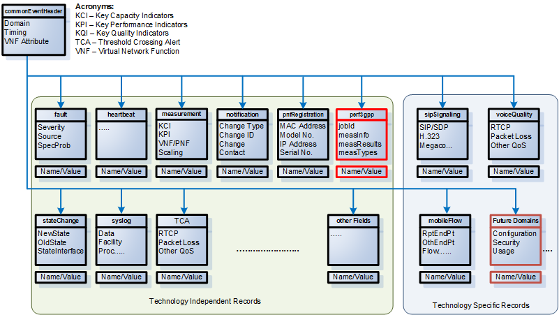
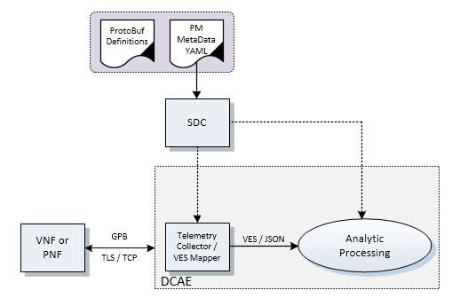

.. This work is licensed under a Creative Commons Attribution 4.0 International License.
.. http://creativecommons.org/licenses/by/4.0
.. Copyright 2017 AT&T Intellectual Property.  All rights reserved.

**ONAP Management Requirements**
=====================================

The ONAP platform is the part of the larger Network Function
Virtualization/Software Defined Network (NFV/SDN) ecosystem that
is responsible for the efficient control, operation and management
of Virtual Network Function (VNF) capabilities and functions. It
specifies standardized abstractions and interfaces that enable
efficient interoperation of the NVF/SDN ecosystem components. It
enables product/service independent capabilities for design, creation
and runtime lifecycle management (includes all aspects of installation,
change management, assurance, and retirement) of resources in NFV/SDN
environment (see ECOMP white paper ). These capabilities are provided
using two major architectural frameworks: (1) a Design Time Framework
to design, define and program the platform (uniform onboarding), and
(2) a Runtime Execution Framework to execute the logic programmed in
the design environment (uniform delivery and runtime lifecycle
management). The platform delivers an integrated information model
based on the VNF package to express the characteristics and behavior
of these resources in the Design Time Framework. The information model
is utilized by Runtime Execution Framework to manage the runtime
lifecycle of the VNFs. The management processes are orchestrated
across various modules of ONAP to instantiate, configure, scale,
monitor, and reconfigure the VNFs using a set of standard APIs
provided by the VNF developers.

Although the guidelines and requirements specified in this document
were originally driven by the need to standardize and automate the
management of the virtualized environments (with VNFs) operated by
Service Providers, we believe that most of the requirements are equally
applicable to the operation of the physical network functions (PNFs),
those network functions provided by traditional physical network
elements (e.g. whitebox switches) or customized peripherals (e.g. a
video rendering engine for augmented reality). The primary area of
difference will be in how the network function is orchestrated into
place - VNFs can be much more dynamically created & placed by ONAP
to support varying geographic, availability and scalability needs,
whereas the PNFs have to be deployed a priori in specific locations
based on planning and engineering - their availability and scalability
will be determined by the capabilities offered by the PNFs.

**PNF** is a vendor-provided Network Function(s) implemented using a
bundled set of hardware and software while VNFs utilize cloud resources
to provide Network Functions through virtualized software modules.  PNF
can be supplied by a vendor as a Black BOX (provides no knowledge of its
internal characteristics, logic, and software design/architecture) or as
a White Box (provides detailed knowledge and access of its internal
components and logic) or as a Grey Box (provides limited knowledge and
access to its internal components).

* Requirements that equally apply to both VNFs and PNFs are defined as
  "The xNF MUST/SHOULD/..."
* Requirements that only apply to VNFs are defined as "The VNF MUST/SHOULD/..."
* Requirements that only apply to PNFs are defined as "The PNF MUST/SHOULD/..."

Service Design
------------------------------------

This section, Service Design, has been left intentionally blank. It
is out-of-scope for the VNF Requirements project for the Amsterdam
release and no numbered requirements are expected. Content may be
added in future updates of this document.

VNF On-boarding and package management
-----------------------------------------------------------------------------

Design Definition
^^^^^^^^^^^^^^^^^^

The ONAP Design Time Framework provides the ability to design NFV
resources including VNFs, Services, and products. The VNF provider must
provide VNF packages that include a rich set of recipes, management and
functional interfaces, policies, configuration parameters, and
infrastructure requirements that can be utilized by the ONAP Design
module to onboard and catalog these resources. Initially this
information may be provided in documents, but in the near future a
method will be developed to automate as much of the transfer of data as
possible to satisfy its long term requirements.

The current VNF Package Requirement is based on a subset of the
Requirements contained in the ETSI Document: ETSI GS NFV-MAN 001 v1.1.1
and GS NFV IFA011 V0.3.0 (2015-10) - Network Functions Virtualization
(NFV), Management and Orchestration, VNF Packaging Specification.

Resource Description
^^^^^^^^^^^^^^^^^^^^^^

* R-77707 The xNF provider **MUST** include a Manifest File that
  contains a list of all the components in the xNF package.
* R-66070 The xNF Package **MUST** include xNF Identification Data to
  uniquely identify the resource for a given xNF provider. The identification
  data must include: an identifier for the xNF, the name of the xNF as was
  given by the xNF provider, xNF description, xNF provider, and version.
* R-69565 The xNF Package **MUST** include documentation describing xNF
  Management APIs, which must include information and tools for ONAP to
  deploy and configure (initially and ongoing) the xNF application(s)
  (e.g., NETCONF APIs) which includes a description of configurable
  parameters for the xNF and whether the parameters can be configured
  after xNF instantiation.
* R-00156 The xNF Package **MUST** include documentation describing xNF
  Management APIs, which must include information and tools for ONAP
  to monitor the health of the xNF (conditions that require healing
  and/or scaling responses).
* R-00068 The xNF Package **MUST** include documentation which includes
  a description of parameters that can be monitored for the xNF and
  event records (status, fault, flow, session, call, control plane,
  etc.) generated by the xNF after instantiation.
* R-12678 The xNF Package **MUST** include documentation which includes a
  description of runtime lifecycle events and related actions (e.g.,
  control responses, tests) which can be performed for the xNF.
* R-84366 The xNF Package **MUST** include documentation describing
  xNF Functional APIs that are utilized to build network and
  application services. This document describes the externally exposed
  functional inputs and outputs for the xNF, including interface
  format and protocols supported.
* R-36280 The xNF provider **MUST** provide documentation describing
  xNF Functional Capabilities that are utilized to operationalize the
  xNF and compose complex services.
* R-98617 The xNF provider **MUST** provide information regarding any
  dependency (e.g., affinity, anti-affinity) with other xNFs and resources.

Resource Configuration
^^^^^^^^^^^^^^^^^^^^^^^

* R-89571 The xNF **MUST** support and provide artifacts for configuration
  management using at least one of the following technologies;
  a) Netconf/YANG, b) Chef, or c) Ansible.

  Note: The requirements for Netconf/YANG, Chef, and Ansible protocols
  are provided separately and must be supported only if the corresponding
  protocol option is provided by the xNF providor.

Configuration Management via NETCONF/YANG
~~~~~~~~~~~~~~~~~~~~~~~~~~~~~~~~~~~~~~~~~~

* R-30278 The xNF provider **MUST** provide a Resource/Device YANG model
  as a foundation for creating the YANG model for configuration. This will
  include xNF attributes/parameters and valid values/attributes configurable
  by policy.

Configuration Management via Chef
~~~~~~~~~~~~~~~~~~~~~~~~~~~~~~~~~~~

* R-13390 The xNF provider **MUST** provide cookbooks to be loaded
  on the appropriate Chef Server.
* R-18525 The xNF provider **MUST** provide a JSON file for each
  supported action for the xNF.  The JSON file must contain key value
  pairs with all relevant values populated with sample data that illustrates
  its usage. The fields and their description are defined in Tables A1 and A2 in the Appendix.

 Note: Chef support in ONAP is not currently available and planned for 4Q 2017.

Configuration Management via Ansible
~~~~~~~~~~~~~~~~~~~~~~~~~~~~~~~~~~~~

* R-75608 The xNF provider **MUST** provide playbooks to be loaded
  on the appropriate Ansible Server.
* R-16777 The xNF provider **MUST** provide a JSON file for each
  supported action for the xNF.  The JSON file must contain key value
  pairs with all relevant values populated with sample data that illustrates
  its usage. The fields and their description are defined in Table B1 in the Appendix.

* R-46567 The xNF Package **MUST** include configuration scripts
  for boot sequence and configuration.
* R-16065 The xNF provider **MUST** provide configurable parameters
  (if unable to conform to YANG model) including xNF attributes/parameters
  and valid values, dynamic attributes and cross parameter dependencies
  (e.g., customer provisioning data).

Resource Control Loop
^^^^^^^^^^^^^^^^^^^^^^^

* R-22888 The xNF provider **MUST** provide documentation for the xNF
  Policy Description to manage the xNF runtime lifecycle. The document
  must include a description of how the policies (conditions and actions)
  are implemented in the xNF.
* R-01556 The xNF Package **MUST** include documentation describing the
  fault, performance, capacity events/alarms and other event records
  that are made available by the xNF.
* R-16875 The xNF Package **MUST** include documentation which must include
  a unique identification string for the specific xNF, a description of
  the problem that caused the error, and steps or procedures to perform
  Root Cause Analysis and resolve the issue.
* R-35960 The xNF Package **MUST** include documentation which must include
  all events, severity level (e.g., informational, warning, error) and
  descriptions including causes/fixes if applicable for the event.
* R-42018 The xNF Package **MUST** include documentation which must include
  all events (fault, measurement for xNF Scaling, Syslogs, State Change
  and Mobile Flow), that need to be collected at each VM, VNFC (defined in `VNF Guidelines <http://onap.readthedocs.io/en/latest/submodules/vnfrqts/guidelines.git/docs/vnf_guidelines/vnf_guidelines.html#a-glossary>`__ ) and for the overall xNF.
* R-27711 The xNF provider **MUST** provide an XML file that contains a
  list of xNF error codes, descriptions of the error, and possible
  causes/corrective action.
* R-01478 The xNF Package **MUST** include documentation describing all
  parameters that are available to monitor the xNF after instantiation
  (includes all counters, OIDs, PM data, KPIs, etc.) that must be
  collected for reporting purposes.
* R-73560 The xNF Package **MUST** include documentation about monitoring
  parameters/counters exposed for virtual resource management and xNF
  application management.
* R-90632 The xNF Package **MUST** include documentation about KPIs and
  metrics that need to be collected at each VM for capacity planning
  and performance management purposes.
* R-86235 The xNF Package **MUST** include documentation about the monitoring
  parameters that must include latencies, success rates, retry rates, load
  and quality (e.g., DPM) for the key transactions/functions supported by
  the xNF and those that must be exercised by the xNF in order to perform
  its function.
* R-33904 The xNF Package **MUST** include documentation for each KPI, provide
  lower and upper limits.
* R-53598 The xNF Package **MUST** include documentation to, when relevant,
  provide a threshold crossing alert point for each KPI and describe the
  significance of the threshold crossing.
* R-69877 The xNF Package **MUST** include documentation for each KPI,
  identify the suggested actions that need to be performed when a
  threshold crossing alert event is recorded.
* R-22680 The xNF Package **MUST** include documentation that describes
  any requirements for the monitoring component of tools for Network
  Cloud automation and management to provide these records to components
  of the xNF.
* R-33694 The xNF Package **MUST** include documentation to when applicable,
  provide calculators needed to convert raw data into appropriate reporting
  artifacts.
* R-56815 The xNF Package **MUST** include documentation describing
  supported xNF scaling capabilities and capacity limits (e.g., number
  of users, bandwidth, throughput, concurrent calls).
* R-48596 The xNF Package **MUST** include documentation describing
  the characteristics for the xNF reliability and high availability.
* R-74763 The xNF provider **MUST** provide an artifact per xNF that contains
  all of the xNF Event Records supported. The artifact should include
  reference to the specific release of the xNF Event Stream Common Event
  Data Model document it is based on. (e.g.,
  `VES Event Listener <https://github.com/att/evel-test-collector/tree/master/docs/att_interface_definition>`__)

Compute, Network, and Storage Requirements
^^^^^^^^^^^^^^^^^^^^^^^^^^^^^^^^^^^^^^^^^^^^

* R-35851 The xNF Package **MUST** include xNF topology that describes
  basic network and application connectivity internal and external to the
  xNF including Link type, KPIs, Bandwidth, latency, jitter, QoS (if
  applicable) for each interface.
* R-97102 The VNF Package **MUST** include VM requirements via a Heat
  template that provides the necessary data for VM specifications
  for all VNF components - for hypervisor, CPU, memory, storage.
* R-20204 The VNF Package **MUST** include VM requirements via a Heat
  template that provides the necessary data for network connections,
  interface connections, internal and external to VNF.
* R-44896 The VNF Package **MUST** include VM requirements via a Heat
  template that provides the necessary data for high availability
  redundancy model.
* R-55802 The VNF Package **MUST** include VM requirements via a Heat
  template that provides the necessary data for scaling/growth VM
  specifications.

  Note: Must comply with the *Heat requirements in 5.b*.

* R-26881 The xNF provider **MUST** provide the binaries and images
  needed to instantiate the xNF (xNF and VNFC images).
* R-96634 The xNF provider **MUST** describe scaling capabilities
  to manage scaling characteristics of the xNF.

Testing
^^^^^^^^^^

* R-43958 The xNF Package **MUST** include documentation describing
  the tests that were conducted by the xNF providor and the test results.
* R-04298 The xNF provider **MUST** provide their testing scripts to
  support testing.
* R-58775 The xNF provider **MUST** provide software components that
  can be packaged with/near the xNF, if needed, to simulate any functions
  or systems that connect to the xNF system under test. This component is
  necessary only if the existing testing environment does not have the
  necessary simulators.

Licensing Requirements
^^^^^^^^^^^^^^^^^^^^^^^

* R-85653 The xNF **MUST** provide metrics (e.g., number of sessions,
  number of subscribers, number of seats, etc.) to ONAP for tracking
  every license.
* R-44125 The xNF provider **MUST** agree to the process that can
  be met by Service Provider reporting infrastructure. The Contract
  shall define the reporting process and the available reporting tools.
* R-40827 The xNF provider **MUST** enumerate all of the open
  source licenses their xNF(s) incorporate.
* R-97293 The xNF provider **MUST NOT** require audits of
  Service Provider's business.
* R-44569 The xNF provider **MUST NOT** require additional
  infrastructure such as a xNF provider license server for xNF provider
  functions and metrics.
* R-13613 The VNF **MUST** provide clear measurements for licensing
  purposes to allow automated scale up/down by the management system.
* R-27511 The VNF provider **MUST** provide the ability to scale
  up a VNF provider supplied product during growth and scale down a
  VNF provider supplied product during decline without "real-time"
  restrictions based upon VNF provider permissions.
* R-85991 The xNF provider **MUST** provide a universal license key
  per xNF to be used as needed by services (i.e., not tied to a VM
  instance) as the recommended solution. The xNF provider may provide
  pools of Unique xNF License Keys, where there is a unique key for
  each xNF instance as an alternate solution. Licensing issues should
  be resolved without interrupting in-service xNFs.
* R-47849 The xNF provider **MUST** support the metadata about
  licenses (and their applicable entitlements) as defined in this
  document for xNF software, and any license keys required to authorize
  use of the xNF software.  This metadata will be used to facilitate
  onboarding the xNF into the ONAP environment and automating processes
  for putting the licenses into use and managing the full lifecycle of
  the licenses. The details of this license model are described in
  Tables C1 to C8 in the Appendix. Note: License metadata support in 
  ONAP is not currently available and planned for 1Q 2018.

Configuration Management
---------------------------------------------------

Controller Interactions With VNF
^^^^^^^^^^^^^^^^^^^^^^^^^^^^^^^^^^^^^

ONAP Controllers (such as APPC) expose a northbound API to clients
(such as SO) in order for the clients to initiate an activity
(aka command) on a VNF.   ONAP controllers interact with VNFs through
Network and Application Adapters to perform configuration and other
lifecycle management activities within NFV environment.
The standardized models, protocols and mechanisms by which network
functions are configured are equally applicable to VNFs and PNFs.

This section describes the list of commands that should be supported
by the VNF.   The following sections describe the standard protocols
that are supported (NETCONF, Chef, Ansible, and REST).

The commands below are expected to be supported on all VNF's, unless
noted otherwise, either directly (via the NETCONF or REST interface)
or indirectly (via a Chef Cookbook or Ansible server).  Note that there
are additional commands offered to northbound clients that are not shown
below, as these commands either act internally on the Controller itself
or depend upon network cloud components for implementation (thus, these
actions do not put any special requirement on the VNF provider).

The commands allow for parametric data to be passed from the controller
to the VNF or Ansible/Chef server in the request.  The format of the
parameter data can be either xml (for NETCONF) or JSON (for Ansible,
Chef, or REST).

Configuration Commands
~~~~~~~~~~~~~~~~~~~~~~~~~~~~~~~~~~~~~~~~~~~

**Configure**: The Controller client is requesting that a post-instantiation
configuration be applied to the target VNF instance. After the Configure
action is completed, the VNF instance should be ready for service.
Note that customer specific configurations may need to be applied using
the ConfigModify action.

**ConfigModify**: The Controller client is requesting a configuration
update to a subset of the total configuration parameters of a VNF or to
apply customer specific configurations. The configuration update is
typically done while the VNF is in service and should not disrupt traffic.

**ConfigBackup**: The Controller client is requesting a backup of the
configuration parameters where the parameters are stored on the VNF.
This command is typically requested as part of an orchestration flow
for scenarios such as a software upgrade. The ConfigBackup is typically
done while the VNF is not in service (i.e., in a maintenance state).
When the ConfigBackup command is executed, the current VNF configuration
parameters are saved in storage that is preserved (if there is an existing
set of backed up parameters, they are overwritten).

**ConfigRestore**: The Controller client is requesting a restore action of
the configuration parameters to the VNF that were saved by ConfigBackup
command. This command is typically requested as part of an orchestration
flow for scenarios such as a software upgrade where the software upgrade
may have failed and the VNF needs to be rolled back to the prior configuration.
When the ConfigRestore command is executed, the VNF configuration parameters
which were backed to persistent preserved storage are applied to the VNF
(replacing existing parameters). The ConfigRestore is typically done while
the VNF is not in service (i.e., in a maintenance state).

**ConfigScaleOut**: The Controller client is requesting that a configuration
be applied after the VNF instance has been scaled out (i.e., one or more
additional VM's instantiated to increase capacity). For some VNF's,
ConfigScaleOut is not needed because the VNF is auto-configured after
scale-out. This command is being introduced in the Beijing release.

**Audit**: The Controller client is requesting that the current (last known
configuration update) is audited against the running configuration on the VNF.

* R-20741 The xNF **MUST** support ONAP Controller's **Configure** command.
* R-19366 The xNF **MUST** support ONAP Controller's **ConfigModify** command.
* R-32981 The xNF **MUST** support ONAP Controller's **ConfigBackup** command.
* R-48247 The xNF **MUST** support ONAP Controller's **ConfigRestore** command.
* R-94084 The xNF **MUST** support ONAP Controller's **ConfigScaleOut**
  command.
* R-56385 The xNF **MUST** support ONAP Controller's **Audit** command.

LifeCycle Management Related Commands
~~~~~~~~~~~~~~~~~~~~~~~~~~~~~~~~~~~~~~~~~~~

**The following commands are needed to support various lifecycle management
flows where the VNF may need to be removed for service.**

**QuiesceTraffic**: The Controller client is requesting the VNF gracefully
stop traffic (aka block and drain traffic). The method for quiescing traffic
is specific to the VNF architecture. The action is completed when all
(in-flight transactions) traffic has stopped.   The VNF remains in an active
state where the VNF is able to process traffic (initiated using the
StartTraffic action).

**ResumeTraffic**: The Controller client is requesting the VNF resume
processing traffic. The method to resume traffic is specific to the VNF
architecture.

**StopApplication**: The Controller client is requesting that the application
running on the VNF is stopped gracefully (i.e., without traffic loss).
This is equivalent to quiescing the traffic and then stopping the application
processes. The processes can be restarted using the StartApplication command.

**StartApplication**: The Controller client is requesting that the application
running on the VNF is started. Get ready to process traffic.

**The following commands are needed to support software upgrades, in-place or
other type of software upgrade. The VNF instance may be removed from service
for the upgrade.**

**UpgradePrecheck**: The Controller client is requesting a confirmation that
the VNF can (and needs to) be upgraded to a specific software version
(specified in the request).

**UpgradeSoftware**: The Controller client is requesting that a (in-place)
software upgrade be performed on the VNF.  The software to be applied is
pre-loaded to a specified location.

**UpgradePostCheck**: The Controller client is requesting a confirmation that
the VNF software upgrade has been completed successfully (VNF upgraded to
the new software version).

**UpgradeBackup**: The Controller client is requesting that the VNF is backed
up prior to the UpgradeSoftware.

**UpgradeBackOut**: The Controller client is requesting that the VNF upgrade
is backed out (in the event that the SoftwareUpgrade or UpgradePostCheck
failed).

* R-12706 The xNF **MUST** support ONAP Controller's **QuiesceTraffic**
  command.
* R-07251 The xNF **MUST** support ONAP Controller's **ResumeTraffic**
  command.
* R-83146 The xNF **MUST** support ONAP Controller's **StopApplication**
  command.
* R-82811 The xNF **MUST** support ONAP Controller's **StartApplication**
  command.
* R-19922 The xNF **MUST** support ONAP Controller's **UpgradePrecheck**
  command.
* R-49466 The xNF **MUST** support ONAP Controller's **UpgradeSoftware**
  command.
* R-45856 The xNF **MUST** support ONAP Controller's **UpgradePostCheck**
  command.
* R-97343 The xNF **MUST** support ONAP Controller's **UpgradeBackup**
  command.
* R-65641 The xNF **MUST** support ONAP Controller's **UpgradeBackOut**
  command.

Virtual Function - Container Recovery Requirements
~~~~~~~~~~~~~~~~~~~~~~~~~~~~~~~~~~~~~~~~~~~~~~~~~~~~~~~~~

As part of life cycle management, for Cloud environment, VNFs need to
support a set of basic recovery capabilities to maintain the health
and extend the life of the VNF, eliminating and reducing the frequency
that an entire VNF needs to be rebuilt or re-instantiated to recover one
or more of its containers. For instance, a VNF in an Openstack environment
is composed of one or more containers called VMs (Virtual Machines). During
the life of a VNF it is expected that Cloud infrastructure hardware will
fail or they would need to be taken down for maintenance or hardware and
software upgrades (e.g. firmware upgrades, HostOS (Hypervisor), power
maintenance, power outages, etc.) To deal with such life cycle events
without having to rebuild entire VNFs or even entire sites these basic
recovery capabilities of individual containers, Virtual Machines or other,
must be supported.

* R-11790 The VNF **MUST** support ONAP Controller's
  **Restart (stop/start or reboot)** command.
* R-56218 The VNF **MUST** support ONAP Controller's Migrate command that
  moves container (VM) from a live Physical Server / Compute Node to
  another live Physical Server / Compute Node.
  
NOTE: Container migrations MUST be transparent to the VNF and no more
intrusive than a stop, followed by some down time for the migration to
be performed from one Compute Node / Physical Server to another, followed
by a start of the same VM with same configuration on the new Compute 
Node / Physical Server.
  
* R-38001 The VNF MUST support ONAP Controller's **Rebuild** command.
* R-76901 VNF MUST support a container rebuild mechanism based on existing
  image (e.g. Glance image in Openstack environment) or a snapshot.
  
HealthCheck and Failure Related Commands
~~~~~~~~~~~~~~~~~~~~~~~~~~~~~~~~~~~~~~~~~~~

**HealthCheck**: The Controller client is requesting a health check over the
entire scope of the VNF.  The VNF must be 100% healthy, ready to take requests
and provide services, with all VNF required capabilities ready to provide
services and with all active and standby resources fully ready with no open
MINOR, MAJOR or CRITICAL alarms.

Note: In addition to the commands above, the Controller supports a set of
Openstack failure recovery related commands that are executed on-demand or via
Control Loop at the VM level.  The VNF must support these commands in a fully
automated fashion.

* R-41430 The xNF **MUST** support ONAP Controller's **HealthCheck**
  command.

Notes On Command Support Using Controller Southbound Protocols
~~~~~~~~~~~~~~~~~~~~~~~~~~~~~~~~~~~~~~~~~~~~~~~~~~~~~~~~~~~~~~~~~~

The ONAP Controllers are designed to support a standard set of protocols in
order to communicate with the VNF instance.  The supported protocols are
NETCONF, Ansible, Chef, and REST.

NETCONF and REST require the VNF to implement a server which supports the RPC
or REST calls.

Ansible and Chef require the use of a Ansible or Chef server which communicates
with the Controller (northbound) and the VNF VM's (southbound).

The vendor must select which protocol to support for the commands listed above.
Notes:

* NETCONF is most suitable for configuration related commands

* Ansible and Chef are suitable for any command.
  Ansible has the advantage that it is agentless.

* REST is specified as an option only for the HealthCheck.

Additional details can be found in the `ONAP Application Controller (APPC) API Guide <http://onap.readthedocs.io/en/latest/submodules/appc.git/docs/APPC%20API%20Guide/APPC%20API%20Guide.html>`_, `ONAP VF-C project <http://onap.readthedocs.io/en/latest/submodules/vfc/nfvo/lcm.git/docs/index.html>`_ and the `ONAP SDNC project <http://onap.readthedocs.io/en/latest/submodules/sdnc/northbound.git/docs/index.html>`_.

NETCONF Standards and Capabilities
^^^^^^^^^^^^^^^^^^^^^^^^^^^^^^^^^^^^^

ONAP Controllers and their Adapters utilize device YANG model and
NETCONF APIs to make the required changes in the VNF state and
configuration. The VNF providers must provide the Device YANG model and
NETCONF server supporting NETCONF APIs to comply with target ONAP and
industry standards.

VNF Configuration via NETCONF Requirements
~~~~~~~~~~~~~~~~~~~~~~~~~~~~~~~~~~~~~~~~~~~

Configuration Management
+++++++++++++++++++++++++++

* R-88026 The xNF **MUST** include a NETCONF server enabling
  runtime configuration and lifecycle management capabilities.
* R-95950 The xNF **MUST** provide a NETCONF interface fully defined
  by supplied YANG models for the embedded NETCONF server.

NETCONF Server Requirements
++++++++++++++++++++++++++++++

* R-73468 The xNF **MUST** allow the NETCONF server connection
  parameters to be configurable during virtual machine instantiation
  through Heat templates where SSH keys, usernames, passwords, SSH
  service and SSH port numbers are Heat template parameters.
* R-90007 The xNF **MUST** implement the protocol operation:
  **close-session()**- Gracefully close the current session.
* R-70496 The xNF **MUST** implement the protocol operation:
  **commit(confirmed, confirm-timeout)** - Commit candidate
  configuration datastore to the running configuration.
* R-18733 The xNF **MUST** implement the protocol operation:
  **discard-changes()** - Revert the candidate configuration
  datastore to the running configuration.
* R-44281 The xNF **MUST** implement the protocol operation:
  **edit-config(target, default-operation, test-option, error-option,
  config)** - Edit the target configuration datastore by merging,
  replacing, creating, or deleting new config elements.
* R-60106 The xNF **MUST** implement the protocol operation:
  **get(filter)** - Retrieve (a filtered subset of) the running
  configuration and device state information. This should include
  the list of xNF supported schemas.
* R-29488 The xNF **MUST** implement the protocol operation:
  **get-config(source, filter)** - Retrieve a (filtered subset of
  a) configuration from the configuration datastore source.
* R-11235 The xNF **MUST** implement the protocol operation:
  **kill-session(session)** - Force the termination of **session**.
* R-02597 The xNF **MUST** implement the protocol operation:
  **lock(target)** - Lock the configuration datastore target.
* R-96554 The xNF **MUST** implement the protocol operation:
  **unlock(target)** - Unlock the configuration datastore target.
* R-29324 The xNF **SHOULD** implement the protocol operation:
  **copy-config(target, source) -** Copy the content of the
  configuration datastore source to the configuration datastore target.
* R-88031 The xNF **SHOULD** implement the protocol operation:
  **delete-config(target) -** Delete the named configuration
  datastore target.
* R-97529 The xNF **SHOULD** implement the protocol operation:
  **get-schema(identifier, version, format) -** Retrieve the YANG schema.
* R-62468 The xNF **MUST** allow all configuration data to be
  edited through a NETCONF <edit-config> operation. Proprietary
  NETCONF RPCs that make configuration changes are not sufficient.
* R-01382 The xNF **MUST** allow the entire configuration of the
  xNF to be retrieved via NETCONF's <get-config> and <edit-config>,
  independently of whether it was configured via NETCONF or other
  mechanisms.
* R-28756 The xNF **MUST** support **:partial-lock** and
  **:partial-unlock** capabilities, defined in RFC 5717. This
  allows multiple independent clients to each write to a different
  part of the <running> configuration at the same time.
* R-83873 The xNF **MUST** support **:rollback-on-error** value for
  the <error-option> parameter to the <edit-config> operation. If any
  error occurs during the requested edit operation, then the target
  database (usually the running configuration) will be left unaffected.
  This provides an 'all-or-nothing' edit mode for a single <edit-config>
  request.
* R-68990 The xNF **MUST** support the **:startup** capability. It
  will allow the running configuration to be copied to this special
  database. It can also be locked and unlocked.
* R-68200 The xNF **MUST** support the **:url** value to specify
  protocol operation source and target parameters. The capability URI
  for this feature will indicate which schemes (e.g., file, https, sftp)
  that the server supports within a particular URL value. The 'file'
  scheme allows for editable local configuration databases. The other
  schemes allow for remote storage of configuration databases.
* R-20353 The xNF **MUST** implement both **:candidate** and
  **:writable-running** capabilities. When both **:candidate** and
  **:writable-running** are provided then two locks should be supported.
* R-11499 The xNF **MUST** fully support the XPath 1.0 specification
  for filtered retrieval of configuration and other database contents.
  The 'type' attribute within the <filter> parameter for <get> and
  <get-config> operations may be set to 'xpath'. The 'select' attribute
  (which contains the XPath expression) will also be supported by the
  server. A server may support partial XPath retrieval filtering, but
  it cannot advertise the **:xpath** capability unless the entire XPath
  1.0 specification is supported.
* R-83790 The xNF **MUST** implement the **:validate** capability
* R-49145 The xNF **MUST** implement **:confirmed-commit** If
  **:candidate** is supported.
* R-58358 The xNF **MUST** implement the **:with-defaults** capability
  [RFC6243].
* R-59610 The xNF **MUST** implement the data model discovery and
  download as defined in [RFC6022].
* R-93443 The xNF **MUST** define all data models in YANG [RFC6020],
  and the mapping to NETCONF shall follow the rules defined in this RFC.
* R-26115 The xNF **MUST** follow the data model upgrade rules defined
  in [RFC6020] section 10. All deviations from section 10 rules shall
  be handled by a built-in automatic upgrade mechanism.
* R-10716 The xNF **MUST** support parallel and simultaneous
  configuration of separate objects within itself.
* R-29495 The xNF **MUST** support locking if a common object is
  being manipulated by two simultaneous NETCONF configuration operations
  on the same xNF within the context of the same writable running data
  store (e.g., if an interface parameter is being configured then it
  should be locked out for configuration by a simultaneous configuration
  operation on that same interface parameter).
* R-53015 The xNF **MUST** apply locking based on the sequence of
  NETCONF operations, with the first configuration operation locking
  out all others until completed.
* R-02616 The xNF **MUST** permit locking at the finest granularity
  if a xNF needs to lock an object for configuration to avoid blocking
  simultaneous configuration operations on unrelated objects (e.g., BGP
  configuration should not be locked out if an interface is being
  configured or entire Interface configuration should not be locked out
  if a non-overlapping parameter on the interface is being configured).
* R-41829 The xNF **MUST** be able to specify the granularity of the
  lock via a restricted or full XPath expression.
* R-66793 The xNF **MUST** guarantee the xNF configuration integrity
  for all simultaneous configuration operations (e.g., if a change is
  attempted to the BUM filter rate from multiple interfaces on the same
  EVC, then they need to be sequenced in the xNF without locking either
  configuration method out).
* R-54190 The xNF **MUST** release locks to prevent permanent lock-outs
  when/if a session applying the lock is terminated (e.g., SSH session
  is terminated).
* R-03465 The xNF **MUST** release locks to prevent permanent lock-outs
  when the corresponding <partial-unlock> operation succeeds.
* R-63935 The xNF **MUST** release locks to prevent permanent lock-outs
  when a user configured timer has expired forcing the NETCONF SSH Session
  termination (i.e., product must expose a configuration knob for a user
  setting of a lock expiration timer)
* R-10173 The xNF **MUST** allow another NETCONF session to be able to
  initiate the release of the lock by killing the session owning the lock,
  using the <kill-session> operation to guard against hung NETCONF sessions.
* R-88899 The xNF **MUST** support simultaneous <commit> operations
  within the context of this locking requirements framework.
* R-07545 The xNF **MUST** support all operations, administration and
  management (OAM) functions available from the supplier for xNFs using
  the supplied YANG code and associated NETCONF servers.
* R-60656 The xNF **MUST** support sub tree filtering.
* R-80898 The xNF **MUST** support heartbeat via a <get> with null filter.
* R-25238 The xNF PACKAGE **MUST** validated YANG code using the open
  source pyang [1]_ program using the following commands:

.. code-block:: python

 $ pyang --verbose --strict <YANG-file-name(s)>
 $ echo $!

* R-63953 The xNF **MUST** have the echo command return a zero value
  otherwise the validation has failed
* R-26508 The xNF **MUST** support a NETCONF server that can be mounted on
  OpenDaylight (client) and perform the operations of: modify, update,
  change, rollback configurations using each configuration data element,
  query each state (non-configuration) data element, execute each YANG
  RPC, and receive data through each notification statement.

The following requirements provides the Yang models that suppliers must
conform, and those where applicable, that suppliers need to use.

* R-28545 The xNF **MUST** conform its YANG model to RFC 6060,
  "YANG - A Data Modeling Language for the Network Configuration
  Protocol (NETCONF)"
* R-22700 The xNF **MUST** conform its YANG model to RFC 6470,
  "NETCONF Base Notifications".
* R-10353 The xNF **MUST** conform its YANG model to RFC 6244,
  "An Architecture for Network Management Using NETCONF and YANG".
* R-53317 The xNF **MUST** conform its YANG model to RFC 6087,
  "Guidelines for Authors and Reviewers of YANG Data Model Documents".
* R-33955 The xNF **SHOULD** conform its YANG model to RFC 6991,
  "Common YANG Data Types".
* R-22946 The xNF **SHOULD** conform its YANG model to RFC 6536,
  "NETCONF Access Control Model".
* R-10129 The xNF **SHOULD** conform its YANG model to RFC 7223,
  "A YANG Data Model for Interface Management".
* R-12271 The xNF **SHOULD** conform its YANG model to RFC 7223,
  "IANA Interface Type YANG Module".
* R-49036 The xNF **SHOULD** conform its YANG model to RFC 7277,
  "A YANG Data Model for IP Management".
* R-87564 The xNF **SHOULD** conform its YANG model to RFC 7317,
  "A YANG Data Model for System Management".
* R-24269 The xNF **SHOULD** conform its YANG model to RFC 7407,
  "A YANG Data Model for SNMP Configuration", if Netconf used to 
  configure SNMP engine.

The NETCONF server interface shall fully conform to the following
NETCONF RFCs.

* R-33946 The xNF **MUST** conform to the NETCONF RFC 4741,
  "NETCONF Configuration Protocol".
* R-04158 The xNF **MUST** conform to the NETCONF RFC 4742,
  "Using the NETCONF Configuration Protocol over Secure Shell (SSH)".
* R-13800 The xNF **MUST** conform to the NETCONF RFC 5277,
  "NETCONF Event Notification".
* R-01334 The xNF **MUST** conform to the NETCONF RFC 5717,
  "Partial Lock Remote Procedure Call".
* R-08134 The xNF **MUST** conform to the NETCONF RFC 6241,
  "NETCONF Configuration Protocol".
* R-78282 The xNF **MUST** conform to the NETCONF RFC 6242,
  "Using the Network Configuration Protocol over Secure Shell".

VNF REST APIs
^^^^^^^^^^^^^^^

HealthCheck is a command for which no NETCONF support exists.
Therefore, this must be supported using a RESTful interface
(defined in this section) or with a Chef cookbook/Ansible playbook
(defined in sections `Chef Standards and Capabilities`_ and
`Ansible Standards and Capabilities`_).

HealthCheck Definition: The VNF level HealthCheck is a check over
the entire scope of the VNF. The VNF must be 100% healthy, ready
to take requests and provide services, with all VNF required
capabilities ready to provide services and with all active and
standby resources fully ready with no open MINOR, MAJOR or CRITICAL
alarms.  NOTE: A switch may need to be turned on, but the VNF should
be ready to take service requests or be already processing service
requests successfully.

The VNF must provide a REST formatted GET RPCs to support HealthCheck
queries via the GET method over HTTP(s).

The port number, url, and other authentication information is provided
by the VNF provider.

REST APIs
~~~~~~~~~

* R-31809 The xNF **MUST** support the HealthCheck RPC. The HealthCheck
  RPC executes a xNF Provider-defined xNF HealthCheck over the scope of
  the entire xNF (e.g., if there are multiple VNFCs, then run a health check,
  as appropriate, for all VNFCs). It returns a 200 OK if the test completes.
  A JSON object is returned indicating state (healthy, unhealthy), scope
  identifier, time-stamp and one or more blocks containing info and fault
  information. If the xNF is unable to run the HealthCheck, return a
  standard http error code and message.

Examples of responses when HealthCheck runs and is able to provide a healthy
or unhealthy response:

.. code-block:: java

 {
   "identifier": "scope represented",
   "state": "healthy",
   "time": "01-01-1000:0000"
 }

 {
   "identifier": "scope represented",
   "state": "unhealthy",
    {[
   "info": "System threshold exceeded details",
   "fault":
     {
       "cpuOverall": 0.80,
       "cpuThreshold": 0.45
     }
     ]},
   "time": "01-01-1000:0000"
 }

Chef Standards and Capabilities
^^^^^^^^^^^^^^^^^^^^^^^^^^^^^^^^^

ONAP will support configuration of VNFs via Chef subject to the
requirements and guidelines defined in this section.

The Chef configuration management mechanism follows a client-server
model. It requires the presence of a Chef-Client on the VNF that will be
directly managed by a Chef Server. The Chef-client will register with
the appropriate Chef Server and are managed via ‘cookbooks' and
configuration attributes loaded on the Chef Server which contain all
necessary information to execute the appropriate actions on the VNF via
the Chef-client.

ONAP will utilize the open source Chef Server, invoke the documented
Chef REST APIs to manage the VNF and requires the use of open source
Chef-Client and Push Jobs Client on the VNF
(https://downloads.chef.io/).

VNF Configuration via Chef Requirements
~~~~~~~~~~~~~~~~~~~~~~~~~~~~~~~~~~~~~~~~~~

Chef Client Requirements
+++++++++++++++++++++++++

* R-79224 The xNF **MUST** have the chef-client be preloaded with
  validator keys and configuration to register with the designated
  Chef Server as part of the installation process.
* R-72184 The xNF **MUST** have routable FQDNs for all the endpoints
  (VMs) of a xNF that contain chef-clients which are used to register
  with the Chef Server.  As part of invoking xNF actions, ONAP will
  trigger push jobs against FQDNs of endpoints for a xNF, if required.
* R-47068 The xNF **MAY** expose a single endpoint that is
  responsible for all functionality.
* R-67114 The xNF **MUST** be installed with Chef-Client >= 12.0 and
  Chef push jobs client >= 2.0.

Chef Roles/Requirements
++++++++++++++++++++++++++

* R-27310 The xNF Package **MUST** include all relevant Chef artifacts
  (roles/cookbooks/recipes) required to execute xNF actions requested by
  ONAP for loading on appropriate Chef Server.
* R-26567 The xNF Package **MUST** include a run list of
  roles/cookbooks/recipes, for each supported xNF action, that will
  perform the desired xNF action in its entirety as specified by ONAP
  (see Section 7.c, ONAP Controller APIs and Behavior, for list of xNF
  actions and requirements), when triggered by a chef-client run list
  in JSON file.
* R-98911 The xNF **MUST NOT** use any instance specific parameters
  for the xNF in roles/cookbooks/recipes invoked for a xNF action.
* R-37929 The xNF **MUST** accept all necessary instance specific
  data from the environment or node object attributes for the xNF
  in roles/cookbooks/recipes invoked for a xNF action.
* R-62170 The xNF **MUST** over-ride any default values for
  configurable parameters that can be set by ONAP in the roles,
  cookbooks and recipes.
* R-78116 The xNF **MUST** update status on the Chef Server
  appropriately (e.g., via a fail or raise an exception) if the
  chef-client run encounters any critical errors/failures when
  executing a xNF action.
* R-44013 The xNF **MUST** populate an attribute, defined as node
  [‘PushJobOutput'] with the desired output on all nodes in the push job
  that execute chef-client run if the xNF action requires the output of a
  chef-client run be made available (e.g., get running configuration).
* R-30654 The xNF Package **MUST** have appropriate cookbooks that are
  designed to automatically ‘rollback' to the original state in case of
  any errors for actions that change state of the xNF (e.g., configure).
* R-65755 The xNF **SHOULD** support callback URLs to return information
  to ONAP upon completion of the chef-client run for any chef-client run
  associated with a xNF action.

-  As part of the push job, ONAP will provide two parameters in the
   environment of the push job JSON object:

    -  ‘RequestId' a unique Id to be used to identify the request,
    -  ‘CallbackUrl', the URL to post response back.

-  If the CallbackUrl field is empty or missing in the push job, then
   the chef-client run need not post the results back via callback.

* R-15885 The xNF **MUST** Upon completion of the chef-client run,
  POST back on the callback URL, a JSON object as described in Table
  A2 if the chef-client run list includes a cookbook/recipe that is
  callback capable. Failure to POST on the Callback Url should not be
  considered a critical error. That is, if the chef-client successfully
  completes the xNF action, it should reflect this status on the Chef
  Server regardless of whether the Callback succeeded or not.

ONAP Chef API Usage
~~~~~~~~~~~~~~~~~~~

This section outlines the workflow that ONAP invokes when it receives an
action request against a Chef managed VNF.

1. When ONAP receives a request for an action for a Chef Managed VNF, it
   retrieves the corresponding template (based on **action** and
   **VNF)** from its database and sets necessary values in the
   "Environment", "Node" and "NodeList" keys (if present) from either
   the payload of the received action or internal data.

2. If "Environment" key is present in the updated template, it posts the
   corresponding JSON dictionary to the appropriate Environment object
   REST endpoint on the Chef Server thus updating the Environment
   attributes on the Chef Server.

3. Next, it creates a Node Object from the "Node" JSON dictionary for
   all elements listed in the NodeList (using the FQDN to construct the
   endpoint) by replicating it  [2]_. As part of this process, it will
   set the name field in each Node Object to the corresponding FQDN.
   These node objects are then posted on the Chef Server to
   corresponding Node Object REST endpoints to update the corresponding
   node attributes.

4. If PushJobFlag is set to "True" in the template, ONAP requests a push
   job against all the nodes in the NodeList to trigger
   chef-client\ **.** It will not invoke any other command via the push
   job. ONAP will include a callback URL in the push job request and a
   unique Request Id. An example push job posted by ONAP is listed
   below:

.. code-block:: java

   {
     "command": "chef-client",
     "run\_timeout": 300,
     "nodes": ["node1.vnf\_a.onap.com", "node2.vnf\_a.onap.com"],
       "env": {
                "RequestId":"8279-abcd-aksdj-19231",
                "CallbackUrl":"<callback>"
              },
   }

5. If CallbackCapable field in the template is not present or set to
   "False" ONAP will poll the Chef Server to check completion status of
   the push job.

6. If "GetOutputFlag" is set to "True" in the template and
   CallbackCapable is not set to "True", ONAP will retrieve any output
   from each node where the push job has finished by accessing the Node
   Object attribute node[‘PushJobOutput'].

Ansible Standards and Capabilities
^^^^^^^^^^^^^^^^^^^^^^^^^^^^^^^^^^^^

ONAP will support configuration of VNFs via Ansible subject to the
requirements and guidelines defined in this section.

Ansible allows agentless management of VNFs/VMs/VNFCs via execution
of ‘playbooks' over ssh. The ‘playbooks' are a structured set of
tasks which contain all the necessary resources and execution capabilities
to take the necessary action on one or more target VMs (and/or VNFCs)
of the VNF. ONAP will utilize the framework of an Ansible Server that
will host all Ansible artifacts and run playbooks to manage VNFs that support
Ansible.

VNF Configuration via Ansible Requirements
~~~~~~~~~~~~~~~~~~~~~~~~~~~~~~~~~~~~~~~~~~~~

Ansible Client Requirements
+++++++++++++++++++++++++++++

* R-32217 The xNF **MUST** have routable FQDNs that are reachable via
  the Ansible Server for the endpoints (VMs) of a xNF on which playbooks
  will be executed. ONAP will initiate requests to the Ansible Server
  for invocation of playbooks against these end points [3]_.
* R-54373 The xNF **MUST** have Python >= 2.6 on the endpoint VM(s)
  of a xNF on which an Ansible playbook will be executed.
* R-35401 The xNF **MUST** support SSH and allow SSH access by the
  Ansible server for the endpoint VM(s) and comply with the Network
  Cloud Service Provider guidelines for authentication and access.
* R-82018 The xNF **MUST** load the Ansible Server SSH public key onto xNF
  VM(s) as part
  of instantiation. This will allow the Ansible Server to authenticate
  to perform post-instantiation configuration without manual intervention
  and without requiring specific xNF login IDs and passwords.

 CAUTION: For VNFs configured using Ansible, to eliminate the need
 for manual steps, post-instantiation and pre-configuration, to upload
 of SSH public keys, SSH public keys loaded during (heat) instantiation shall
 be preserved and not removed by (heat) embedded (userdata) scripts.

* R-92866 The xNF **MUST** include as part of post-instantiation configuration
  done by Ansible Playbooks the removal/update of the SSH public key from
  /root/.ssh/authorized_keys, and  update of SSH keys loaded through
  instantiation to support Ansible. This may include download and install of
  new SSH keys and new mechanized IDs.
* R-91745 The xNF **MUST** update the Ansible Server and other entities
  storing and using the SSH keys for authentication when the SSH keys used
  by Ansible are regenerated/updated.

  NOTE: Ansible Server itself may be used to upload new SSH public keys
  onto supported VNFs.

Ansible Playbook Requirements
+++++++++++++++++++++++++++++++

An Ansible playbook is a collection of tasks that is executed on the
Ansible server (local host) and/or the target VM (s) in order to
complete the desired action.

* R-40293 The xNF **MUST** make available playbooks that conform
  to the ONAP requirement.
* R-49396 The xNF **MUST** support each ONAP (APPC) xNF action
  by invocation of **one** playbook [4]_. The playbook will be responsible
  for executing
  all necessary tasks (as well as calling other playbooks) to complete
  the request.
* R-33280 The xNF **MUST NOT** use any instance specific parameters
  in a playbook.
* R-48698 The xNF **MUST** utilize information from key value pairs
  that will be provided by the Ansible Server as "extra-vars" during
  invocation to execute the desired xNF action. If the playbook requires
  files, they must also be supplied using the methodology detailed in
  the Ansible Server API, unless they are bundled with playbooks, example,
  generic templates.

The Ansible Server will determine if a playbook invoked to execute a
xNF action finished successfully or not using the "PLAY_RECAP" summary
in Ansible log.  The playbook will be considered to successfully finish
only if the "PLAY RECAP" section at the end of playbook execution output
has no unreachable hosts and no failed tasks. Otherwise, the playbook
will be considered to have failed.

* R-43253 The xNF **MUST** use playbooks designed to allow Ansible
  Server to infer failure or success based on the "PLAY_RECAP" capability.
  NOTE: There are cases where playbooks need to interpret results of a task
  and then determine success or failure and return result accordingly
  (failure for failed tasks).
* R-50252 The xNF **MUST** write to a specific one text files that
  will be retrieved and made available by the Ansible Server if, as part
  of a xNF action (e.g., audit), a playbook is required to return any
  xNF information. The text files must be written in the same directory as
  the one from which the playbook is being executed. A text file must be
  created for the xNF playbook run targets/affects, with the name
  ‘<VNFname>_results.txt' into which any desired output from each
  respective VM/xNF must be written.
* R-51442 The xNF **SHOULD** use playbooks that are designed to
  automatically ‘rollback' to the original state in case of any errors
  for actions that change state of the xNF (e.g., configure).

 NOTE: In case rollback at the playbook level is not supported or possible,
 the xNF provider shall provide alternative locking mechanism (e.g., for a
 small xNF the rollback mechanism may rely on workflow to terminate and
 re-instantiate VNF VMs and then re-run playbook(s)). Backing up updated
 files also recommended to support rollback when soft rollback is feasible.

* R-58301 The xNF **SHOULD NOT** use playbooks that make requests to
  Cloud resources e.g. Openstack (nova, neutron, glance, heat, etc.);
  therefore, there is no use for Cloud specific variables like Openstack
  UUIDs in Ansible Playbooks.

 Rationale: Flows that require interactions with Cloud services
 e.g. Openstack shall rely on workflows run by an Orchestrator
 (Change Management) or
 other capability (such as a control loop or Operations GUI) outside
 Ansible Server which can be executed by a Controller such as APPC.
 There are policies, as part of Control Loop models, that send remediation
 action requests to APPC; these are triggered as a response to an event
 or correlated events published to Event Bus.

* R-02651 The xNF **SHOULD** use the Ansible backup feature to save a
  copy of configuration files before implementing changes to support
  operations such as backing out of software upgrades, configuration
  changes or other work as this will help backing out of configuration
  changes when needed.
* R-43353 The xNF **MUST** return control from Ansible Playbooks only
  after tasks are fully complete, signaling that the playbook completed
  all tasks. When starting services, return control only after all services
  are up. This is critical for workflows where the next steps are dependent
  on prior tasks being fully completed.

 Detailed examples:

 StopApplication Playbook - StopApplication Playbook shall return control
 and a completion status only after VNF application is fully stopped, all
 processes/services stopped.
 StartApplication Playbook - StartApplication Playbook shall return control
 and a completion status only after all VNF application services are fully up,
 all processes/services started and ready to provide services. NOTE: Start
 Playbook should not be declared complete/done after starting one or several
 processes that start the other processes.

 HealthCheck Playbook:

 SUCCESS - HealthCheck success shall be returned (return code 0) by a
 Playbook or Cookbook only when VNF is 100% healthy, ready to take requests
 and provide services, with all VNF required capabilities ready to provide
 services and with all active and standby resources fully ready with no
 open MINOR, MAJOR or CRITICAL alarms.

 NOTE: In some cases, a switch may need to be turned on, but a VNF
 reported as healthy, should be ready to take service requests or be
 already processing service requests successfully.

 A successful execution of a health-check playbook shall also create one
 file per VNF VM, named after the VNF instance name followed by
 "_results.txt (<vnf_instance>_results.txt) to indicate health-check was
 executed and completed successfully, example: vfdb9904v_results.txt,
 with the following contents:

.. code-block:: java

  {
   "identifier": "VNF",
   "state": "healthy",
   "time": "2018-03-16:1139"
  }

Example:

.. code-block:: java

  $ cat vfdb9904v_results.txt
  {
   "identifier": "VNF",
   "state": "healthy",
   "time": "2018-03-16:1139"
  }
..

 FAILURE - A health check playbook shall return a non-zero return code in
 case VNF is not 100% healthy because one or more VNF application processes
 are stopped or not ready to take service requests or because critical or
 non-critical resources are not ready or because there are open MINOR, MAJOR
 or CRITICAL traps/alarms or because there are issues with the VNF that
 need attention even if they do not impact services provided by the VNF.

 A failed health-check playbook shall also create one file per VNF,
 named after the VNF instance name, followed by
 "_results.txt to indicate health-check was executed and found issues
 in the health of the VNF. This is to differentiate from failure to
 run health-check playbook or playbook tasks to verify the health of the VNF,
 example: vfdb9904v_results.txt, with the following contents:

.. code-block:: java

 {
  "identifier": "VNF",
  "state": "unhealthy",
  "info": "Error in following VM(s). Check hcstatus files
  under /tmp/ccfx9901v for details",
  "fault": [
    "vfdb9904vm001",
    "vfdb9904vm002"
  ],
  "time": "2018-03-16:4044"
 }
..

 Example:

.. code-block:: java

 $ cat vfdb9904v_results.txt
 {
  "identifier": "VNF",
  "state": "unhealthy",
  "info": "Error in following VM(s). Check hcstatus files
  under /tmp/ccfx9901v for details",
  "fault": [
    "vfdb9904vm001",
    "vfdb9904vm002"
  ],
  "time": "2018-03-16:4044"
 }
..

 See `VNF REST APIs`_ for additional details on HealthCheck.

ONAP Controller / Ansible API Usage
~~~~~~~~~~~~~~~~~~~~~~~~~~~~~~~~~~~~~~

This section outlines the workflow that ONAP Controller invokes when
it receives an action request against an Ansible managed VNF.

 #. When ONAP Controller receives a request for an action for an
    AnsibleManaged VNF, it retrieves the corresponding template (based
    on **action** and **VNF**) from its database and sets necessary
    values (such as an Id, NodeList, and EnvParameters) from either
    information in the request or data obtained from other sources.
    This is referred to as the payload that is sent as a JSON object
    to the Ansible server.
 #. The ONAP Controller sends a request to the Ansible server to
    execute the action.
 #. The ONAP Controller polls the Ansible Server for result (success
    or failure).  The ONAP Controllers has a timeout value which is
    contained in the template.   If the result is not available when the
    timeout is reached, the ONAP Controller stops polling and returns a
    timeout error to the requester.   The Ansible Server continues to
    process the request.

Support of Controller Commands And Southbound Protocols
^^^^^^^^^^^^^^^^^^^^^^^^^^^^^^^^^^^^^^^^^^^^^^^^^^^^^^^^^^

The following table summarizes the commands and possible protocols selected.
Note that the HealthCheck can also be supported via REST.

Table 8. ONAP Controller APIs and NETCONF Commands

+-------------+--------------------+--------------------+--------------------+
|**Command**  |**NETCONF Support** |**Chef Support**    |**Ansible**         |
+=============+====================+====================+====================+
|General      |For each RPC, the   |VNF Vendor must     |VNF Vendor must     |
|Comments     |appropriate RPC     |provide any         |provide an Ansible  |
|             |operation is listed.|necessary roles,    |playbook to retrieve|
|             |                    |cookbooks, recipes  |the running         |
|             |                    |to retrieve the     |configuration from a|
|             |                    |running             |VNF and place the   |
|             |                    |configuration from  |output on the       |
|             |                    |a VNF and place it  |Ansible server in   |
|             |                    |in the respective   |a manner aligned    |
|             |                    |Node Objects        |with playbook       |
|             |                    |‘PushJobOutput'     |requirements listed |
|             |                    |attribute of all    |in this document.   |
|             |                    |nodes in NodeList   |                    |
|             |                    |when triggered      |The PlaybookName    |
|             |                    |by a chef-client    |must be provided    |
|             |                    |run.                |in the JSON file.   |
|             |                    |                    |                    |
|             |                    |The JSON file for   |NodeList must list  |
|             |                    |this VNF action is  |IP addresses or DNS |
|             |                    |required to set     |supported FQDNs of  |
|             |                    |"PushJobFlag" to    |an example VNF      |
|             |                    |"True" and          |on which to         |
|             |                    |"GetOutputFlag" to  |execute playbook.   |
|             |                    |"True". The "Node"  |                    |
|             |                    |JSON dictionary     |                    |
|             |                    |must have the run   |                    |
|             |                    |list populated      |                    |
|             |                    |with the necessary  |                    |
|             |                    |sequence of roles,  |                    |
|             |                    |cookbooks, recipes. |                    |
|             |                    |                    |                    |
|             |                    |The Environment     |                    |
|             |                    |and Node values     |                    |
|             |                    |should contain all  |                    |
|             |                    |appropriate         |                    |
|             |                    |configuration       |                    |
|             |                    |attributes.         |                    |
|             |                    |                    |                    |
|             |                    |NodeList must       |                    |
|             |                    |list sample FQDNs   |                    |
|             |                    |that are required to|                    |
|             |                    |conduct a           |                    |
|             |                    |chef-client run for |                    |
|             |                    |this VNF Action.    |                    |
+-------------+--------------------+--------------------+--------------------+
|Audit        |The <get-config> is |Supported via a     |Supported via a     |
|             |used to return the  |cookbook that       |playbook that       |
|             |running             |returns the running |returns the running |
|             |configuration.      |configuration.      |configuration.      |
+-------------+--------------------+--------------------+--------------------+
|Configure,   |The <edit-config>   |Supported via a     |Supported via a     |
|ModifyConfig |operation loads all |cookbook that       |playbook that       |
|             |or part of a        |updates the VNF     |updates the VNF     |
|             |specified data set  |configuration.      |configuration.      |
|             |to the specified    |                    |                    |
|             |target database. If |                    |                    |
|             |there is no         |                    |                    |
|             |<candidate/>        |                    |                    |
|             |database, then the  |                    |                    |
|             |target is the       |                    |                    |
|             |<running/> database.|                    |                    |
|             |A <commit> follows. |                    |                    |
+-------------+--------------------+--------------------+--------------------+
|Other        |This command has no |Supported via a     |Supported via a     |
|Configuration|existing NETCONF RPC|cookbook that       |playbook that       |
|Commands     |action.             |performs            |performs            |
|             |                    |the action.         |the action.         |
+-------------+--------------------+--------------------+--------------------+
|Lifecycle    |This command has no |Supported via a     |Supported via a     |
|Management   |existing NETCONF RPC|cookbook that       |playbook that       |
|Commands     |action.             |performs            |performs            |
|             |                    |the action.         |the action.         |
+-------------+--------------------+--------------------+--------------------+
|Health Check |This command has no |Supported via a     |Supported           |
|             |existing NETCONF RPC|cookbook            |via a               |
|             |action.             |that                |playbook            |
|             |                    |performs            |that                |
|             |                    |a HealthCheck and   |performs            |
|             |                    |returns the results.|the                 |
|             |                    |                    |HealthCheck         |
|             |                    |                    |and returns         |
|             |                    |                    |the                 |
|             |                    |                    |results.            |
+-------------+--------------------+--------------------+--------------------+

Monitoring & Management
--------------------------------------------------

This section addresses data collection and event processing
functionality that is directly dependent on the interfaces
provided by the VNFs' APIs. These can be in the form of asynchronous
interfaces for event, fault notifications, and autonomous data streams.
They can also be synchronous interfaces for on-demand requests to
retrieve various performance, usage, and other event information.

The target direction for VNF interfaces is to employ APIs that are
implemented utilizing standardized messaging and modeling protocols
over standardized transports. Migrating to a virtualized environment
presents a tremendous opportunity to eliminate the need for proprietary
interfaces for VNF provider equipment while removing the traditional
boundaries between Network Management Systems and Element Management
Systems. Additionally, VNFs provide the ability to instrument the
networking applications by creating event records to test and monitor
end-to-end data flow through the network, similar to what physical or
virtual probes provide without the need to insert probes at various
points in the network. The VNF providers must be able to provide the
aforementioned set of required data directly to the ONAP collection
layer using standardized interfaces.

Data Model for Event Records
^^^^^^^^^^^^^^^^^^^^^^^^^^^^^^^^^^^^

This section describes the data model for the collection of telemetry
data from VNFs by Service Providers (SPs) to manage VNF health and
runtime lifecycle. This data model is referred to as the VNF Event
Streaming (VES) specifications. While this document is focused on
specifying some of the records from the ONAP perspective, there may
be other external bodies using the same framework to specify additional
records. For example, OPNFV has a VES project that is looking to specify
records for OpenStack's internal telemetry to manage Application (VNFs),
physical and virtual infrastructure (compute, storage, network devices),
and virtual infrastructure managers (cloud controllers, SDN controllers).
Note that any configurable parameters for these data records (e.g.,
frequency, granularity, policy-based configuration) will be managed
using the "Configuration" framework described in the prior sections
of this document.

The Data Model consists of:

-  Common Header Record: This data structure precedes each of the
   Technology Independent and Technology Specific records sections of
   the data model.

-  Technology Independent Records: This version of the document
   specifies the model for Fault, Heartbeat, State Change, Syslog,
   Threshold Crossing Alerts, and VNF Scaling* (short for
   measurementForVfScalingFields - actual name used in JSON
   specification) records. In the future, these may be extended to
   support other types of technology independent records. Each of
   these records allows additional fields (name/ value pairs) for
   extensibility. The VNF provider can use these VNF Provider-specific
   additional fields to provide additional information that may be
   relevant to the managing systems.

-  Technology Specific Records: This version of the document specifies
   the model for Mobile Flow records, Signaling and Voice Quality records.
   In the future, these may be extended to support other types of records
   (e.g. Network Fabric, Security records, etc.). Each of these records
   allows additional fields (name/value pairs) for extensibility. The VNF
   providers can use these VNF-specific additional fields to provide
   additional information that may be relevant to the managing systems.
   A placeholder for additional technology specific areas of interest to
   be defined in the future documents has been depicted.

|image0|

Figure 1. Data Model for Event Records

Event Records - Data Structure Description
^^^^^^^^^^^^^^^^^^^^^^^^^^^^^^^^^^^^^^^^^^^^^^

The data structure for event records consists of:

-  a Common Event Header block;

-  zero or more technology independent domain blocks; and

   -  e.g., Fault domain, State Change domain, Syslog domain, etc.

-  zero or more technology specific domain blocks.

   -  e.g., Mobile Flow domain, Signaling domain, Voice Quality domain,
      etc.

Common Event Header
~~~~~~~~~~~~~~~~~~~~~

The common header that precedes any of the domain-specific records contains
information identifying the type of record to follow, information about
the sender and other identifying characteristics related to timestamp,
sequence number, etc.

Technology Independent Records - Fault Fields
~~~~~~~~~~~~~~~~~~~~~~~~~~~~~~~~~~~~~~~~~~~~~~~~~~

The Fault Record, describing a condition in the Fault domain, contains
information about the fault such as the entity under fault, the
severity, resulting status, etc.

Technology Independent Records - Heartbeat Fields
~~~~~~~~~~~~~~~~~~~~~~~~~~~~~~~~~~~~~~~~~~~~~~~~~~~~~~~~

The Heartbeat Record provides an optional structure for communicating
information about heartbeat or watchdog signaling events.  It can
contain information about service intervals, status information etc.
as required by the heartbeat implementation.

Note: Heartbeat records would only have the Common Event Header block.
An optional heartbeat domain is available if required by the heartbeat
implementation.

Technology Independent Records - State Change Fields
~~~~~~~~~~~~~~~~~~~~~~~~~~~~~~~~~~~~~~~~~~~~~~~~~~~~~~~~~~

The State Change Record provides a structure for communicating information
about data flow through the VNF. It can contain information about state
change related to physical device that is reported by VNF. As an example,
when cards or port name of the entity that has changed state.

Technology Independent Records - Syslog Fields
~~~~~~~~~~~~~~~~~~~~~~~~~~~~~~~~~~~~~~~~~~~~~~~~~~~~~~~~~

The Syslog Record provides a structure for communicating any type of
information that may be logged by the VNF. It can contain information
about system internal events, status, errors, etc.

Technology Independent Records - Threshold Crossing Alert Fields
~~~~~~~~~~~~~~~~~~~~~~~~~~~~~~~~~~~~~~~~~~~~~~~~~~~~~~~~~~~~~~~~~~~~~~

The Threshold Crossing Alert (TCA) Record provides a structure for
communicating information about threshold crossing alerts. It can
contain alert definitions and types, actions, events, timestamps
and physical or logical details.

Technology Independent Records - VNF Scaling Fields
~~~~~~~~~~~~~~~~~~~~~~~~~~~~~~~~~~~~~~~~~~~~~~~~~~~~~

The VNF Scaling\* (short for measurementForVfScalingFields -
actual name used in JSON specification) Record contains information
about VNF and VNF resource structure and its condition to help in
the management of the resources for purposes of elastic scaling.

Technology Independent Records - otherFields
~~~~~~~~~~~~~~~~~~~~~~~~~~~~~~~~~~~~~~~~~~~~~~~~~

The otherFields Record defines fields for events belonging to the
otherFields domain of the Technology Independent domain enumeration.
This record provides a mechanism to convey a complex set of fields
(possibly nested or opaque) and is purely intended to address
miscellaneous needs such as addressing time-to-market considerations
or other proof-of-concept evaluations. Hence, use of this record
type is discouraged and should be minimized.

Technology Specific Records - Mobile Flow Fields
~~~~~~~~~~~~~~~~~~~~~~~~~~~~~~~~~~~~~~~~~~~~~~~~~~~~~~

The Mobile Flow Record provides a structure for communicating
information about data flow through the VNF. It can contain
information about connectivity and data flows between serving
elements for mobile service, such as between LTE reference points, etc.

Technology Specific Records - Signaling Fields
~~~~~~~~~~~~~~~~~~~~~~~~~~~~~~~~~~~~~~~~~~~~~~~~~~~~~

The Signaling Record provides a structure for communicating information
about signaling messages, parameters and signaling state.  It can
contain information about data flows for signaling and controlling
multimedia communication sessions such as voice and video calls.

Technology Specific Records - Voice Quality Fields
~~~~~~~~~~~~~~~~~~~~~~~~~~~~~~~~~~~~~~~~~~~~~~~~~~~~~~~
The Voice Quality Record provides a structure for communicating information
about voice quality statistics including media connection information,
such as transmitted octet and packet counts, packet loss, packet delay
variation, round-trip delay, QoS parameters and codec selection.

Technology Specific Records - Future Domains
~~~~~~~~~~~~~~~~~~~~~~~~~~~~~~~~~~~~~~~~~~~~~~~~~~

The futureDomains Record is a placeholder for additional technology
specific areas of interest that will be defined and described
in the future documents.

Data Structure Specification of the Event Record
^^^^^^^^^^^^^^^^^^^^^^^^^^^^^^^^^^^^^^^^^^^^^^^^^^

For additional information on the event record formats of the data
structures mentioned above, please refer to `VES Event
Listener <https://github.com/att/evel-test-collector/tree/master/docs/att_interface_definition>`__.

Transports and Protocols Supporting Resource Interfaces
^^^^^^^^^^^^^^^^^^^^^^^^^^^^^^^^^^^^^^^^^^^^^^^^^^^^^^^^

Delivery of data from VNFs to ONAP must use the common transport
mechanisms and protocols for all VNFs as defined in this document.
Transport mechanisms and protocols have been selected to enable both
high volume and moderate volume datasets, as well as asynchronous and
synchronous communications over secure connections. The specified
encoding provides self-documenting content, so data fields can be
changed as needs evolve, while minimizing changes to data delivery.

The term ‘Event Record' is used throughout this document to represent
various forms of telemetry or instrumentation made available by the
VNF including, faults, status events, various other types of VNF
measurements and logs. Headers received by themselves must be used
as heartbeat indicators. Common structures and delivery protocols for
other types of data will be given in future versions of this document
as we get more insight into data volumes and required processing.

In the following sections, we provide options for encoding, serialization
and data delivery. Agreements between Service Providers and VNF providers
shall determine which encoding, serialization and delivery method to use
for particular data sets. The selected methods must be agreed to prior to
the on-boarding of the VNF into ONAP design studio.

VNF Telemetry using VES/JSON Model
~~~~~~~~~~~~~~~~~~~~~~~~~~~~~~~~~~

The preferred model for data delivery from a VNF to ONAP DCAE is
the JSON driven model as depicted in Figure 2.

|image1|

Figure 2. VES/JSON Driven Model

VNF providers will provide a YAML artifact to the Service Provider
that describes:

* standard VES/JSON model information elements (key/values) that
  the VNF provides
* any additional non-standard (custom) VES/JSON model information
  elements (key/values) that the VNF provides

Using the semantics and syntax supported by YAML, VNF providers
will indicate specific conditions that may arise, and recommend
actions that should be taken at specific thresholds, or if specific
conditions repeat within a specified time interval.

Based on the VNF provider's recommendations, the Service Provider may
create additional YAML artifacts (using ONAP design Studio), which
finalizes Service Provider engineering rules for the processing of
the VNF events.  The Service Provider may alter the threshold levels
recommended by the VNF providor, and may modify and more clearly
specify actions that should be taken when specified conditions arise.
The Service Provider-created version of the YAML artifact will be
distributed to ONAP applications by the Design framework.

VNF Telemetry using YANG Model
~~~~~~~~~~~~~~~~~~~~~~~~~~~~~~

In addition to the JSON driven model described above, a YANG
driven model can also be supported, as depicted in Figure 3.

|image2|

Figure 3. YANG Driven Model

VNF providers will provide to the Service Provider the following
YANG model artifacts:

* common IETF YANG modules that support the VNF
* native (VNF provider-supplied) YANG modules that support the VNF
* open (OpenConfig) YANG modules and the following
  configuration-related information, including:

  * telemetry configuration and operational state data; such as:

    * sensor paths
    * subscription bindings
    * path destinations
    * delivery frequency
    * transport mechanisms
    * data encodings

* a YAML artifact that provides all necessary mapping relationships
  between YANG model data types to VES/JSON information elements
* YANG helper or decoder functions that automate the conversion between
  YANG model data types to VES/JSON information elements
* OPTIONAL: YANG Telemetry modules in JSON format per RFC 7951

Using the semantics and syntax supported by YANG, VNF providers
will indicate specific conditions that may arise, and recommend
actions that should be taken at specific thresholds, or if specific
conditions repeat within a specified time interval.

Based on the VNF provider's recommendations, the Service Provider may
create additional YAML artifacts (using ONAP design Studio), which
finalizes Service Provider engineering rules for the processing of the
VNF events.  The Service Provider may alter the threshold levels recommended
by the VNF provider, and may modify and more clearly specify actions that
should be taken when specified conditions arise.  The Service
Provided-created version of the YAML will be distributed to ONAP
applications by the Design framework.

Note: While supporting the YANG model described above, we are still
leveraging the VES JSON based model in DCAE.  The purpose of the
diagram above is to illustrate the concept only and not to imply a
specific implementation.

VNF Telemetry using Google Protocol Buffers
~~~~~~~~~~~~~~~~~~~~~~~~~~~~~~~~~~~~~~~~~~~

In addition to the data delivery models described above, support for
delivery of VNF telemetry using Google Protocol Buffers (GPB) can
also be supported, as depicted in Figure 4.

VNF providers will provide to the Service Provider the additional
following artifacts to support the delivery of VNF telemetry to DCAE
via the open-source gRPC mechanism using Google's Protocol Buffers:

* the YANG model artifacts described in support of the
  "VNF Telemetry using YANG Model"
* valid definition file(s) for all GPB / KV-GPB encoded messages
* valid definition file(s) for all gRPC services
* gRPC method parameters and return types specified as Protocol
  Buffers messages

|image3|

Figure 4. Protocol Buffers Driven Model

Note: if Google Protocol Buffers are employed for delivery of VNF
telemetry, Key-Value Google Protocol Buffers (KV-GPB) is the
preferred serialization method.  Details of specifications and
versioning corresponding to a release can be found at:
`VES Event Listener <https://github.com/att/evel-test-collector/tree/master/docs/att_interface_definition>`__.

Note: While supporting the VNF telemetry delivery approach described above,
we are still leveraging the VES JSON based model in DCAE.  The purpose of
the diagram above is to illustrate the concept only and not to imply a
specific implementation.

Monitoring & Management Requirements
^^^^^^^^^^^^^^^^^^^^^^^^^^^^^^^^^^^^^^^^^^^^^^^^

VNF telemetry via standardized interface
~~~~~~~~~~~~~~~~~~~~~~~~~~~~~~~~~~~~~~~~~~~

* R-51910 The xNF **MUST** provide all telemetry (e.g., fault event
  records, syslog records, performance records etc.) to ONAP using the
  model, format and mechanisms described in this section.

Encoding and Serialization
~~~~~~~~~~~~~~~~~~~~~~~~~~~

Content delivered from VNFs to ONAP is to be encoded and serialized using JSON:

JSON
~~~~~~~~~~~~~~~~~~

* R-19624 The xNF **MUST** encode and serialize content delivered to
  ONAP using JSON (RFC 7159) plain text format. High-volume data
  is to be encoded and serialized using `Avro <http://avro.apache.org/>`_, where the Avro [5]_ data format are described using JSON.

  Note:

  - JSON plain text format is preferred for moderate volume data sets
    (option 1), as JSON has the advantage of having well-understood simple
    processing and being human-readable without additional decoding. Examples
    of moderate volume data sets include the fault alarms and performance
    alerts, heartbeat messages, measurements used for xNF scaling and syslogs.
  - Binary format using Avro is preferred for high volume data sets
    (option 2) such as mobility flow measurements and other high-volume
    streaming events (such as mobility signaling events or SIP signaling)
    or bulk data, as this will significantly reduce the volume of data
    to be transmitted. As of the date of this document, all events are
    reported using plain text JSON and REST.
  - Avro content is self-documented, using a JSON schema. The JSON schema is
    delivered along with the data content
    (http://avro.apache.org/docs/current/ ). This means the presence and
    position of data fields can be recognized automatically, as well as the
    data format, definition and other attributes. Avro content can be
    serialized as JSON tagged text or as binary. In binary format, the
    JSON schema is included as a separate data block, so the content is
    not tagged, further compressing the volume. For streaming data, Avro
    will read the schema when the stream is established and apply the
    schema to the received content.

In addition to the preferred method (JSON), content can be delivered
from xNFs to ONAP can be encoded and serialized using Google Protocol
Buffers (GPB).

KV-GPB/GPB
~~~~~~~~~~~~~~~~~~

Telemetry data delivered using Google Protocol Buffers v3 (proto3)
can be serialized in one of the following methods:

* Key-value Google Protocol Buffers (KV-GPB) is also known as
  self-describing GPB:

  * keys are strings that correspond to the path of the system
    resources for the VNF being monitored.
  * values correspond to integers or strings that identify the
    operational state of the VNF resource, such a statistics counters
    and the state of a VNF resource.

* VNF providers must supply valid KV-GPB definition file(s) to allow
  for the decoding of all KV-GPB encoded telemetry messages.

* Native Google Protocol Buffers (GPB) is also known as compact GPB:

  * keys are represented as integers pointing to the system resources for
    the VNF being monitored.
  * values correspond to integers or strings that identify the operational
    state of the VNF resource, such a statistics counters and the state
    of a VNF resource.

* Google Protocol Buffers (GPB) requires metadata in the form of .proto
  files. VNF providers must supply the necessary GPB .proto files such that
  GPB telemetry messages can be encoded and decoded.

* In the future, we may consider support for other types of
  encoding & serialization methods based on industry demand.

Reporting Frequency
~~~~~~~~~~~~~~~~~~~~~

* R-98191 The xNF **MUST** vary the frequency that asynchronous data
  is delivered based on the content and how data may be aggregated or
  grouped together.

  Note:

  - For example, alarms and alerts are expected to be delivered as
    soon as they appear. In contrast, other content, such as
    performance measurements, KPIs or reported network signaling may have
    various ways of packaging and delivering content. Some content should
    be streamed immediately; or content may be monitored over a time interval,
    then packaged as collection of records and delivered as block; or data
    may be collected until a package of a certain size has been collected;
    or content may be summarized statistically over a time interval, or
    computed as a KPI, with the summary or KPI being delivered.
  - We expect the reporting frequency to be configurable depending
    on the virtual network function's needs for management. For example,
    Service Provider may choose to vary the frequency of collection between
    normal and trouble-shooting scenarios.
  - Decisions about the frequency of data reporting will affect the
    size of delivered data sets, recommended delivery method, and how the
    data will be interpreted by ONAP. These considerations should not
    affect deserialization and decoding of the data, which will be guided
    by the accompanying JSON schema or GPB definition files.

Addressing and Delivery Protocol
~~~~~~~~~~~~~~~~~~~~~~~~~~~~~~~~~~~

ONAP destinations can be addressed by URLs for RESTful data PUT. Future
data sets may also be addressed by host name and port number for TCP
streaming, or by host name and landing zone directory for SFTP transfer
of bulk files.

* R-88482 The xNF **SHOULD** use REST using HTTPS delivery of plain
  text JSON for moderate sized asynchronous data sets, and for high
  volume data sets when feasible.
* R-84879 The xNF **MUST** have the capability of maintaining a primary
  and backup DNS name (URL) for connecting to ONAP collectors, with the
  ability to switch between addresses based on conditions defined by policy
  such as time-outs, and buffering to store messages until they can be
  delivered. At its discretion, the service provider may choose to populate
  only one collector address for a xNF. In this case, the network will
  promptly resolve connectivity problems caused by a collector or network
  failure transparently to the xNF.
* R-81777 The xNF **MUST** be configured with initial address(es) to use
  at deployment time. Subsequently, address(es) may be changed through
  ONAP-defined policies delivered from ONAP to the xNF using PUTs to a
  RESTful API, in the same manner that other controls over data reporting
  will be controlled by policy.
* R-08312 The xNF **MAY** use another option which is expected to include REST
  delivery of binary encoded data sets.
* R-79412 The xNF **MAY** use another option which is expected to include TCP
  for high volume streaming asynchronous data sets and for other high volume
  data sets. TCP delivery can be used for either JSON or binary encoded data
  sets.
* R-01033 The xNF **MAY** use another option which is expected to include SFTP
  for asynchronous bulk files, such as bulk files that contain large volumes of
  data collected over a long time interval or data collected across many xNFs.
  (Preferred is to reorganize the data into more frequent or more focused data
  sets, and deliver these by REST or TCP as appropriate.)
* R-63229 The xNF **MAY** use another option which is expected to include REST
  for synchronous data, using RESTCONF (e.g., for xNF state polling).
* R-03070 The xNF **MUST**, by ONAP Policy, provide the ONAP addresses
  as data destinations for each xNF, and may be changed by Policy while
  the xNF is in operation. We expect the xNF to be capable of redirecting
  traffic to changed destinations with no loss of data, for example from
  one REST URL to another, or from one TCP host and port to another.

Asynchronous and Synchronous Data Delivery
~~~~~~~~~~~~~~~~~~~~~~~~~~~~~~~~~~~~~~~~~~~~

* R-06924 The xNF **MUST** deliver asynchronous data as data becomes
  available, or according to the configured frequency.
* R-73285 The xNF **MUST** must encode, address and deliver the data
  as described in the previous paragraphs.
* R-42140 The xNF **MUST** respond to data requests from ONAP as soon
  as those requests are received, as a synchronous response.
* R-34660 The xNF **MUST** use the RESTCONF/NETCONF framework used by
  the ONAP configuration subsystem for synchronous communication.
* R-86586 The xNF **MUST** use the YANG configuration models and RESTCONF
  [RFC8040] (https://tools.ietf.org/html/rfc8040).
* R-11240 The xNF **MUST** respond with content encoded in JSON, as
  described in the RESTCONF specification. This way the encoding of a
  synchronous communication will be consistent with Avro.
* R-70266 The xNF **MUST** respond to an ONAP request to deliver the
  current data for any of the record types defined in
  `Event Records - Data Structure Description`_ by returning the requested
  record, populated with the current field values. (Currently the defined
  record types include fault fields, mobile flow fields, measurements for
  xNF scaling fields, and syslog fields. Other record types will be added
  in the future as they become standardized and are made available.)
* R-46290 The xNF **MUST** respond to an ONAP request to deliver granular
  data on device or subsystem status or performance, referencing the YANG
  configuration model for the xNF by returning the requested data elements.
* R-43327 The xNF **SHOULD** use `Modeling JSON text with YANG
  <https://tools.ietf.org/html/rfc7951>`_, If YANG models need to be
  translated to and from JSON{RFC7951]. YANG configuration and content can
  be represented via JSON, consistent with Avro, as described in "Encoding
  and Serialization" section.

Security
~~~~~~~~~~

* R-42366 The xNF **MUST** support secure connections and transports such as
  Transport Layer Security (TLS) protocol
  [`RFC5246 <https://tools.ietf.org/html/rfc5246>`_] and should adhere to
  the best current practices outlined in
  `RFC7525 <https://tools.ietf.org/html/rfc7525>`_.
* R-44290 The xNF **MUST** control access to ONAP and to xNFs, and creation
  of connections, through secure credentials, log-on and exchange mechanisms.
* R-47597 The xNF **MUST** carry data in motion only over secure connections.
* R-68165 The xNF **MUST** encrypt any content containing Sensitive Personal
  Information (SPI) or certain proprietary data, in addition to applying the
  regular procedures for securing access and delivery.

.. [1]
   https://github.com/mbj4668/pyang

.. [2]
   Recall that the Node Object **is required** to be identical across
   all VMs of a VNF invoked as part of the action except for the "name".

.. [3]
   Upstream elements must provide the appropriate FQDN in the request to
   ONAP for the desired action.

.. [4]
   Multiple ONAP actions may map to one playbook.

.. [5]
   This option is not currently supported in ONAP and it is currently
   under consideration.

.. [6]
   https://wiki.opnfv.org/display/PROJ/VNF+Event+Stream

.. |image1| image:: VES_JSON_Driven_Model.png
      :width: 5in
      :height: 3in

.. |image2| image:: YANG_Driven_Model.png
      :width: 5in
      :height: 3in

