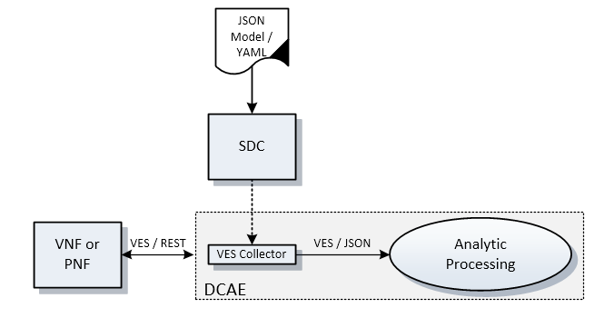

.. Modifications Copyright © 2017-2018 AT&T Intellectual Property.

.. Licensed under the Creative Commons License, Attribution 4.0 Intl.
   (the "License"); you may not use this documentation except in compliance
   with the License. You may obtain a copy of the License at

.. https://creativecommons.org/licenses/by/4.0/

.. Unless required by applicable law or agreed to in writing, software
   distributed under the License is distributed on an "AS IS" BASIS,
   WITHOUT WARRANTIES OR CONDITIONS OF ANY KIND, either express or implied.
   See the License for the specific language governing permissions and
   limitations under the License.

Monitoring & Management
-----------------------

This section addresses data collection and event processing functionality that
is directly dependent on the interfaces provided by the VNFs' or PNFs' APIs.
These can be in the form of asynchronous interfaces for event, fault
notifications, and autonomous data streams. They can also be synchronous
interfaces for on-demand requests to retrieve various performance, usage, and
other event information. It should be understood that events are well
structured packages of information, identified by an eventName, which are
communicated to subscribers who are interested in the eventName. Events are
simply a way of communicating well-structured packages of information to one
or more instances of an Event Listener service.

The target direction for these interfaces is to employ APIs that are
implemented utilizing standardized messaging and modeling protocols over
standardized transports. Standardized environments (physical, virtual) present
a tremendous opportunity to eliminate the need for proprietary interfaces while
removing the traditional boundaries between Network Management Systems and
Element Management Systems. Additionally, virtualized NFs provide the ability
to instrument networking applications by creating event records to test and
monitor end-to-end data flow through the network, similar to what physical or
virtual probes provide without the need to insert probes at various points in
the network. Providers must be able to provide the aforementioned set of
required data directly to the ONAP collection layer using standardized
interfaces.

Data Model for Event Records
^^^^^^^^^^^^^^^^^^^^^^^^^^^^^^^^^^^^

This section describes the data model for the collection of telemetry data from
physical or virtual NFs by Service Providers (SPs) to manage NF health and
run-time life cycle. This data model is referred to as the VES Data Model. The
VES acronym originally stood for Virtual-function Event Streaming, but VES has
been generalized to support network-function event streaming, whether
virtualized or not.

The VES Data Model describes a vendor-agnostic common vocabulary of event
payloads. Vendor-specific, product-specific or service-specific data is
supported by the inclusion of a flexible additional information field
structure. The VES Data Models' common vocabulary is used to drive standard
and automated data analytics (policy-driven analytics) within the ONAP
DCAE Framework.

While this document is focused on specifying some of the records from the
ONAP perspective, there may be other external bodies using the same framework
to specify additional records. For example, OPNFV has a VES project that is
looking to specify records for OpenStack's internal telemetry to manage
application (VNFs or PNFs), physical and virtual infrastructure (compute,
storage, network devices, etc.) and virtual infrastructure managers (cloud
controllers, SDN controllers). It uses ONAP's VES Agent to generate VES events
from the NF and Intel's collectD agent to generate infrastructure VES events.
Note that any configurable parameters for these data records (e.g., frequency,
granularity, policy-based configuration) will be managed using the
"Configuration" framework described in the prior sections of this document.
The infrastructure metrics have been funneled via the ONAP Multi-VIM Project
and are now included in current specifications.

The Data Model consists of:

  - Common Header Record: This data structure precedes each of the
    Technology Independent and Technology Specific records sections of
    the data model.

  - Technology Independent Records: This version of the document specifies
    the model for fault, heartbeat, measurement, notification, perf3gpp,
    pnfRegistration, stateChange, syslog, and thresholdCrossingAlert (TCA)
    records. In the future, these may be extended to support other types of
    technology independent records. Each of these records allows additional
    fields (name/value pairs) for extensibility. The NF provider may use these
    NF provider-specific additional fields to provide additional information
    that may be relevant to the managing systems.

  - Technology Specific Records: This version of the document specifies the
    model for mobileFlow, sipSignaling and voiceQuality records. In the
    future, these may be extended to support other types of records (e.g.
    Network Fabric, Security records, etc.). Each of these records allows
    additional fields (name/value pairs) for extensibility. The NF provider can
    use these NF-specific additional fields to provide additional information
    that may be relevant to the managing systems. A placeholder for additional
    technology specific areas of interest to be defined in the future documents
    has been depicted.

|image0|

Figure 1. Data Model for Event Records

Event Records - Data Structure Description
^^^^^^^^^^^^^^^^^^^^^^^^^^^^^^^^^^^^^^^^^^

The data structure for event records consists of:

-  a Common Event Header block; and

-  zero (heartbeat) or more technology independent domain blocks; or

   - e.g. fault, measurement, notification, perf3gpp, pnfRegistration,
     stateChange, syslog, TCA, otherFields etc.

-  technology specific domain blocks.

   - e.g. mobileFlow, sipSignaling, voiceQuality, etc.

Common Event Header
~~~~~~~~~~~~~~~~~~~~~

The common header that precedes any of the domain-specific records contains
information identifying the type of record to follow, information about the
sender and other identifying characteristics related to the domain and event.
(e.g., name, priority, sequence number, source, timestamp, type, etc.).

.. req::
   :id: R-528866
   :target: VNF
   :introduced: casablanca
   :validation_mode: in_service
   :impacts: dcae
   :keyword: MUST
   :updated: dublin

   The VNF **MUST** produce VES events that include the following mandatory
   fields in the common event header.

    * ``domain`` - the event domain enumeration
    * ``eventId`` - the event key unique to the event source
    * ``eventName`` - the unique event name
    * ``lastEpochMicrosec`` - the latest unix time (aka epoch time) associated
      with the event
    * ``priority`` - the processing priority enumeration
    * ``reportingEntityName`` - name of the entity reporting the event or
      detecting a problem in another VNF or PNF
    * ``sequence`` - the ordering of events communicated by an event source
    * ``sourceName`` - name of the entity experiencing the event issue, which
      may be detected and reported by a separate reporting entity
    * ``startEpochMicrosec`` - the earliest unix time (aka epoch time)
      associated with the event
    * ``version`` - the version of the event header
    * ``vesEventListenerVersion`` - Version of the VES event listener API spec
      that this event is compliant with

Technology Independent Records
~~~~~~~~~~~~~~~~~~~~~~~~~~~~~~

The current version of the data model supports the following technology
independent event records:

   * ``fault`` - the fault record, describing a condition in the fault domain,
     contains information about device failures. The fault event provides data
     such as the entity experiencing a fault, the severity, resulting status,
     etc.

   * ``heartbeat`` - the heartbeat record provides an optional structure for
     communicating information about device health. Heartbeat records would
     only have the Common Event Header block. An optional heartbeat domain is
     available to specify information such as heartbeat interval and
     recommended action upon missing heartbeat interval. Heartbeat avoids the
     need to ping a device.  A communication failure can be determined via
     missing heartbeat events being delivered to DCAE and appropriate action
     (e.g. restart VM, rebuild VNF or create ticket) can be taken by DCAE
     CLAMP.

   * ``Measurements`` - the Measurements Record contains information about
     PNF or VNF and PNF or VNF resource structure and its condition to help
     in the management of the resources for purposes of capacity planning,
     elastic scaling, performance management and service assurance. These
     are soft alarms providing an opportunity for proactive maintenance.

   * ``Notification`` - the Notification Record provides a structure for
     communicating notification information from the PNF or VNF. It can contain
     notification information related to the current operational state that is
     reported by the PNF or VNF. As an example, when cards or port name of the
     entity have changed state. (e.g., offline -> online) Other use cases
     include notification of file ready for collection using Bulk Data Transfer
     or notification on configuration changes to a device.

   * ``Other`` - the Other Record defines fields for events that do not have a
     defined domain but are needed to be collected and sent to DCAE. This
     record provides a mechanism to convey a complex set of fields (possibly
     nested or opaque) and is purely intended to address miscellaneous needs
     such as addressing time-to-market considerations or other proof-of-concept
     evaluations. Hence, use of this record type is discouraged and should be
     minimized. (Note: the Other domain could be used to create and test new
     domain ideas.)

   * ``perf3gpp`` - the perf3gpp record provides a structure for communicating
     information that supports 3GPP defined performance metrics. The perf3gpp
     record can contain information from vendors, including measurement name,
     measurement family, measured object class, description, collection method,
     value ranges, unit of measure, triggering conditions and other measurement
     information.

   * ``pnfRegistration`` - the pnfRegistration Record provides a structure for
     registration of a physical network function. The pnfRegistration Record
     can contain information about attributes related to the physical network
     function including serial number, software revision, unit type and vendor
     name.

   * ``stateChange`` - the State Change Record provides a structure for
     communicating information about data flow through the PNF or VNF. The
     State Change Record can contain information about state change related to
     physical device that is reported by the PNF or VNF. As an example, when
     cards or port name of the entity that has changed state. Note: The
     Notification Domain can also communicate similar information.

   * ``Syslog`` - the Syslog Record provides a structure for communicating any
     type of information that may be logged by the PNF or VNF. It can contain
     information about system internal events, status, errors, etc. It is
     recommended that low volume control or session logs are communicated via a
     push mechanism, while other large volume logs should be sent via file
     transfer.

   * ``thresholdCrossingAlert`` - the Threshold Crossing Alert (TCA) Record
     provides a structure for communicating information about threshold
     crossing alerts. It uses data from the Measurement or a similar domain to
     watch for a Key Performance Indicator (KPI) threshold that has been
     crossed. TCA provides alert definitions and types, actions, events,
     timestamps and physical or logical details.

Technology Specific Records
~~~~~~~~~~~~~~~~~~~~~~~~~~~

The current version of the data model supports the following technology
specific event records:

   * ``Mobile Flow`` - the Mobile Flow Record provides a structure for
     communicating information about data flow through the NF. It can contain
     information about connectivity and data flows between serving elements for
     mobile service, such as between LTE reference points, etc.

   * ``Signaling`` - the Signaling Record provides a structure for
     communicating information about signaling messages, parameters and
     signaling state. It can contain information about data flows for signaling
     and controlling multimedia communication sessions such as voice and video
     calls.

   * ``Voice Quality`` - the Voice Quality Record provides a structure for
     communicating information about voice quality statistics including media
     connection information, such as transmitted octet and packet counts,
     packet loss, packet delay variation, round-trip delay, QoS parameters and
     codec selection.

   * ``Future Domains`` - the Future Domains Record is a placeholder for
     additional technology specific areas of interest that will be defined and
     described in the future documents.

Miscellaneous
~~~~~~~~~~~~~

The event specification contains various extensible structures (e.g. hashMap)
that enable event publishers to send information that has not been explicitly
defined.

.. req::
   :id: R-283988
   :target: VNF
   :introduced: casablanca
   :validation_mode: in_service
   :impacts: dcae
   :keyword: MUST NOT

   The VNF, when publishing events, **MUST NOT** send information through
   extensible structures if the event specification has explicitly defined
   fields for that information.

.. req::
   :id: R-470963
   :target: VNF
   :introduced: casablanca
   :validation_mode: in_service
   :impacts: dcae
   :keyword: MUST

   The VNF, when publishing events, **MUST** leverage camel case to separate
   words and acronyms used as keys that will be sent through extensible fields.
   When an acronym is used as the key, then only the first letter shall be
   capitalized.

.. req::
   :id: R-408813
   :target: VNF
   :keyword: MUST
   :introduced: casablanca
   :validation_mode: none
   :impacts: dcae

   The VNF, when publishing events, **MUST** pass all information it is
   able to collect even if the information field is identified as optional.
   However, if the data cannot be collected, then optional fields can be
   omitted.

Data Structure Specification of the Event Record
^^^^^^^^^^^^^^^^^^^^^^^^^^^^^^^^^^^^^^^^^^^^^^^^^

.. req::
   :id: R-520802
   :target: VNF or PNF PROVIDER
   :keyword: MUST
   :introduced: casablanca
   :validation_mode: static
   :impacts: dcae
   :updated: dublin

   The VNF or PNF provider **MUST** provide a YAML file formatted in adherence with
   the :ref:`VES Event Registration specification <ves_event_registration_3_2>`
   that defines the following information for each event produced by the VNF:

   * ``eventName``
   * Required fields
   * Optional fields
   * Any special handling to be performed for that event

.. req::
   :id: R-120182
   :target: VNF or PNF PROVIDER
   :keyword: MUST
   :introduced: casablanca
   :validation_mode: static
   :impacts: dcae
   :updated: dublin

   The VNF or PNF provider **MUST** indicate specific conditions that may arise, and
   recommend actions that may be taken at specific thresholds, or if specific
   conditions repeat within a specified time interval, using the semantics and
   syntax described by the :ref:`VES Event Registration specification <ves_event_registration_3_2>`.

**NOTE:** The Service Provider may override VNF or PNF provider Event
Registrations using the ONAP SDC Design Studio to finalizes Service
Provider engineering rules for the processing of the VNF or PNF events.
These changes may modify any of the following:

* Threshold levels
* Specified actions related to conditions

.. req::
   :id: R-570134
   :target: VNF or PNF
   :keyword: MUST
   :introduced: casablanca
   :validation_mode: in_service
   :impacts: dcae
   :updated: dublin

   The events produced by the VNF or PNF **MUST** must be compliant with the common
   event format defined in the
   :ref:`VES Event Listener<ves_event_listener_7_1>`
   specification.

.. req::
   :id: R-123044
   :target: VNF or PNF PROVIDER
   :keyword: MUST
   :introduced: casablanca
   :validation_mode: in_service
   :impacts: dcae
   :updated: dublin

   The VNF or PNF Provider **MAY** require that specific events, identified by their
   ``eventName``, require that certain fields, which are optional in the common
   event format, must be present when they are published.

Transports and Protocols Supporting Resource Interfaces
^^^^^^^^^^^^^^^^^^^^^^^^^^^^^^^^^^^^^^^^^^^^^^^^^^^^^^^^

Transport mechanisms and protocols have been selected to enable both high
volume and moderate volume data sets, as well as asynchronous and synchronous
communications over secure connections. The specified encoding provides
self-documenting content, so data fields can be changed as needs evolve, while
minimizing changes to data delivery.

.. req::
   :id: R-798933
   :target: VNF or PNF
   :keyword: SHOULD
   :impacts: dcae
   :validation_mode: in_service
   :introduced: casablanca
   :updated: dublin

   The VNF or PNF **SHOULD** deliver event records that fall into the event domains
   supported by VES.

.. req::
   :id: R-821839
   :target: VNF or PNF
   :keyword: MUST
   :impacts: dcae
   :validation_mode: in_service
   :introduced: casablanca
   :updated: dublin

   The VNF or PNF **MUST** deliver event records to ONAP using the common
   transport mechanisms and protocols defined in this specification.

The term 'Event Record' is used throughout this document to represent various
forms of telemetry or instrumentation made available by the VNFs or PNFs
including, faults, status events, various other types of VNF or PNF
measurements and logs.

Common structures and delivery protocols for other types of data will be given
in future versions of this document as we gain more insight into data volumes
and required processing.

In the following sections, we provide options for encoding, serialization and
data delivery. Agreements between Service Providers and VNF or PNF providers
determine which encoding, serialization and delivery method to use for
particular data sets.

.. req::
   :id: R-932071
   :target: VNF or PNF
   :keyword: MUST
   :impacts: dcae
   :validation_mode: none
   :introduced: casablanca
   :updated: dublin

   The VNF or PNF provider **MUST** reach agreement with the Service Provider on
   the selected methods for encoding, serialization and data delivery
   prior to the on-boarding of the VNF or PNF into ONAP SDC Design Studio.

VNF or PNF Telemetry using VES/JSON Model
~~~~~~~~~~~~~~~~~~~~~~~~~~~~~~~~~~~~~~~~~

.. req::
   :id: R-659655
   :target: VNF or PNF
   :keyword: SHOULD
   :impacts: dcae
   :validation_mode: in_service
   :introduced: casablanca
   :updated: dublin

   The VNF or PNF **SHOULD** leverage the JSON-driven model, as depicted in Figure 2,
   for data delivery unless there are specific performance or operational
   concerns agreed upon by the Service Provider that would warrant using an
   alternate model.

|image1|

Figure 2. VES/JSON Driven Model

VNF or PNF Telemetry using Google Protocol Buffers
~~~~~~~~~~~~~~~~~~~~~~~~~~~~~~~~~~~~~~~~~~~~~~~~~~~

.. req::
   :id: R-697654
   :target: VNF or PNF
   :keyword: MAY
   :impacts: dcae
   :validation_mode: in_service
   :introduced: casablanca
   :updated: dublin

   The VNF or PNF **MAY** leverage the Google Protocol Buffers (GPB) delivery model
   depicted in Figure 3 to support real-time performance management (PM) data.
   In this model the VES events are streamed as binary-encoded GBPs over via
   TCP sockets.

|image2|

Figure 3. VNF or PNF Telemetry using Google Protocol Buffers

**NOTE:** For high-volume VNF or PNF telemetry, native (binary) Google Protocol
Buffers (GPB) is the preferred serialization method. While supporting the GPB
telemetry delivery approach described above, the default delivery method
is the VES/REST JSON based model in DCAE. The purpose of the diagram above
is to illustrate the GPB delivery concept only and not to imply a specific
implementation.

For additional information and uses cases for Real Time Performance
Management and High Volume Stream Data Collection, please refer to the
`5G - Real Time PM and High Volume Stream Data Collection ONAP Development <https://wiki.onap.org/display/DW/5G+-+Real+Time+PM+and+High+Volume+Stream+Data+Collection>`__
Wiki page.

Bulk Telemetry Transmission
~~~~~~~~~~~~~~~~~~~~~~~~~~~

.. req::
   :id: R-908291
   :target: VNF or PNF
   :keyword: MAY
   :introduced: casablanca
   :impacts: dcae, dmaap
   :validation_mode: in_service
   :updated: dublin

   The VNF or PNF **MAY** leverage bulk VNF or PNF telemetry transmission mechanism, as
   depicted in Figure 4, in instances where other transmission methods are not
   practical or advisable.

|image3|

Figure 4. VNF or PNF Telemetry using Bulk Transmission

**NOTE:** An optional VES mapper micro-service can be leveraged to to extract
measurements and publish them as VES events.

For additional information and use cases for the Bulk Telemetry Transmission
Mechanism, please refer to the `5G - Bulk PM ONAP Development <https://wiki.onap.org/display/DW/5G+-+Bulk+PM>`__
Wiki page.

Monitoring & Management Requirements
^^^^^^^^^^^^^^^^^^^^^^^^^^^^^^^^^^^^

VNF telemetry via standardized interface
~~~~~~~~~~~~~~~~~~~~~~~~~~~~~~~~~~~~~~~~

.. req::
   :id: R-821473
   :target: VNF or PNF
   :keyword: MUST
   :introduced: casablanca
   :impacts: dcae
   :validation_mode: in_service
   :updated: dublin

   The VNF or PNF MUST produce heartbeat indicators consisting of events containing
   the common event header only per the VES Listener Specification.

JSON
~~~~~~~~~~~~~~~~~~

.. req::
    :id: R-19624
    :target: VNF or PNF
    :keyword: MUST
    :updated: dublin

    The VNF or PNF, when leveraging JSON for events, **MUST** encode and serialize
    content delivered to ONAP using JSON (RFC 7159) plain text format.
    High-volume data is to be encoded and serialized using
    `Avro <http://avro.apache.org/>`_, where the Avro data
    format are described using JSON.

Note:

  - JSON plain text format is preferred for moderate volume data sets
    (option 1), as JSON has the advantage of having well-understood simple
    processing and being human-readable without additional decoding. Examples
    of moderate volume data sets include the fault alarms and performance
    alerts, heartbeat messages, measurements used for VNF scaling and syslogs.

  - Binary format using Avro is preferred for high volume data sets (option 2)
    such as mobility flow measurements and other high-volume streaming events
    (such as mobility signaling events, mobility trace data or SIP signaling)
    or bulk data, as this will significantly reduce the volume of data to be
    transmitted. As of the date of this document, all events are reported
    using plain text JSON and REST.

  - Avro content is self-documented, using a JSON schema. The JSON schema is
    delivered along with the data content
    (http://avro.apache.org/docs/current/ ). This means the presence and
    position of data fields can be recognized automatically, as well as the
    data format, definition and other attributes. Avro content can be
    serialized as JSON tagged text or as binary. In binary format, the JSON
    schema is included as a separate data block, so the content is not tagged,
    further compressing the volume. For streaming data, Avro will read the
    schema when the stream is established and apply the schema to the
    received content.

  - In addition to the preferred delivery format (JSON), content delivered
    from PNFs or VNFs to ONAP can be encoded and serialized using Google
    Protocol Buffers (GPB). Please refer to the next section of this document
    for additional information.

In addition to the preferred method (JSON), content can be delivered
from VNFs or PNFs to ONAP can be encoded and serialized using Google Protocol
Buffers (GPB).

Google Protocol Buffers (GPB)
~~~~~~~~~~~~~~~~~~~~~~~~~~~~~

.. req::
   :id: R-257367
   :target: VNF or PNF
   :keyword: MUST
   :introduced: casablanca
   :validation_mode: in_service
   :updated: dublin

   The VNF or PNF, when leveraging Google Protocol Buffers for events, **MUST**
   serialize the events using native Google Protocol Buffers (GPB) according
   to the following guidelines:

      * The keys are represented as integers pointing to the system resources
        for the VNF or PNF being monitored
      * The values correspond to integers or strings that identify the
        operational state of the VNF resource, such a statistics counters and
        the state of an VNF or PNF resource.
      * The required Google Protocol Buffers (GPB) metadata is provided in the
        form of .proto files.

.. req::
   :id: R-978752
   :target: VNF or PNF PROVIDER
   :keyword: MUST
   :introduced: casablanca
   :validation_mode: static
   :updated: dublin

   The VNF or PNF providers **MUST** provide the Service Provider the following
   artifacts to support the delivery of high-volume VNF or PNF telemetry to
   DCAE via GPB over TLS/TCP:

      * A valid VES Event .proto definition file, to be used validate and
        decode an event
      * A valid high volume measurement .proto definition file, to be used for
        processing high volume events
      * A supporting PM content metadata file to be used by analytics
        applications to process high volume measurement events

Reporting Frequency
~~~~~~~~~~~~~~~~~~~~~

.. req::
   :id: R-146931
   :target: VNF or PNF
   :keyword: MUST
   :introduced: casablanca
   :validation_mode: in_service
   :updated: dublin

   The VNF or PNF **MUST** report exactly one Measurement event per period
   per source name.

.. req::
    :id: R-98191
    :target: VNF or PNF
    :keyword: MUST
    :updated: dublin

    The VNF or PNF **MUST** vary the frequency that asynchronous data
    is delivered based on the content and how data may be aggregated or
    grouped together.

        Note:

        - For example, alarms and alerts are expected to be delivered as
          soon as they appear. In contrast, other content, such as performance
          measurements, KPIs or reported network signaling may have various
          ways of packaging and delivering content. Some content should be
          streamed immediately; or content may be monitored over a time
          interval, then packaged as collection of records and delivered
          as block; or data may be collected until a package of a certain
          size has been collected; or content may be summarized statistically
          over a time interval, or computed as a KPI, with the summary or KPI
          being delivered.
        - We expect the reporting frequency to be configurable depending on
          the virtual network functions needs for management. For example,
          Service Provider may choose to vary the frequency of collection
          between normal and trouble-shooting scenarios.
        - Decisions about the frequency of data reporting will affect
          the size of delivered data sets, recommended delivery method,
          and how the data will be interpreted by ONAP. These considerations
          should not affect deserialization and decoding of the data, which
          will be guided by the accompanying JSON schema or GPB definition
          files.

Addressing and Delivery Protocol
~~~~~~~~~~~~~~~~~~~~~~~~~~~~~~~~~~~

ONAP destinations can be addressed by URLs for RESTful data PUT. Future
data sets may also be addressed by host name and port number for TCP
streaming, or by host name and landing zone directory for SFTP transfer
of bulk files.

.. req::
    :id: R-88482
    :target: VNF or PNF
    :keyword: SHOULD
    :updated: dublin

    The VNF or PNF **SHOULD** use REST using HTTPS delivery of plain
    text JSON for moderate sized asynchronous data sets, and for high
    volume data sets when feasible.

.. req::
    :id: R-84879
    :target: VNF or PNF
    :keyword: MUST
    :updated: dublin

    The VNF or PNF **MUST** have the capability of maintaining a primary
    and backup DNS name (URL) for connecting to ONAP collectors, with the
    ability to switch between addresses based on conditions defined by policy
    such as time-outs, and buffering to store messages until they can be
    delivered. At its discretion, the service provider may choose to populate
    only one collector address for a VNF or PNF. In this case, the network will
    promptly resolve connectivity problems caused by a collector or network
    failure transparently to the VNF or PNF.

.. req::
    :id: R-81777
    :target: VNF or PNF
    :keyword: MUST
    :updated: dublin

    The VNF or PNF **MUST** be configured with initial address(es) to use
    at deployment time. Subsequently, address(es) may be changed through
    ONAP-defined policies delivered from ONAP to the VNF or PNF using PUTs to a
    RESTful API, in the same manner that other controls over data reporting
    will be controlled by policy.

.. req::
    :id: R-08312
    :target: VNF or PNF
    :keyword: MAY
    :updated: dublin

    The VNF or PNF **MAY** use another option which is expected to include REST
    delivery of binary encoded data sets.

.. req::
    :id: R-79412
    :target: VNF or PNF
    :keyword: MAY
    :updated: dublin

    The VNF or PNF **MAY** use another option which is expected to include TCP
    for high volume streaming asynchronous data sets and for other high volume
    data sets. TCP delivery can be used for either JSON or binary encoded data
    sets.

.. req::
    :id: R-01033
    :target: VNF or PNF
    :keyword: MAY
    :updated: dublin

    The VNF or PNF **MAY** use another option which is expected to include SFTP
    for asynchronous bulk files, such as bulk files that contain large volumes
    of data collected over a long time interval or data collected across many
    VNFs or PNFs. (Preferred is to reorganize the data into more frequent or more focused
    data sets, and deliver these by REST or TCP as appropriate.)

.. req::
    :id: R-63229
    :target: VNF or PNF
    :keyword: MAY
    :updated: dublin

    The VNF or PNF **MAY** use another option which is expected to include REST
    for synchronous data, using RESTCONF (e.g., for VNF or PNF state polling).

.. req::
    :id: R-03070
    :target: VNF or PNF
    :keyword: MUST
    :updated: dublin

    The VNF or PNF **MUST**, by ONAP Policy, provide the ONAP addresses
    as data destinations for each VNF or PNF, and may be changed by Policy while
    the VNF or PNF is in operation. We expect the VNF or PNF to be capable of redirecting
    traffic to changed destinations with no loss of data, for example from
    one REST URL to another, or from one TCP host and port to another.

Asynchronous and Synchronous Data Delivery
~~~~~~~~~~~~~~~~~~~~~~~~~~~~~~~~~~~~~~~~~~~~

.. req::
    :id: R-06924
    :target: VNF or PNF
    :keyword: MUST
    :updated: dublin

    The VNF or PNF **MUST** deliver asynchronous data as data becomes
    available, or according to the configured frequency.

.. req::
    :id: R-73285
    :target: VNF or PNF
    :keyword: MUST
    :updated: dublin

    The VNF or PNF **MUST** must encode, address and deliver the data
    as described in the previous paragraphs.

.. req::
    :id: R-42140
    :target: VNF or PNF
    :keyword: MUST
    :updated: dublin

    The VNF or PNF **MUST** respond to data requests from ONAP as soon
    as those requests are received, as a synchronous response.

.. req::
    :id: R-34660
    :target: VNF or PNF
    :keyword: MUST
    :updated: dublin

    The VNF or PNF **MUST** use the RESTCONF/NETCONF framework used by
    the ONAP configuration subsystem for synchronous communication.

.. req::
    :id: R-86586
    :target: VNF or PNF
    :keyword: MUST
    :updated: dublin

    The VNF or PNF **MUST** use the YANG configuration models and RESTCONF
    [RFC8040] (https://tools.ietf.org/html/rfc8040).

.. req::
    :id: R-11240
    :target: VNF or PNF
    :keyword: MUST
    :updated: dublin

    The VNF or PNF **MUST** respond with content encoded in JSON, as
    described in the RESTCONF specification. This way the encoding of a
    synchronous communication will be consistent with Avro.

.. req::
    :id: R-70266
    :target: VNF or PNF
    :keyword: MUST
    :updated: dublin

    The VNF or PNF **MUST** respond to an ONAP request to deliver the
    current data for any of the record types defined in
    `Event Records - Data Structure Description`_ by returning the requested
    record, populated with the current field values. (Currently the defined
    record types include fault fields, mobile flow fields, measurements for
    VNF or PNF scaling fields, and syslog fields. Other record types will be added
    in the future as they become standardized and are made available.)

.. req::
   :id: R-332680
   :target: VNF or PNF
   :keyword: SHOULD
   :impacts: dcae
   :validation_mode: in_service
   :introduced: casablanca
   :updated: dublin

   The VNF or PNF **SHOULD** deliver all syslog messages to the VES Collector per the
   specifications in Monitoring and Management chapter.

.. req::
    :id: R-46290
    :target: VNF or PNF
    :keyword: MUST
    :updated: dublin

    The VNF or PNF **MUST** respond to an ONAP request to deliver granular
    data on device or subsystem status or performance, referencing the YANG
    configuration model for the VNF or PNF by returning the requested data elements.

.. req::
    :id: R-43327
    :target: VNF or PNF
    :keyword: SHOULD
    :updated: dublin

    The VNF or PNF **SHOULD** use `Modeling JSON text with YANG
    <https://tools.ietf.org/html/rfc7951>`_, If YANG models need to be
    translated to and from JSON{RFC7951]. YANG configuration and content can
    be represented via JSON, consistent with Avro, as described in "Encoding
    and Serialization" section.

Security
~~~~~~~~~~

.. req::
    :id: R-42366
    :target: VNF or PNF
    :keyword: MUST
    :updated: dublin

    The VNF or PNF **MUST** support secure connections and transports such as
    Transport Layer Security (TLS) protocol
    [`RFC5246 <https://tools.ietf.org/html/rfc5246>`_] and should adhere to
    the best current practices outlined in
    `RFC7525 <https://tools.ietf.org/html/rfc7525>`_.

.. req::
    :id: R-44290
    :target: VNF or PNF
    :keyword: MUST
    :updated: dublin

    The VNF or PNF **MUST** control access to ONAP and to VNFs or PNFs, and creation
    of connections, through secure credentials, log-on and exchange mechanisms.

.. req::
    :id: R-47597
    :target: VNF or PNF
    :keyword: MUST
    :updated: dublin

    The VNF or PNF **MUST** carry data in motion only over secure connections.

.. req::
    :id: R-68165
    :target: VNF or PNF
    :keyword: MUST
    :updated: dublin

    The VNF or PNF **MUST** encrypt any content containing Sensitive Personal
    Information (SPI) or certain proprietary data, in addition to applying the
    regular procedures for securing access and delivery.

.. req::
    :id: R-01427
    :target: VNF or PNF
    :keyword: MUST
    :introduced: casablanca
    :updated: el alto

    If the VNF or PNF is using Basic Authentication, then the VNF or
    PNF **MUST** support the provisioning of security and authentication
    parameters (HTTP username and password) in order to be able to
    authenticate with DCAE VES Event Listener.

    Note: The configuration management and provisioning software
    are specific to a vendor architecture.

.. req::
    :id: R-894004
    :target: VNF or PNF
    :keyword: MUST
    :introduced: casablanca
    :updated: el alto

    If the VNF or PNF is using Basic Authentication, then when the VNF
    or PNF sets up a HTTPS connection to the DCAE VES Event Listener,
    the VNF or PNF **MUST** provide a username and password to the
    DCAE VES Event Listener in the Authorization header and the VNF
    or PNF MUST support one-way TLS authentication.

    Note: In one-way TLS authentication, the client (VNF or PNF)
    must authentication the server (DCAE) certificate.

.. req::
   :id: R-55634
   :target: VNF or PNF
   :keyword: MUST
   :introduced: el alto

   If VNF or PNF is using Basic Authentication, then the VNF or PNF
   **MUST** be in compliance with
   `RFC7617 <https://tools.ietf.org/html/rfc7617>`_ for authenticating HTTPS
   connections to the DCAE VES Event Listener.

.. req::
   :id: R-43387
   :target: VNF or PNF
   :keyword: MUST
   :introduced: el alto

   If the VNF or PNF is using Certificate Authentication, the
   VNF or PNF **MUST** support mutual TLS authentication and the Subject
   Name in the end-entity certificate MUST be used according to
   `RFC5280 <https://tools.ietf.org/html/rfc5280>`_.

   Note: In mutual TLS authentication, the client (VNF or PNF) must
   authenticate the server (DCAE) certificate and must provide its own
   X.509v3 end-entity certificate to the server for authentication.

.. req::
   :id: R-33878
   :target: VNF or PNF
   :keyword: MUST
   :introduced: el alto

   The VNF or PNF **MUST** support one of the following authentication
   methods for authenticating HTTPS connections to the DCAE VES Event
   Listener:

   - The preferred method is Certificate Authentication

   - The non-preferred option is Basic Authentication.

Bulk Performance Measurement
~~~~~~~~~~~~~~~~~~~~~~~~~~~~

.. req::
    :id: R-841740
    :target: VNF or PNF
    :keyword: SHOULD
    :introduced: casablanca
    :impacts: dcae, dmaap
    :updated: dublin

    The VNF or PNF **SHOULD** support FileReady VES event for event-driven bulk transfer
    of monitoring data.

.. req::
    :id: R-440220
    :target: VNF or PNF
    :keyword: SHOULD
    :introduced: casablanca
    :impacts: dcae, dmaap
    :updated: dublin

    The VNF or PNF **SHOULD** support File transferring protocol, such as FTPES or SFTP,
    when supporting the event-driven bulk transfer of monitoring data.

.. req::
    :id: R-75943
    :target: VNF or PNF
    :keyword: SHOULD
    :introduced: casablanca
    :impacts: dcae, dmaap
    :updated: dublin

    The VNF or PNF **SHOULD** support the data schema defined in 3GPP TS 32.435, when
    supporting the event-driven bulk transfer of monitoring data.

.. req::
    :id: R-807129
    :target: VNF or PNF
    :keyword: SHOULD
    :introduced: dublin
    :impacts: dcae, dmaap

    The VNF or PNF **SHOULD** report the files in FileReady for as long as they are
    available at VNF or PNF.

    Note: Recommended period is at least 24 hours.

PM Dictionary
^^^^^^^^^^^^^^

The Performance Management (PM) Dictionary is used by analytics applications
to interpret and process perf3gpp measurement information from vendors,
including measurement name, measurement family, measured object class,
description, collection method, value ranges, unit of measure, triggering
conditions and other information. The ultimate goal is for analytics
applications to dynamically process new and updated measurements based on
information in the PM Dictionary.

The PM dictionary is supplied by NF vendors in two parts:

  - PM Dictionary Schema: specifies meta-information about perf3gpp
    measurement events from that vendor. The meta-information is conveyed
    using standard meta-information keywords, and may be extended to include
    vendor-specific meta-information keywords. The PM Dictionary Schema may
    also convey a range of vendor-specific values for some of the keywords.

  - PM Dictionary: defines specific perf3gpp measurements sent by vendor VNFs
    or PNFs (each of which is compliant with a referenced PM Dictionary
    Schema).

Note:

  - A vendor may provide multiple versions of the PM Dictionary Schema and
    refer to those versions from the PM Dictionary.

  - Please refer to the latest version of the VES Event Registration
    specification for the listing of the PM Dictionary schema keywords, PM
    Dictionary Schema example and PM Dictionary example.

FM Meta Data
^^^^^^^^^^^^^^

FM Meta Data enables vendors to provide meta information about FM events using
a set of standard keywords. FM Meta Data is conveyed in the YAML event
registration using the YAML Comment qualifier. The FM Meta Data section is
optional.

FM Meta Data includes Alarm Meta Data and Fault Meta Data:

  - FM Meta Data keywords must be provided in 'hash format' as Keyword: Value.

  - FM Meta Data values containing whitespace must be enclosed in single
    quotes. Successive keywords must be separated by commas.

  - Alarm Meta Data, if provided, shall be placed in the YAML comments
    qualifier at the top of the event registration for the alarm.

  - Fault Meta Data, if provided, shall be placed in the YAML comments
    qualifier of faultFields.alarmAdditionalInformation within each alarm.

The above conventions will make machine processing of FM Meta Data Keywords
easier to perform.

Note:

  - Please refer to the latest version of the VES Event Registration
    specification for the listing of the FM Alarm Meta Data keywords, Fault
    Meta Data keywords and FM Meta Data examples.

.. |image0| image:: ../Data_Model_For_Event_Records.png

.. |image2| image:: ../Protocol_Buffers_Driven_Model.png
      :width: 4.74in
      :height: 3.3in

