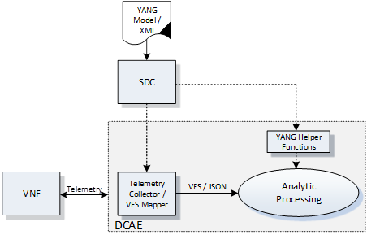

.. Modifications Copyright © 2017-2018 AT&T Intellectual Property.

.. Licensed under the Creative Commons License, Attribution 4.0 Intl.
   (the "License"); you may not use this documentation except in compliance
   with the License. You may obtain a copy of the License at

.. https://creativecommons.org/licenses/by/4.0/

.. Unless required by applicable law or agreed to in writing, software
   distributed under the License is distributed on an "AS IS" BASIS,
   WITHOUT WARRANTIES OR CONDITIONS OF ANY KIND, either express or implied.
   See the License for the specific language governing permissions and
   limitations under the License.

Monitoring & Management
-----------------------

This section addresses data collection and event processing
functionality that is directly dependent on the interfaces
provided by the VNFs' APIs. These can be in the form of asynchronous
interfaces for event, fault notifications, and autonomous data streams.
They can also be synchronous interfaces for on-demand requests to
retrieve various performance, usage, and other event information.

The target direction for VNF interfaces is to employ APIs that are
implemented utilizing standardized messaging and modeling protocols
over standardized transports. Migrating to a virtualized environment
presents a tremendous opportunity to eliminate the need for proprietary
interfaces for VNF provider equipment while removing the traditional
boundaries between Network Management Systems and Element Management
Systems. Additionally, VNFs provide the ability to instrument the
networking applications by creating event records to test and monitor
end-to-end data flow through the network, similar to what physical or
virtual probes provide without the need to insert probes at various
points in the network. The VNF providers must be able to provide the
aforementioned set of required data directly to the ONAP collection
layer using standardized interfaces.

Data Model for Event Records
^^^^^^^^^^^^^^^^^^^^^^^^^^^^^^^^^^^^

This section describes the data model for the collection of telemetry
data from VNFs by Service Providers (SPs) to manage VNF health and
runtime lifecycle. This data model is referred to as the VNF Event
Streaming (VES) specifications. While this document is focused on
specifying some of the records from the ONAP perspective, there may
be other external bodies using the same framework to specify additional
records. For example, OPNFV has a VES project that is looking to specify
records for OpenStack's internal telemetry to manage Application (VNFs),
physical and virtual infrastructure (compute, storage, network devices),
and virtual infrastructure managers (cloud controllers, SDN controllers).
Note that any configurable parameters for these data records (e.g.,
frequency, granularity, policy-based configuration) will be managed
using the “Configuration” framework described in the prior sections
of this document.

The Data Model consists of:

-  Common Header Record: This data structure precedes each of the
   Technology Independent and Technology Specific records sections of
   the data model.

-  Technology Independent Records: This version of the document
   specifies the model for Fault, Heartbeat, State Change, Syslog,
   Threshold Crossing Alerts, and VNF Scaling* (short for
   measurementForVfScalingFields – actual name used in JSON
   specification) records. In the future, these may be extended to
   support other types of technology independent records. Each of
   these records allows additional fields (name/ value pairs) for
   extensibility. The VNF provider can use these VNF Provider-specific
   additional fields to provide additional information that may be
   relevant to the managing systems.

-  Technology Specific Records: This version of the document specifies
   the model for Mobile Flow records, Signaling and Voice Quality records.
   In the future, these may be extended to support other types of records
   (e.g. Network Fabric, Security records, etc.). Each of these records
   allows additional fields (name/value pairs) for extensibility. The VNF
   providers can use these VNF-specific additional fields to provide
   additional information that may be relevant to the managing systems.
   A placeholder for additional technology specific areas of interest to
   be defined in the future documents has been depicted.

|image0|

Figure 1. Data Model for Event Records

Event Records - Data Structure Description
^^^^^^^^^^^^^^^^^^^^^^^^^^^^^^^^^^^^^^^^^^^^^^

The data structure for event records consists of:

-  a Common Event Header block;

-  zero or more technology independent domain blocks; and

   -  e.g., Fault domain, State Change domain, Syslog domain, etc.

-  zero or more technology specific domain blocks.

   -  e.g., Mobile Flow domain, Signaling domain, Voice Quality domain,
      etc.

Common Event Header
~~~~~~~~~~~~~~~~~~~~~

The common header that precedes any of the domain-specific records contains
information identifying the type of record to follow, information about
the sender and other identifying characteristics related to timestamp,
sequence number, etc.

Technology Independent Records – Fault Fields
~~~~~~~~~~~~~~~~~~~~~~~~~~~~~~~~~~~~~~~~~~~~~~~~~~

The Fault Record, describing a condition in the Fault domain, contains
information about the fault such as the entity under fault, the
severity, resulting status, etc.

Technology Independent Records – Heartbeat Fields
~~~~~~~~~~~~~~~~~~~~~~~~~~~~~~~~~~~~~~~~~~~~~~~~~~~~~~~~

The Heartbeat Record provides an optional structure for communicating
information about heartbeat or watchdog signaling events.  It can
contain information about service intervals, status information etc.
as required by the heartbeat implementation.

Note: Heartbeat records would only have the Common Event Header block.
An optional heartbeat domain is available if required by the heartbeat
implementation.

Technology Independent Records – State Change Fields
~~~~~~~~~~~~~~~~~~~~~~~~~~~~~~~~~~~~~~~~~~~~~~~~~~~~~~~~~~

The State Change Record provides a structure for communicating information
about data flow through the VNF. It can contain information about state
change related to physical device that is reported by VNF. As an example,
when cards or port name of the entity that has changed state.

Technology Independent Records – Syslog Fields
~~~~~~~~~~~~~~~~~~~~~~~~~~~~~~~~~~~~~~~~~~~~~~~~~~~~~~~~~

The Syslog Record provides a structure for communicating any type of
information that may be logged by the VNF. It can contain information
about system internal events, status, errors, etc.

Technology Independent Records – Threshold Crossing Alert Fields
~~~~~~~~~~~~~~~~~~~~~~~~~~~~~~~~~~~~~~~~~~~~~~~~~~~~~~~~~~~~~~~~~~~~~~

The Threshold Crossing Alert (TCA) Record provides a structure for
communicating information about threshold crossing alerts. It can
contain alert definitions and types, actions, events, timestamps
and physical or logical details.

Technology Independent Records - VNF Scaling Fields
~~~~~~~~~~~~~~~~~~~~~~~~~~~~~~~~~~~~~~~~~~~~~~~~~~~~~

The VNF Scaling\* (short for measurementForVfScalingFields –
actual name used in JSON specification) Record contains information
about VNF and VNF resource structure and its condition to help in
the management of the resources for purposes of elastic scaling.

Technology Independent Records – otherFields
~~~~~~~~~~~~~~~~~~~~~~~~~~~~~~~~~~~~~~~~~~~~~~~~~

The otherFields Record defines fields for events belonging to the
otherFields domain of the Technology Independent domain enumeration.
This record provides a mechanism to convey a complex set of fields
(possibly nested or opaque) and is purely intended to address
miscellaneous needs such as addressing time-to-market considerations
or other proof-of-concept evaluations. Hence, use of this record
type is discouraged and should be minimized.

Technology Specific Records – Mobile Flow Fields
~~~~~~~~~~~~~~~~~~~~~~~~~~~~~~~~~~~~~~~~~~~~~~~~~~~~~~

The Mobile Flow Record provides a structure for communicating
information about data flow through the VNF. It can contain
information about connectivity and data flows between serving
elements for mobile service, such as between LTE reference points, etc.

Technology Specific Records – Signaling Fields
~~~~~~~~~~~~~~~~~~~~~~~~~~~~~~~~~~~~~~~~~~~~~~~~~~~~~

The Signaling Record provides a structure for communicating information
about signaling messages, parameters and signaling state.  It can
contain information about data flows for signaling and controlling
multimedia communication sessions such as voice and video calls.

Technology Specific Records – Voice Quality Fields
~~~~~~~~~~~~~~~~~~~~~~~~~~~~~~~~~~~~~~~~~~~~~~~~~~~~~~~
The Voice Quality Record provides a structure for communicating information
about voice quality statistics including media connection information,
such as transmitted octet and packet counts, packet loss, packet delay
variation, round-trip delay, QoS parameters and codec selection.

Technology Specific Records – Future Domains
~~~~~~~~~~~~~~~~~~~~~~~~~~~~~~~~~~~~~~~~~~~~~~~~~~

The futureDomains Record is a placeholder for additional technology
specific areas of interest that will be defined and described
in the future documents.

Data Structure Specification of the Event Record
^^^^^^^^^^^^^^^^^^^^^^^^^^^^^^^^^^^^^^^^^^^^^^^^^^

For additional information on the event record formats of the data
structures mentioned above, please refer to `VES Event
Listener <https://onap.readthedocs.io/en/latest/submodules/vnfsdk/model.git/docs/files/VESEventListener.html>`__.

Transports and Protocols Supporting Resource Interfaces
^^^^^^^^^^^^^^^^^^^^^^^^^^^^^^^^^^^^^^^^^^^^^^^^^^^^^^^^

Delivery of data from VNFs to ONAP must use the common transport
mechanisms and protocols for all VNFs as defined in this document.
Transport mechanisms and protocols have been selected to enable both
high volume and moderate volume datasets, as well as asynchronous and
synchronous communications over secure connections. The specified
encoding provides self-documenting content, so data fields can be
changed as needs evolve, while minimizing changes to data delivery.

The term 'Event Record' is used throughout this document to represent
various forms of telemetry or instrumentation made available by the
VNF including, faults, status events, various other types of VNF
measurements and logs. Headers received by themselves must be used
as heartbeat indicators. Common structures and delivery protocols for
other types of data will be given in future versions of this document
as we get more insight into data volumes and required processing.

In the following sections, we provide options for encoding, serialization
and data delivery. Agreements between Service Providers and VNF providers
shall determine which encoding, serialization and delivery method to use
for particular data sets. The selected methods must be agreed to prior to
the on-boarding of the VNF into ONAP design studio.

VNF Telemetry using VES/JSON Model
~~~~~~~~~~~~~~~~~~~~~~~~~~~~~~~~~~

The preferred model for data delivery from a VNF to ONAP DCAE is
the JSON driven model as depicted in Figure 2.

|image1|

Figure 2. VES/JSON Driven Model

VNF providers will provide a YAML artifact to the Service Provider
that describes:

* standard VES/JSON model information elements (key/values) that
  the VNF provides
* any additional non-standard (custom) VES/JSON model information
  elements (key/values) that the VNF provides

Using the semantics and syntax supported by YAML, VNF providers
will indicate specific conditions that may arise, and recommend
actions that should be taken at specific thresholds, or if specific
conditions repeat within a specified time interval.

Based on the VNF provider's recommendations, the Service Provider may
create additional YAML artifacts (using ONAP design Studio), which
finalizes Service Provider engineering rules for the processing of
the VNF events.  The Service Provider may alter the threshold levels
recommended by the VNF providor, and may modify and more clearly
specify actions that should be taken when specified conditions arise.
The Service Provider-created version of the YAML artifact will be
distributed to ONAP applications by the Design framework.

VNF Telemetry using YANG Model
~~~~~~~~~~~~~~~~~~~~~~~~~~~~~~

In addition to the JSON driven model described above, a YANG
driven model can also be supported, as depicted in Figure 3.

|image2|

Figure 3. YANG Driven Model

VNF providers will provide to the Service Provider the following
YANG model artifacts:

* common IETF YANG modules that support the VNF
* native (VNF provider-supplied) YANG modules that support the VNF
* open (OpenConfig) YANG modules and the following
  configuration-related information, including:

  * telemetry configuration and operational state data; such as:

    * sensor paths
    * subscription bindings
    * path destinations
    * delivery frequency
    * transport mechanisms
    * data encodings

* a YAML artifact that provides all necessary mapping relationships
  between YANG model data types to VES/JSON information elements
* YANG helper or decoder functions that automate the conversion between
  YANG model data types to VES/JSON information elements
* OPTIONAL: YANG Telemetry modules in JSON format per RFC 7951

Using the semantics and syntax supported by YANG, VNF providers
will indicate specific conditions that may arise, and recommend
actions that should be taken at specific thresholds, or if specific
conditions repeat within a specified time interval.

Based on the VNF provider's recommendations, the Service Provider may
create additional YAML artifacts (using ONAP design Studio), which
finalizes Service Provider engineering rules for the processing of the
VNF events.  The Service Provider may alter the threshold levels recommended
by the VNF provider, and may modify and more clearly specify actions that
should be taken when specified conditions arise.  The Service
Provided-created version of the YAML will be distributed to ONAP
applications by the Design framework.

Note: While supporting the YANG model described above, we are still
leveraging the VES JSON based model in DCAE.  The purpose of the
diagram above is to illustrate the concept only and not to imply a
specific implementation.

VNF Telemetry using Google Protocol Buffers
~~~~~~~~~~~~~~~~~~~~~~~~~~~~~~~~~~~~~~~~~~~

In addition to the data delivery models described above, support for
delivery of VNF telemetry using Google Protocol Buffers (GPB) can
also be supported, as depicted in Figure 4.

VNF providers will provide to the Service Provider the additional
following artifacts to support the delivery of VNF telemetry to DCAE
via the open-source gRPC mechanism using Google's Protocol Buffers:

* the YANG model artifacts described in support of the
  "VNF Telemetry using YANG Model"
* valid definition file(s) for all GPB / KV-GPB encoded messages
* valid definition file(s) for all gRPC services
* gRPC method parameters and return types specified as Protocol
  Buffers messages

|image3|

Figure 4. Protocol Buffers Driven Model

Note: if Google Protocol Buffers are employed for delivery of VNF
telemetry, Key-Value Google Protocol Buffers (KV-GPB) is the
preferred serialization method.  Details of specifications and
versioning corresponding to a release can be found at:
`VES Event Listener <https://onap.readthedocs.io/en/latest/submodules/vnfsdk/model.git/docs/files/VESEventListener.html>`__.

Note: While supporting the VNF telemetry delivery approach described above,
we are still leveraging the VES JSON based model in DCAE.  The purpose of
the diagram above is to illustrate the concept only and not to imply a
specific implementation.

Monitoring & Management Requirements
^^^^^^^^^^^^^^^^^^^^^^^^^^^^^^^^^^^^^^^^^^^^^^^^

VNF telemetry via standardized interface
~~~~~~~~~~~~~~~~~~~~~~~~~~~~~~~~~~~~~~~~~~~

.. req::
    :id: R-51910
    :target: XNF
    :keyword: MUST

    The xNF **MUST** provide all telemetry (e.g., fault event
    records, syslog records, performance records etc.) to ONAP using the
    model, format and mechanisms described in this section.

Encoding and Serialization
~~~~~~~~~~~~~~~~~~~~~~~~~~~

Content delivered from VNFs to ONAP is to be encoded and serialized using JSON:

JSON
~~~~~~~~~~~~~~~~~~

.. req::
    :id: R-19624
    :target: XNF
    :keyword: MUST

    The xNF **MUST** encode and serialize content delivered to
    ONAP using JSON (RFC 7159) plain text format. High-volume data
    is to be encoded and serialized using `Avro <http://avro.apache.org/>`_,
    where the Avro [#7.4.1]_ data format are described using JSON.

    Note:

        - JSON plain text format is preferred for moderate volume data sets
          (option 1), as JSON has the advantage of having well-understood simple
          processing and being human-readable without additional decoding. Examples
          of moderate volume data sets include the fault alarms and performance
          alerts, heartbeat messages, measurements used for xNF scaling and syslogs.
        - Binary format using Avro is preferred for high volume data sets
          (option 2) such as mobility flow measurements and other high-volume
          streaming events (such as mobility signaling events or SIP signaling)
          or bulk data, as this will significantly reduce the volume of data
          to be transmitted. As of the date of this document, all events are
          reported using plain text JSON and REST.
        - Avro content is self-documented, using a JSON schema. The JSON schema is
          delivered along with the data content
          (http://avro.apache.org/docs/current/ ). This means the presence and
          position of data fields can be recognized automatically, as well as the
          data format, definition and other attributes. Avro content can be
          serialized as JSON tagged text or as binary. In binary format, the
          JSON schema is included as a separate data block, so the content is
          not tagged, further compressing the volume. For streaming data, Avro
          will read the schema when the stream is established and apply the
          schema to the received content.

In addition to the preferred method (JSON), content can be delivered
from xNFs to ONAP can be encoded and serialized using Google Protocol
Buffers (GPB).

KV-GPB/GPB
~~~~~~~~~~~~~~~~~~

Telemetry data delivered using Google Protocol Buffers v3 (proto3)
can be serialized in one of the following methods:

* Key-value Google Protocol Buffers (KV-GPB) is also known as
  self-describing GPB:

  * keys are strings that correspond to the path of the system
    resources for the VNF being monitored.
  * values correspond to integers or strings that identify the
    operational state of the VNF resource, such a statistics counters
    and the state of a VNF resource.

* VNF providers must supply valid KV-GPB definition file(s) to allow
  for the decoding of all KV-GPB encoded telemetry messages.

* Native Google Protocol Buffers (GPB) is also known as compact GPB:

  * keys are represented as integers pointing to the system resources for
    the VNF being monitored.
  * values correspond to integers or strings that identify the operational
    state of the VNF resource, such a statistics counters and the state
    of a VNF resource.

* Google Protocol Buffers (GPB) requires metadata in the form of .proto
  files. VNF providers must supply the necessary GPB .proto files such that
  GPB telemetry messages can be encoded and decoded.

* In the future, we may consider support for other types of
  encoding & serialization methods based on industry demand.

Reporting Frequency
~~~~~~~~~~~~~~~~~~~~~

.. req::
    :id: R-98191
    :target: XNF
    :keyword: MUST

    The xNF **MUST** vary the frequency that asynchronous data
    is delivered based on the content and how data may be aggregated or
    grouped together.

        Note:

        - For example, alarms and alerts are expected to be delivered as
          soon as they appear. In contrast, other content, such as performance
          measurements, KPIs or reported network signaling may have various
          ways of packaging and delivering content. Some content should be
          streamed immediately; or content may be monitored over a time
          interval, then packaged as collection of records and delivered
          as block; or data may be collected until a package of a certain
          size has been collected; or content may be summarized statistically
          over a time interval, or computed as a KPI, with the summary or KPI
          being delivered.
        - We expect the reporting frequency to be configurable depending on
          the virtual network functions needs for management. For example,
          Service Provider may choose to vary the frequency of collection
          between normal and trouble-shooting scenarios.
        - Decisions about the frequency of data reporting will affect
          the size of delivered data sets, recommended delivery method,
          and how the data will be interpreted by ONAP. These considerations
          should not affect deserialization and decoding of the data, which
          will be guided by the accompanying JSON schema or GPB definition
          files.

Addressing and Delivery Protocol
~~~~~~~~~~~~~~~~~~~~~~~~~~~~~~~~~~~

ONAP destinations can be addressed by URLs for RESTful data PUT. Future
data sets may also be addressed by host name and port number for TCP
streaming, or by host name and landing zone directory for SFTP transfer
of bulk files.

.. req::
    :id: R-88482
    :target: XNF
    :keyword: SHOULD

    The xNF **SHOULD** use REST using HTTPS delivery of plain
    text JSON for moderate sized asynchronous data sets, and for high
    volume data sets when feasible.

.. req::
    :id: R-84879
    :target: XNF
    :keyword: MUST

    The xNF **MUST** have the capability of maintaining a primary
    and backup DNS name (URL) for connecting to ONAP collectors, with the
    ability to switch between addresses based on conditions defined by policy
    such as time-outs, and buffering to store messages until they can be
    delivered. At its discretion, the service provider may choose to populate
    only one collector address for a xNF. In this case, the network will
    promptly resolve connectivity problems caused by a collector or network
    failure transparently to the xNF.

.. req::
    :id: R-81777
    :target: XNF
    :keyword: MUST

    The xNF **MUST** be configured with initial address(es) to use
    at deployment time. Subsequently, address(es) may be changed through
    ONAP-defined policies delivered from ONAP to the xNF using PUTs to a
    RESTful API, in the same manner that other controls over data reporting
    will be controlled by policy.

.. req::
    :id: R-08312
    :target: XNF
    :keyword: MAY

    The xNF **MAY** use another option which is expected to include REST
    delivery of binary encoded data sets.

.. req::
    :id: R-79412
    :target: XNF
    :keyword: MAY

    The xNF **MAY** use another option which is expected to include TCP
    for high volume streaming asynchronous data sets and for other high volume
    data sets. TCP delivery can be used for either JSON or binary encoded data
    sets.

.. req::
    :id: R-01033
    :target: XNF
    :keyword: MAY

    The xNF **MAY** use another option which is expected to include SFTP
    for asynchronous bulk files, such as bulk files that contain large volumes
    of data collected over a long time interval or data collected across many
    xNFs. (Preferred is to reorganize the data into more frequent or more focused
    data sets, and deliver these by REST or TCP as appropriate.)

.. req::
    :id: R-63229
    :target: XNF
    :keyword: MAY

    The xNF **MAY** use another option which is expected to include REST
    for synchronous data, using RESTCONF (e.g., for xNF state polling).

.. req::
    :id: R-03070
    :target: XNF
    :keyword: MUST

    The xNF **MUST**, by ONAP Policy, provide the ONAP addresses
    as data destinations for each xNF, and may be changed by Policy while
    the xNF is in operation. We expect the xNF to be capable of redirecting
    traffic to changed destinations with no loss of data, for example from
    one REST URL to another, or from one TCP host and port to another.

Asynchronous and Synchronous Data Delivery
~~~~~~~~~~~~~~~~~~~~~~~~~~~~~~~~~~~~~~~~~~~~

.. req::
    :id: R-06924
    :target: XNF
    :keyword: MUST

    The xNF **MUST** deliver asynchronous data as data becomes
    available, or according to the configured frequency.

.. req::
    :id: R-73285
    :target: XNF
    :keyword: MUST

    The xNF **MUST** must encode, address and deliver the data
    as described in the previous paragraphs.

.. req::
    :id: R-42140
    :target: XNF
    :keyword: MUST

    The xNF **MUST** respond to data requests from ONAP as soon
    as those requests are received, as a synchronous response.

.. req::
    :id: R-34660
    :target: XNF
    :keyword: MUST

    The xNF **MUST** use the RESTCONF/NETCONF framework used by
    the ONAP configuration subsystem for synchronous communication.

.. req::
    :id: R-86586
    :target: XNF
    :keyword: MUST

    The xNF **MUST** use the YANG configuration models and RESTCONF
    [RFC8040] (https://tools.ietf.org/html/rfc8040).

.. req::
    :id: R-11240
    :target: XNF
    :keyword: MUST

    The xNF **MUST** respond with content encoded in JSON, as
    described in the RESTCONF specification. This way the encoding of a
    synchronous communication will be consistent with Avro.

.. req::
    :id: R-70266
    :target: XNF
    :keyword: MUST

    The xNF **MUST** respond to an ONAP request to deliver the
    current data for any of the record types defined in
    `Event Records - Data Structure Description`_ by returning the requested
    record, populated with the current field values. (Currently the defined
    record types include fault fields, mobile flow fields, measurements for
    xNF scaling fields, and syslog fields. Other record types will be added
    in the future as they become standardized and are made available.)

.. req::
    :id: R-46290
    :target: XNF
    :keyword: MUST

    The xNF **MUST** respond to an ONAP request to deliver granular
    data on device or subsystem status or performance, referencing the YANG
    configuration model for the xNF by returning the requested data elements.

.. req::
    :id: R-43327
    :target: XNF
    :keyword: SHOULD

    The xNF **SHOULD** use `Modeling JSON text with YANG
    <https://tools.ietf.org/html/rfc7951>`_, If YANG models need to be
    translated to and from JSON{RFC7951]. YANG configuration and content can
    be represented via JSON, consistent with Avro, as described in "Encoding
    and Serialization" section.

Security
~~~~~~~~~~

.. req::
    :id: R-42366
    :target: XNF
    :keyword: MUST

    The xNF **MUST** support secure connections and transports such as
    Transport Layer Security (TLS) protocol
    [`RFC5246 <https://tools.ietf.org/html/rfc5246>`_] and should adhere to
    the best current practices outlined in
    `RFC7525 <https://tools.ietf.org/html/rfc7525>`_.

.. req::
    :id: R-44290
    :target: XNF
    :keyword: MUST

    The xNF **MUST** control access to ONAP and to xNFs, and creation
    of connections, through secure credentials, log-on and exchange mechanisms.

.. req::
    :id: R-47597
    :target: XNF
    :keyword: MUST

    The xNF **MUST** carry data in motion only over secure connections.

.. req::
    :id: R-68165
    :target: XNF
    :keyword: MUST

    The xNF **MUST** encrypt any content containing Sensitive Personal
    Information (SPI) or certain proprietary data, in addition to applying the
    regular procedures for securing access and delivery.

Bulk Performance Measurement
~~~~~~~~~~

.. req::
    :id: R-841740
    :target: XNF
    :keyword: SHOULD
    :introduced: casablanca
    :impacts: dcae, dmaap

    The xNF **SHOULD** support FileReady VES event for event-driven bulk transfer
    of monitoring data.

.. req::
    :id: R-440220
    :target: XNF
    :keyword: SHOULD
    :introduced: casablanca
    :impacts: dcae, dmaap

    The xNF **SHOULD** support File transferring protocol, such as FTPES or SFTP,
    when supporting the event-driven bulk transfer of monitoring data.

.. req::
    :id: R-75943 
    :target: XNF
    :keyword: SHOULD
    :introduced: casablanca
    :impacts: dcae, dmaap

    The xNF **SHOULD** support the data schema defined in 3GPP TS 32.435, when
    supporting the event-driven bulk transfer of monitoring data.

.. [#7.4.1]
   This option is not currently supported in ONAP and it is currently
   under consideration.

.. |image0| image:: ../Data_Model_For_Event_Records.png
      :width: 7in
      :height: 8in

.. |image1| image:: ../VES_JSON_Driven_Model.png
      :width: 5in
      :height: 3in

.. |image3| image:: ../Protocol_Buffers_Driven_Model.png
      :width: 4.74in
      :height: 3.3in
