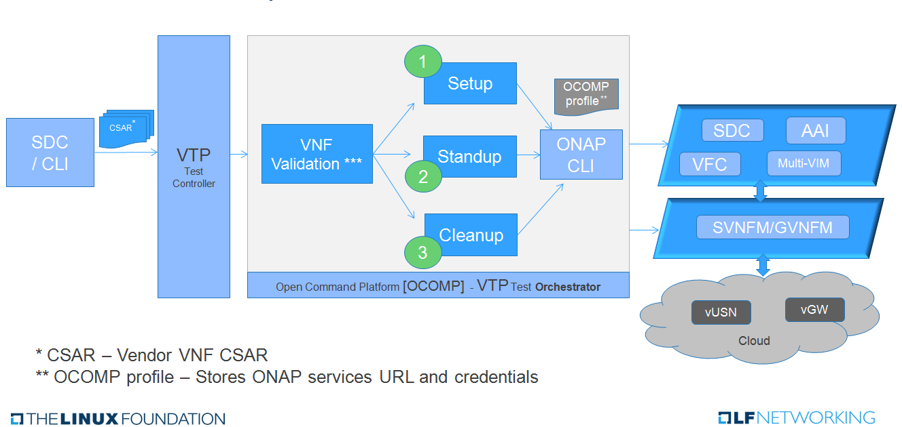

.. Modifications Copyright © 2017-2018 AT&T Intellectual Property.

.. Licensed under the Creative Commons License, Attribution 4.0 Intl.
   (the "License"); you may not use this documentation except in compliance
   with the License. You may obtain a copy of the License at

.. https://creativecommons.org/licenses/by/4.0/

.. Unless required by applicable law or agreed to in writing, software
   distributed under the License is distributed on an "AS IS" BASIS,
   WITHOUT WARRANTIES OR CONDITIONS OF ANY KIND, either express or implied.
   See the License for the specific language governing permissions and
   limitations under the License.

OPNFV Verfied Program Badging for VNFs
--------------------------------------

OPNFV Verified Program Overview
^^^^^^^^^^^^^^^^^^^^^^^^^^^^^^^

The `OPNFV Verified Program (OVP) <https://www.lfnetworking.org/OVP/>`__ is

    an open source, community-led compliance and verification program to
    demonstrate the readiness and availability of commercial NFV products and
    services, including NFVI and VNFs, using OPNFV and ONAP components.

    -- Source: OVP

The program currently offers verification badges for NFVI, VNFs, and Labs. The
VNF badge aims to verify that a given VNF is compatible and interoperable with
a given release of ONAP and an ONAP-compatible NFVI.

Relationship to ONAP
^^^^^^^^^^^^^^^^^^^^

The ONAP VNF Requirements project defines the mandatory and recommended
requirements for a VNF to be successfully orchestrated by ONAP.  At this time,
the OPNFV VNF badge automates the verification of a subset of these
requirements with plans to expand the scope over verified requirements over
time.

Currently, the `OPNFV VNF badge <https://vnf-verified.lfnetworking.org/#/>`__
covers the following:

* Compliance checks of the contents of a VNF onboarding package for :ref:`Heat-based <heat_requirements>`
  or :ref:`TOSCA-based <tosca_requirements>` VNFs.

  * Validation of the packages are, respectively, performed by the ONAP VVP
    and ONAP VNFSDK projects.

* Validation that the package can be onboarded, modeled, configured, deployed,
  and instantiated on an ONAP-compatible NFVI (currently OpenStack)

How to Receive a ONPFV VNF Badge
~~~~~~~~~~~~~~~~~~~~~~~~~~~~~~~~

The ONAP platform includes a set of automated tests that can be setup and
executed for a given VNF to verify its compliance with the in-scope VNF
Requirements.  This test suite will produce a result file that is compatible
for submission to the OPNFV Verified Program.  Please refer to the
`OPNFV VNF Portal <https://vnf-verified.lfnetworking.org/#/>`__ for more details
on registering for the program and submitting your results.

The following section will describe how to setup and execute the tests.

Executing the OPNFV Verified Compliance and Validation Tests
^^^^^^^^^^^^^^^^^^^^^^^^^^^^^^^^^^^^^^^^^^^^^^^^^^^^^^^^^^^^

The instructions related to setting up and executing the tests vary based on
whether the VNF is modeled in OpenStack Heat or in TOSCA.  Please refer
to the appropriate section based on your VNF.

* :ref:`heat_vnf_validation`
* :ref:`tosca_vnf_validation`

.. _heat_vnf_validation:

Heat-based VNF Validation
~~~~~~~~~~~~~~~~~~~~~~~~~

Instructions
++++++++++++

The instructions for setting up and running the validation scripts can be found
on the `VVP Test Engine GitHub site <https://github.com/onap/vvp-test-engine/tree/frankfurt/ovp_testsuite>`__.

Reporting Results
+++++++++++++++++

Once the test suite passes, the results tarball can be submitted to the
`OPNFV Verification Program VNF Portal <https://vnf-verified.lfnetworking.org/#/>`__.

Additional Resources
++++++++++++++++++++

- `ONAP VVP Project <https://wiki.onap.org/display/DW/VNF+Validation+Program+Project>`_

.. _tosca_vnf_validation:

TOSCA-based VNF Testing
~~~~~~~~~~~~~~~~~~~~~~~

VNF Test Platform (VTP) provides an platform to on-board different test cases
required for OVP for various VNF testing provided by VNFSDK (for TOSCA) projects
in ONAP. And it generates the test case outputs which would be uploaded into
OVP portal for VNF badging.

TOSCA VNF Test Environment
++++++++++++++++++++++++++

As pre-requestsite steps, it is assumed that, successful ONAP, Vendor VNFM and
OpenStack cloud are already available. Below installation steps help to setup
VTP components and CLI.

Installation
++++++++++++

Clone the VNFSDK repo.

.. code-block:: bash

    git clone --branch elalto https://git.onap.org/vnfsdk/refrepo

Install the VTP by using script
``refrepo/vnfmarket-be/deployment/install/vtp_install.sh``

Follow the steps as below (in sequence):

- ``vtp_install.sh --download``: It will download all required artifacts into
  ``/opt/vtp_stage``
- ``vtp_install.sh --install``: It will install VTP (``/opt/controller``) and
  CLI (``/opt/oclip``)
- ``vtp_install.sh --start``: It will start VTP controller as Tomcat service
  and CLI as ``oclip`` service
- ``vtp_install.sh --verify``: It will verify the setup is done properly by
  running some test cases.

Last step (verify) would check the health of VTP components and TOSCA VNF
compliance and validation test cases.

Check Available Test Cases
++++++++++++++++++++++++++

VTP supports to check the compliance of VNF and PNF based on ONAP VNFRQTS.

To check:

- Go to command console
- Run command ``oclip``
- Now it will provide a command prompt:

``oclip:open-cli>``

Now run command as below and check the supported compliance test cases for
VNFRQTS.

- ``csar-validate`` - Helps to validate given VNF CSAR for all configured
  VNFRQTS.
- ``csar-validate-rxxx`` - Helps to validate given VNF CSAR for a given
  VNFRQTS requirement number.

.. code-block:: bash

    oclip:open-cli>schema-list --product onap-dublin --service vnf-compliance
    +--------------+----------------+------------------------+--------------+----------+------+
    |product       |service         |command                 |ocs-version   |enabled   |rpc   |
    +--------------+----------------+------------------------+--------------+----------+------+
    |onap-dublin   |vnf-compliance  |csar-validate-r10087    |1.0           |true      |      |
    +--------------+----------------+------------------------+--------------+----------+------+
    |onap-dublin   |vnf-compliance  |csar-validate           |1.0           |true      |      |
    +--------------+----------------+------------------------+--------------+----------+------+
    |onap-dublin   |vnf-compliance  |csar-validate-r26885    |1.0           |true      |      |
    +--------------+----------------+------------------------+--------------+----------+------+
    |onap-dublin   |vnf-compliance  |csar-validate-r54356    |1.0           |true      |      |
    ...

To know the details of each VNFRQTS, run as below.

.. code-block:: bash

    oclip:open-cli>use onap-dublin
    oclip:onap-dublin>csar-validate-r54356 --help
    usage: oclip csar-validate-r54356

    Data types used by NFV node and is based on TOSCA/YAML constructs specified in draft GS NFV-SOL 001.
    The node data definitions/attributes used in VNFD MUST comply.

Now run command as below and check the supported validation testcases

.. code-block:: bash

    oclip:onap-dublin>use open-cli
    oclip:open-cli>schema-list --product onap-dublin --service vnf-validation
    +--------------+----------------+----------------------+--------------+----------+------+
    |product       |service         |command               |ocs-version   |enabled   |rpc   |
    +--------------+----------------+----------------------+--------------+----------+------+
    |onap-dublin   |vnf-validation  |vnf-tosca-provision   |1.0           |true      |      |
    +--------------+----------------+----------------------+--------------+----------+------+

Configure ONAP with required VNFM and cloud details
+++++++++++++++++++++++++++++++++++++++++++++++++++

**1. Setup the OCOMP profile onap-dublin**

Run following command to configure the ONAP service URL and credentials as
given below, which will be used by VTP while executing the test cases

.. code-block:: bash

    oclip:open-cli>use onap-dublin
    oclip:onap-dublin>profile onap-dublin
    oclip:onap-dublin>set sdc.onboarding:host-url=http://159.138.8.8:30280
    oclip:onap-dublin>set sdc.onboarding:host-username=cs0008
    oclip:onap-dublin>set sdc.onboarding:host-password=demo123456!
    oclip:onap-dublin>set sdc.catalog:host-url=http://159.138.8.8:30205
    oclip:onap-dublin>set sdc.catalog:host-password=demo123456\!
    oclip:onap-dublin>set sdc.catalog:host-username=cs0008
    oclip:onap-dublin>set sdc.catalog:service-model-approve:host-username=gv0001
    oclip:onap-dublin>set sdc.catalog:service-model-distribute:host-username=op0001
    oclip:onap-dublin>set sdc.catalog:service-model-test-start:host-username=jm0007
    oclip:onap-dublin>set sdc.catalog:service-model-test-accept:host-username=jm0007
    oclip:onap-dublin>set sdc.catalog:service-model-add-artifact:host-username=ocomp
    oclip:onap-dublin>set sdc.catalog:vf-model-add-artifact:host-username=ocomp
    oclip:onap-dublin>set aai:host-url=https://159.138.8.8:30233
    oclip:onap-dublin>set aai:host-username=AAI
    oclip:onap-dublin>set aai:host-password=AAI
    oclip:onap-dublin>set vfc:host-url=http://159.138.8.8:30280
    oclip:onap-dublin>set multicloud:host-url=http://159.138.8.8:30280

NOTE: Mostly all above entries value would be same except the IP address used
in the URL, which would be ONAP Kubernetes cluster IP.

By default, SDC onboarding service does not provide node port, which is
available to access from external ONAP network. To enable for external access,
register the SDC onboarding service into MSB and use MSB url for
sdc.onboarding:host-url.

.. code-block:: bash

    oclip:onap-dublin> microservice-create --service-name sdcob --service-version v1.0 --service-url /onboarding-api/v1.0 --path /onboarding-api/v1.0 --node-ip 172.16.1.0 --node-port 8081

NOTE: To find the node-ip and node-port, use the following steps.

Find out SDC onboarding service IP and port details as given here:

.. code-block:: bash

    [root@onap-dublin-vfw-93996-50c1z ~]# kubectl get pods -n onap -o wide | grep sdc-onboarding-be
    dev-sdc-sdc-onboarding-be-5564b877c8-vpwr5 2/2 Running 0 29d 172.16.1.0 192.168.2.163 <none> <none>
    dev-sdc-sdc-onboarding-be-cassandra-init-mtvz6 0/1 Completed 0 29d 172.16.0.220 192.168.2.163 <none> <none>
    [root@onap-dublin-vfw-93996-50c1z ~]#

Note down the IP address for sdc-onboarding-be 172.16.1.0

.. code-block:: bash

    [root@onap-dublin-vfw-93996-50c1z ~]# kubectl get services -n onap -o wide | grep sdc-onboarding-be
    sdc-onboarding-be ClusterIP 10.247.198.92 <none> 8445/TCP,8081/TCP 29d app=sdc-onboarding-be,release=dev-sdc
    [root@onap-dublin-vfw-93996-50c1z ~]#

Note down the port for sdc-onboarding-be 8445 8081

Similarly, other service IP and Port could be discovered like above, in case not
know earlier :)

Verify these details once by typing 'set'

.. code-block:: bash

    oclip:onap-dublin> set

This profile would be used by user while running the test cases with ONAP setup
configured in it, as below oclip --profile onap-dublin vnf-tosca-provision ....

**2. Setup SDC consumer**

SDC uses consumer concept to configure required VN model and service model
artifacts. So following commands required to run, which will create consumer
named ocomp, which is already configured in onap-dublin profile created in above
steps.

.. code-block:: bash

    oclip --product onap-dublin --profile onap-dublin sdc-consumer-create --consumer-name ocomp

NOTE: command oclip could be used in scripting mode as above or in interactive
mode as used in earlier steps

**3. Update the cloud and vnfm driver details**

In the configuration file /opt/oclip/conf/vnf-tosca-provision.json, update the
cloud and VNFM details.

.. code-block:: json

    { "cloud": {
            "identity-url": "http://10.12.11.1:5000/v3",
            "username": "admin",
            "password": "password",
            "region": "RegionOVP",
            "version": "ocata",
            "tenant": "ocomp"
        },
        "vnfm":{
            "hwvnfmdriver":{
                "version": "v1.0",
                "url": "http://159.138.8.8:38088",
                "username": "admin",
                "password": "xxxx"
            },
            "gvnfmdriver":{
                "version": "v1.0",
                "url": "http://159.138.8.8:30280"
            }
        }
    }

**4.Configure the decided VNFRES (optional)**
VTP allows to configure the set of VNFRQTS to be considered while running the
VNF compliance test cases in the configuration file
``/opt/oclip/conf/VNFRQTS.properties.``

If not available, please create this file with following entries:

.. code-block:: bash

    VNFRQTS.enabled=r02454,r04298,r07879,r09467,r13390,r23823,r26881,r27310,r35851,r40293,r43958,r66070,r77707,r77786,r87234,r10087,r21322,r26885,r40820,r35854,r65486,r17852,r46527,r15837,r54356,r67895,r95321,r32155,r01123,r51347,r787965,r130206
    pnfreqs.enabled=r10087,r87234,r35854,r15837,r17852,r293901,r146092,r57019,r787965,r130206
    # ignored all chef and ansible related tests
    vnferrors.ignored=
    pnferrors.ignored=

Running the TOSCA VNF Test
++++++++++++++++++++++++++

Every test provided in VTP is given with guidelines on how to use it. On every
execution of test cases, use the following additional arguments based on
requirements

- ``--product onap-dublin`` - It helps VTP choose the test cases written for
  onap-dublin version
- ``--profile onap-dublin`` - It helps VTP to use the profile settings provided
  by admin (optional)
- ``--request-id`` - It helps VTP to  track the progress of the test cases
  execution and user could use this id for same. (optional)

So, final test case execution would be as below.  To find the test case
arguments details, run second command below.

.. code-block:: bash

    oclip --product onap-dublin --profile onap-dublin --request-id req-1 <test case name> <test case arguments>
    oclip --product onap-dublin <test case name> --help

Running TOSCA VNF Compliance Testing
++++++++++++++++++++++++++++++++++++

To run compliance test as below with given CSAR file

.. clode-block:: bash

    oclip --product onap-dublin csar-validate --csar <csar file complete path>

It will produce the result format as below:

.. code-block:: json

    {
        "date": "Fri Sep 20 17:34:24 CST 2019",
        "criteria": "PASS",
        "contact": "ONAP VTP Team onap-discuss@lists.onap.org",
        "results": [
        {
            "description": "V2.4.1 (2018-02)",
            "passed": true,
            "vnfreqName": "SOL004",
            "errors": []
        },
        {
            "description": "If the VNF or PNF CSAR Package utilizes Option 2 for package security, then the complete CSAR file MUST be digitally signed with the VNF or PNF provider private key. The VNF or PNF provider delivers one zip file consisting of the CSAR file, a signature file and a certificate file that includes the VNF or PNF provider public key. The certificate may also be included in the signature container, if the signature format allows that. The VNF or PNF provider creates a zip file consisting of the CSAR file with .csar extension, signature and certificate files. The signature and certificate files must be siblings of the CSAR file with extensions .cms and .cert respectively.\n",
            "passed": true,
            "vnfreqName": "r787965",
            "errors": []
        }
        ],
        "platform": "VNFSDK - VNF Test Platform (VTP) 1.0",
        "vnf": {
        "mode": "WITH_TOSCA_META_DIR",
        "vendor": "ONAP",
        "name": null,
        "type": "TOSCA",
        "version": null
        }
    }

In case of errors, the errors section will have list of details as below.  Each
error block, will be given with error code and error details. Error code would
be very useful to provide the troubleshooting guide in future. Note, to
generate the test result in OVP archieve format, its recommended to run this
compliance test with request-id similar to running validation test as below.

.. code-block:: bash

    [
    {
        "vnfreqNo": "R66070",
        "code": "0x1000",
        "message": "MissinEntry-Definitions file",
        "lineNumber": -1
    }
    ]

Running TOSCA VNF Validation Testing
++++++++++++++++++++++++++++++++++++

VTP provides validation test case with following modes:

* **setup**: Create requires Vendor, Service Subscription and VNF cloud in
  ONAP
* **standup**: From the given VSP csar, VNF csar and NS csar, it creates VF
  Model, NS Model and NS service
* **cleanup**: Remove those entries created during provision
* **provision**: Runs setup -> standup
* **validate**: Runs setup -> standup -> cleanup
* **checkup**: mode helps to verify automation is deployed properly.

For OVP badging, validate mode would be used as below:

.. code-block:: bash

    oclip --request-id WkVVu9fD--product onap-dublin --profile onap-dublin vnf-tosca-provision --vsp <vsp csar> --vnf-csar <v

Validation testing would take for a while to complete the test execution, so
user could use the above given ``request-id``, to tracking the progress as
below:

.. code-block:: bash

    oclip execution-list --request-id WkVVu9fD
    +------------+------------------------+--------------+------------------+------------------------------+--------------+------------+--------------------------+--------------------------+
    |request-id  |execution-id            |product       |service           |command                       |profile       |status      |start-time                |end-time                  |
    +------------+------------------------+--------------+------------------+------------------------------+--------------+------------+--------------------------+--------------------------+
    |WkVVu9fD    |WkVVu9fD-1568731678753  |onap-dublin   |vnf-validation    |vnf-tosca-provision           |              |in-progress |2019-09-17T14:47:58.000   |                        |
    +------------+------------------------+--------------+------------------+------------------------------+--------------+------------+--------------------------+--------------------------+
    |WkVVu9fD    |WkVVu9fD-1568731876397  |onap-dublin   |sdc.catalog       |service-model-test-request    |onap-dublin   |in-progress |2019-09-17T14:51:16.000   |                          |
    +------------+------------------------+--------------+------------------+------------------------------+--------------+------------+--------------------------+--------------------------+
    |WkVVu9fD    |WkVVu9fD-1568731966966  |onap-dublin   |sdc.onboarding    |vsp-archive                   |onap-dublin   |completed   |2019-09-17T14:52:46.000   |2019-09-17T14:52:47.000   |
    +------------+------------------------+--------------+------------------+------------------------------+--------------+------------+--------------------------+--------------------------+
    |WkVVu9fD    |WkVVu9fD-1568731976982  |onap-dublin   |aai               |subscription-delete           |onap-dublin   |completed   |2019-09-17T14:52:56.000   |2019-09-17T14:52:57.000   |
    +------------+------------------------+--------------+------------------+------------------------------+--------------+------------+--------------------------+--------------------------+
    |WkVVu9fD    |WkVVu9fD-1568731785780  |onap-dublin   |aai               |vnfm-create                   |onap-dublin   |completed   |2019-09-17T14:49:45.000   |2019-09-17T14:49:46.000   |
    ......

While executing the test cases, VTP provides unique execution-id (2nd column)
for each step. As you note in the example above, some steps are in-progress,
while others are completed already. If there is error then status will be set
to failed.

To find out the foot-print of each step, following commands are available:

.. code-block:: bash

    oclip execution-show-out --execution-id WkVVu9fD-1568731785780       - Reports the standard output logs
    oclip execution-show-err --execution-id WkVVu9fD-1568731785780        - Reports the standard error logs
    oclip execution-show-debug --execution-id WkVVu9fD-1568731785780  - Reports the debug details like HTTP request and responseoclip execution-show --execution-id WkVVu9fD-1568731785780              - Reports the complete foot-print of inputs, outputs of steps

Track the progress of the vnf-tosca-provision test cases until its completed.
Then the out of the validation test cases could be retrieved as below:

.. code-block:: bash

    oclip execution-show --execution-id WkVVu9fD-1568731678753              - use vnf tosca test case execution id here

It will provides the output format as below:

.. code-block:: json

    {
    "output": {
        "ns-id": null,
        "vnf-id": "",
        "vnfm-driver": "hwvnfmdriver",
        "vnf-vendor-name": "huawei",
        "onap-objects": {
        "ns_instance_id": null,
        "tenant_version": null,
        "service_type_id": null,
        "tenant_id": null,
        "subscription_version": null,
        "esr_vnfm_id": null,
        "location_id": null,
        "ns_version": null,
        "vnf_status": "active",
        "entitlement_id": null,
        "ns_id": null,
        "cloud_version": null,
        "cloud_id": null,
        "vlm_version": null,
        "esr_vnfm_version": null,
        "vlm_id": null,
        "vsp_id": null,
        "vf_id": null,
        "ns_instance_status": "active",
        "service_type_version": null,
        "ns_uuid": null,
        "location_version": null,
        "feature_group_id": null,
        "vf_version": null,
        "vsp_version": null,
        "agreement_id": null,
        "vf_uuid": null,
        "ns_vf_resource_id": null,
        "vsp_version_id": null,
        "customer_version": null,
        "vf_inputs": null,
        "customer_id": null,
        "key_group_id": null,
        },
        "vnf-status": "active",
        "vnf-name": "vgw",
        "ns-status": "active"
    },
    "input": {
        "mode": "validate",
        "vsp": "/tmp/data/vtp-tmp-files/1568731645518.csar",
        "vnfm-driver": "hwvnfmdriver",
        "config-json": "/opt/oclip/conf/vnf-tosca-provision.json",
        "vnf-vendor-name": "huawei",
        "ns-csar": "/tmp/data/vtp-tmp-files/1568731660745.csar",
        "onap-objects": "{}",
        "timeout": "600000",
        "vnf-name": "vgw",
        "vnf-csar": "/tmp/data/vtp-tmp-files/1568731655310.csar"
    },
    "product": "onap-dublin",
    "start-time": "2019-09-17T14:47:58.000",
    "service": "vnf-validation",
    "end-time": "2019-09-17T14:53:46.000",
    "request-id": "WkVVu9fD-1568731678753",
    "command": "vnf-tosca-provision",
    "status": "completed"
    }

Reporting Results
+++++++++++++++++

VTP provides translation tool to migrate the VTP result into OVP portal format
and generates the tar file for the given test case execution.  Please refer
`<https://github.com/onap/vnfsdk-refrepo/tree/master/vnfmarket-be/deployment/vtp2ovp>`_
for more details.

Once tar is generated, it can be used to submit into OVP portal
`<https://vnf-verified.lfnetworking.org/>`_

.. References
.. _`OVP VNF portal`: https://vnf-verified.lfnetworking.org
